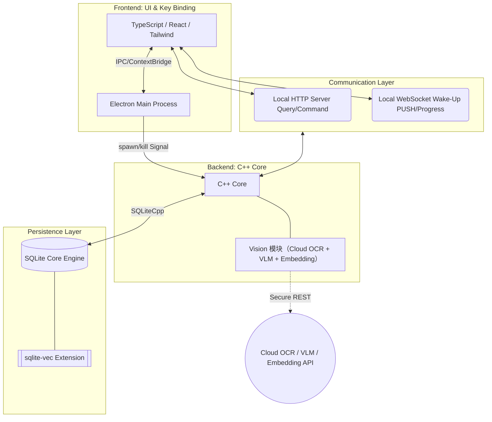

# QuickMemes 架构设计与技术栈规范

## 技术栈速览

**前后端分离**：UI与系统调用交互由前端 UI 框架管理，核心底层持久化策略与多模态匹配由独立后端进程执行。

| 模块         | 技术栈                     | 额外信息                                         | 开源协议            | 外部链接/源                                          |
| ------------ | -------------------------- | ------------------------------------------------ | ------------------- | ---------------------------------------------------- |
| **UI 框架**  | `Electron`                 | 生命周期管理与跨平台UI支持                       | 开源 (MIT)          | [electronjs.org](https://www.electronjs.org)         |
| **前端语言** | `TypeScript`               |                                                  | 开源 (Apache-2.0)   | [typescriptlang.org](https://www.typescriptlang.org) |
| **UI 构建**  | `React` + `Tailwind CSS`   |                                                  | 开源 (MIT)          | [react.dev](https://react.dev)                       |
| **核心**     | `C++23` (基于 CMake 构建)  | C++23 后端                                       | -                   | [isocpp.org](https://isocpp.org)                     |
| **通信**     | `Boost.Beast` (Boost.Asio) | HTTP REST API + WebSocket长链通信                | 开源 (BSL-1.0)      | [Boost.Beast](https://github.com/boostorg/beast)     |
| **数据传输** | `nlohmann/json`            | 前后端数据通信                                   | 开源 (MIT)          | [nlohmann/json](https://github.com/nlohmann/json)    |
| **持久化**   | `SQLite3` + `SQLiteCpp`    | Tags、时间戳与索引等内容存储                     | 开源 (PD, MIT)      | [sqlite.org](https://www.sqlite.org)                 |
| **全文检索** | `sqlite-vec` + `simple`    | FTS5 关键词检索，支持中文/拼音分词与模糊匹配      | 开源 (MIT)          | [sqlite-vec](https://github.com/asg017/sqlite-vec) / [simple](https://github.com/wangfenjin/simple) |
| **向量查询** | `sqlite-vec`               | 用于词向量模糊查询                               | 开源 (MIT)          | [sqlite-vec](https://github.com/asg017/sqlite-vec)   |
| **图像处理** | `stb_image` 系列           | 图像解码/缩放/缩略图输出（header-only 单文件库） | 开源 (MIT/PD)       | [stb](https://github.com/nothings/stb)               |
| **云端视觉** | `第三方 LLM / OCR 接口`    | 云端 OCR 文字识别 + AI 打标签 + 词向量转换       | 闭源 (商用网络 API) | -                                                    |

---

## 分层架构设计与交互拓扑

> 此图描述进程拓扑结构及其控制流数据链路。

---

## 依赖管理方案

> 本项目采用**前端 npm 锁定 + 后端 CMake FetchContent 拉取**的混合依赖管理方案。前端依赖由 `src/frontend/package-lock.json` 锁定，CI 使用 npm 缓存；后端 C++ 依赖主要通过 `FetchContent` 拉取并本地编译。Windows 后端 CI 额外使用 `vcpkg` 提供 OpenSSL，其余依赖不依赖 vcpkg / Conan。

| 层级         | 方案                                  | 说明                                         |
| ------------ | ------------------------------------- | -------------------------------------------- |
| **前端**     | `npm` + `package-lock.json`           | 依赖安装与 CI 缓存都围绕 `src/frontend` 的 lockfile |
| **后端 C++** | `CMake FetchContent` + 本地编译       | 主要依赖统一源码拉取、静态编译后链接            |
| **Windows CI** | `vcpkg` 仅用于 OpenSSL               | 由 CI 额外安装 `openssl:x64-windows`           |

| 依赖库              | 集成方式                             | 说明                                       |
| ------------------- | ------------------------------------ | ------------------------------------------ |
| `Boost.Beast`       | `FetchContent` 拉取 Boost 1.90.0     | Beast/Asio 模块，同时提供 HTTP + WebSocket |
| `nlohmann/json`     | `FetchContent` 拉取后链接目标        | 单文件 header-only，但由 CMake 统一管理    |
| `SQLiteCpp`         | `FetchContent` 拉取后编译             | 轻量封装，非 header-only                   |
| `sqlite-vec`        | `FetchContent` 拉取后静态编译        | 作为 `vec0` 扩展库链接进后端二进制        |
| `simple`            | `FetchContent` 拉取后静态编译        | 提供 FTS5 `simple` tokenizer，用于中文/拼音搜索 |
| `stb_image`         | `FetchContent` 拉取后以头文件方式使用 | 单文件 header-only，图像解码读取           |
| `stb_image_resize2` | `FetchContent` 拉取后以头文件方式使用 | 单文件 header-only，图像缩放               |
| `stb_image_write`   | `FetchContent` 拉取后以头文件方式使用 | 单文件 header-only，JPEG 缩略图输出        |

---
