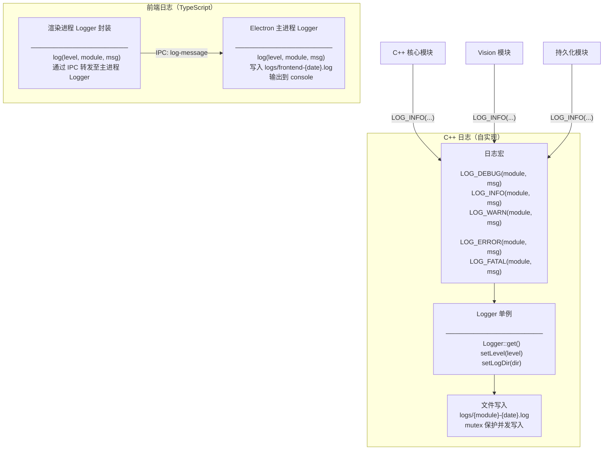
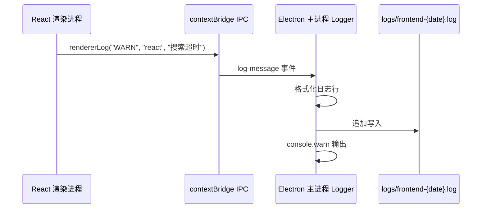

# 日志模块

> **所属层级**：横切关注点（前端 Electron 层 + C++ 后端层均覆盖）  
> **对应索引**：[Arch.md - 日志模块](../02-Architecture/overview.md#日志模块)

---

## 目录

- [模块职责与边界](#模块职责与边界)
- [模块架构图](#模块架构图)
- [模块独有数据结构](#模块独有数据结构)
- [日志格式规范](#日志格式规范)
- [前端日志函数（TypeScript）](#前端日志函数typescript)
- [C++ 日志函数](#c-日志函数)
- [处理流程](#处理流程)
- [错误处理与边界情况](#错误处理与边界情况)

---

## 模块职责与边界

**负责的事情：**
- 提供统一的日志接口，覆盖前端 Electron 层和 C++ 后端层
- 将日志同时输出到控制台（开发时）和文件（始终）
- 按模块区分日志文件，命名格式为 `{模块名}-{YYYY-MM-DD}.log`，存放在 `{app_dir}/logs/` 目录下
- 支持五个日志等级：`DEBUG / INFO / WARN / ERROR / FATAL`，低于配置等级的日志不输出
- 线程安全（C++ 后端多线程环境下不丢失日志）
- 支持日志文件自动清理：可配置保留天数和开关，超期日志文件自动删除

**不负责的事情：**
- 日志数据分析或告警通知
- 日志上传到远端
- 日志压缩归档（仅做简单文件写入）

---

## 模块架构图



---

## 模块独有数据结构

### `LogLevel` — 日志等级枚举

```
// C++ 端
LogLevel : DEBUG = 0 | INFO = 1 | WARN = 2 | ERROR = 3 | FATAL = 4

// TypeScript 端（对应映射）
LogLevel : "DEBUG" | "INFO" | "WARN" | "ERROR" | "FATAL"
```

### `LogEntry` — 单条日志记录

```
LogEntry {
    timestamp : string   // 格式 "YYYY-MM-DD HH:MM:SS.mmm"
    level     : LogLevel // 日志等级
    module    : string   // 模块名称，如 "cpp_core" / "vision" / "frontend"
    message   : string   // 日志内容
}
```

---

## 日志格式规范

### 日志行格式

```
[YYYY-MM-DD HH:MM:SS.mmm] [LEVEL] [module] 消息内容
```

**示例：**
```
[2026-03-01 19:32:05.123] [INFO ] [cpp_core] 服务器启动成功，监听端口 57321
[2026-03-01 19:32:05.456] [DEBUG] [vision  ] 开始云端 OCR 识别图像: /storage/memes/abc.png
[2026-03-01 19:32:06.789] [ERROR] [vision  ] API 请求失败: HTTP 429, 配额超限
[2026-03-01 19:32:07.001] [FATAL] [persist ] 数据库写入失败，磁盘空间不足
```

> 注意：等级字段固定宽度 5 字符（用空格补齐），模块名字段固定宽度 8 字符，便于对齐阅读。

### 日志文件命名规范

```
{app_dir}/logs/{module}-{YYYY-MM-DD}.log

// 示例：
logs/cpp_core-2026-03-01.log
logs/vision-2026-03-01.log
logs/persistence-2026-03-01.log
logs/frontend-2026-03-01.log
```

---

## 前端日志函数（TypeScript）

### 主进程 Logger

#### `log`

```
log(level: LogLevel, module: string, message: string): void
```

- **描述**：格式化日志行并同时写入：① `logs/frontend-{date}.log` 文件（追加写入），② 控制台（`console.log` / `console.warn` / `console.error`，按等级区分）。
- **输入**：`level`：日志等级；`module`：模块名（如 `"electron"` / `"react"`）；`message`：日志内容
- **输出**：无

---

#### `setMinLevel`

```
setMinLevel(level: LogLevel): void
```

- **描述**：设置最低输出等级，低于该等级的日志调用直接返回，不写入文件。开发模式默认 `DEBUG`，生产模式默认 `INFO`。
- **输入**：`level`：最低日志等级
- **输出**：无

---

### 渲染进程 Logger 封装

#### `rendererLog`

```
rendererLog(level: LogLevel, module: string, message: string): void
```

- **描述**：渲染进程中调用，通过 `contextBridge` 暴露的 IPC 通道将日志内容发送给主进程的 `log()` 函数处理和写入。渲染进程本身不直接写文件。
- **输入**：`level`：日志等级；`module`：模块名；`message`：日志内容
- **输出**：无

---

### 快捷调用封装（各等级语法糖）

```
logDebug(module: string, message: string): void
logInfo(module: string, message: string): void
logWarn(module: string, message: string): void
logError(module: string, message: string): void
logFatal(module: string, message: string): void
```

---

## C++ 日志函数

### `Logger::get`

```
Logger::get(): Logger&
```

- **描述**：获取全局 Logger 单例实例（Meyer's Singleton）。第一次调用时延迟初始化。
- **输入**：无
- **输出**：Logger 单例引用

---

### `Logger::initialize`

```
Logger::initialize(logDir: string, minLevel: LogLevel): void
```

- **描述**：
  1. 创建 `logDir` 目录（若不存在）
  2. 设置最低输出等级 `minLevel`
  3. 记录日志目录路径，后续日志按模块名和当日日期动态打开对应文件
  4. 若启用日志清理（`retentionEnabled`），调用 `cleanOldLogs()` 删除超期日志文件
- **输入**：`logDir`：日志文件输出目录；`minLevel`：最低输出等级
- **输出**：无

---

### `Logger::cleanOldLogs`

```
Logger::cleanOldLogs(retentionDays: int): int
```

- **描述**：遍历 `logDir` 目录下所有 `.log` 文件，根据文件名中的日期部分判断是否超期（超过 `retentionDays` 天），删除超期文件。此函数在 `initialize()` 时调用，也可由 C++ 核心模块的定时任务每日调用。
- **输入**：`retentionDays`：日志保留天数
- **输出**：已删除的日志文件数量

---

### `Logger::log`

```
Logger::log(level: LogLevel, module: string, message: string): void
```

- **描述**：
  1. 检查 `level >= minLevel`，否则立即返回
  2. 获取当前时间戳（毫秒精度）
  3. 格式化日志行：`[timestamp] [LEVEL] [module] message`
  4. 加锁（`std::mutex`），将日志行追加写入 `logs/{module}-{date}.log`
  5. 同时输出到 `stderr`
  6. 若等级为 `FATAL`，写入完成后调用 `std::abort()` 终止进程
- **输入**：`level`：日志等级；`module`：模块名（不超过 8 字符）；`message`：日志内容
- **输出**：无（FATAL 级不返回）

---

### 日志宏定义（各模块调用接口）

```cpp
// 各模块通过宏调用，自动传入字符串化的模块名
#define LOG_DEBUG(module, msg) Logger::get().log(LogLevel::DEBUG, module, msg)
#define LOG_INFO(module, msg)  Logger::get().log(LogLevel::INFO,  module, msg)
#define LOG_WARN(module, msg)  Logger::get().log(LogLevel::WARN,  module, msg)
#define LOG_ERROR(module, msg) Logger::get().log(LogLevel::ERROR, module, msg)
#define LOG_FATAL(module, msg) Logger::get().log(LogLevel::FATAL, module, msg)

// 使用示例：
LOG_INFO("cpp_core", "服务器启动成功，端口: " + std::to_string(port));
LOG_ERROR("ai_gate", "API 请求失败: " + errorMessage);
```

---

## 处理流程

### 渲染进程日志写入流程



### C++ 日志写入流程

```mermaid
flowchart TD
    CALL([LOG_INFO / LOG_ERROR 宏调用]) --> CHECK{level >= minLevel?}
    CHECK -->|否| DROP([直接返回])
    CHECK -->|是| FORMAT[格式化日志行]
    FORMAT --> LOCK[加 mutex 锁]
    LOCK --> OPEN[打开/追加 logs/{module}-{date}.log]
    OPEN --> WRITE[写入日志行]
    WRITE --> STDERR[输出到 stderr]
    STDERR --> UNLOCK[释放锁]
    UNLOCK --> FATAL{等级为 FATAL?}
    FATAL -->|是| ABORT([std::abort 终止进程])
    FATAL -->|否| RETURN([返回])
```

---

## 错误处理与边界情况

| 场景                                | 处理策略                                                     |
| ----------------------------------- | ------------------------------------------------------------ |
| `logs/` 目录创建失败（权限不足）    | C++ Logger 退化为仅输出到 `stderr`，不崩溃                   |
| 日志文件写入失败（磁盘满）          | 静默忽略写入错误，继续向 `stderr` 输出，避免日志本身引发崩溃 |
| 多线程并发写入同一日志文件          | `std::mutex` 保证串行，不会出现日志行交叉混乱                |
| `FATAL` 等级日志调用后进程终止      | 写入完成后调用 `std::abort()`，确保日志已落盘再终止          |
| 渲染进程 IPC 发送日志时主进程未就绪 | IPC 消息丢失，渲染进程不报错（日志丢失可接受）               |
| 单日日志文件过大                    | 当前不做大小限制（简单实现），按日期自然分割已足够           |
