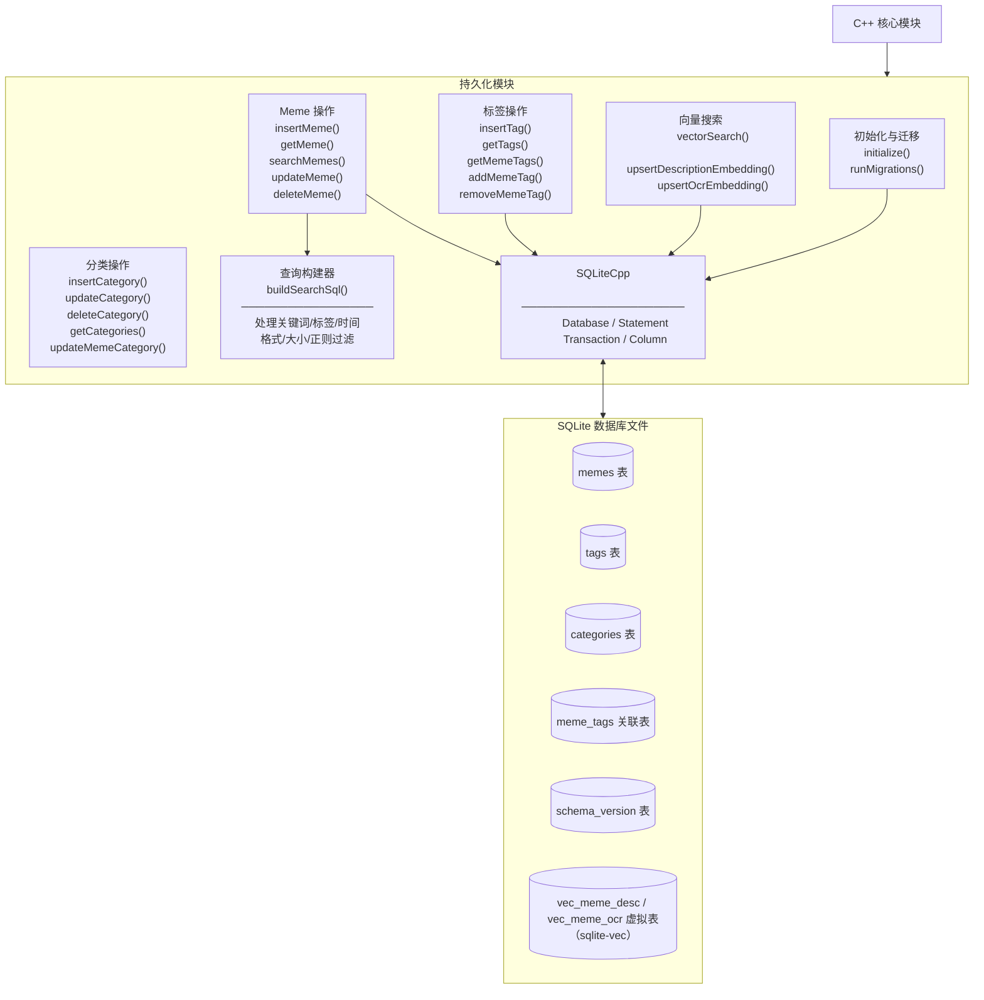
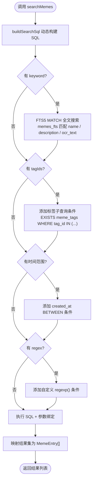
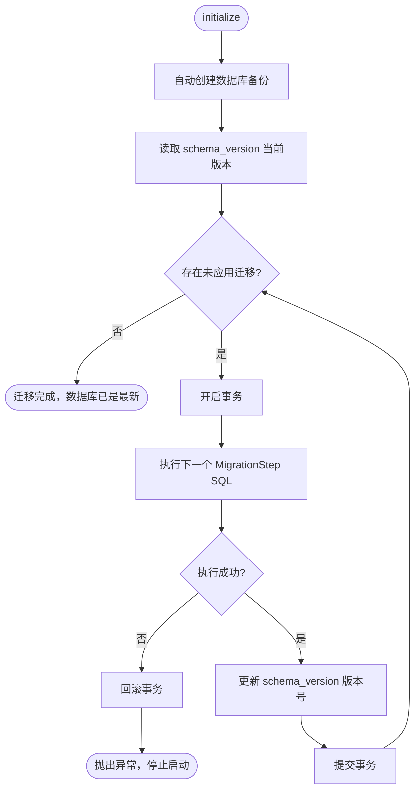

# 持久化模块

> **所属层级**：持久化层（SQLite3 + SQLiteCpp + sqlite-vec 扩展）  
> **对应索引**：[Arch.md - 持久化模块](../02-Architecture/overview.md#持久化模块)

---

## 目录

- [模块职责与边界](#模块职责与边界)
- [模块架构图](#模块架构图)
- [数据库表结构](#数据库表结构)
- [模块独有数据结构](#模块独有数据结构)
- [函数规范](#函数规范)
- [处理流程](#处理流程)
- [错误处理与边界情况](#错误处理与边界情况)

---

## 模块职责与边界

**负责的事情：**
- 管理 SQLite 数据库连接的打开、迁移和关闭
- 提供 Meme 条目、标签和 Meme-Tag 关联关系的全部 CRUD 操作
- 通过 sqlite-vec 扩展支持语义向量的存储与余弦相似度搜索
- 数据库 Schema 版本迁移管理（通过 `schema_version` 表）
- 所有查询构建和参数绑定（防止 SQL 注入）

**不负责的事情：**
- 文件系统操作（由 C++ 核心模块负责）
- 向量的计算和生成（由 Vision 模块负责）
- 任何业务逻辑（由 C++ 核心模块负责）

---

## 模块架构图



---

## 数据库表结构

### `memes` 表

```sql
CREATE TABLE memes (
    id          INTEGER PRIMARY KEY AUTOINCREMENT,
    file_path   TEXT    NOT NULL UNIQUE,
    file_hash   TEXT    NOT NULL UNIQUE,
    mime_type   TEXT    NOT NULL,
    file_size   INTEGER NOT NULL,
    width       INTEGER NOT NULL DEFAULT 0,
    height      INTEGER NOT NULL DEFAULT 0,
    source_name TEXT    NOT NULL DEFAULT '',
    source_url  TEXT    NOT NULL DEFAULT '',
    name        TEXT    NOT NULL DEFAULT '',
    description TEXT    NOT NULL DEFAULT '',
    ocr_text    TEXT    NOT NULL DEFAULT '',
    ocr_status  TEXT    NOT NULL DEFAULT 'PENDING',  -- PENDING/PROCESSING/DONE/FAILED/SKIPPED
    ai_status   TEXT    NOT NULL DEFAULT 'PENDING',  -- PENDING/PROCESSING/DONE/FAILED/SKIPPED
    created_at  INTEGER NOT NULL,  -- Unix 时间戳（毫秒）
    updated_at  INTEGER NOT NULL,
    last_used_at INTEGER NOT NULL DEFAULT 0, -- 最后一次复制到剪贴板的时间戳
    deleted_at  INTEGER NOT NULL DEFAULT 0,  -- 软删除时间戳（0 表示未删除）
    category_id INTEGER NOT NULL DEFAULT 0   -- 所属分类 ID（0 表示未分类）
);

CREATE INDEX idx_memes_file_hash ON memes(file_hash);
CREATE INDEX idx_memes_created_at ON memes(created_at);
CREATE INDEX idx_memes_last_used_at ON memes(last_used_at);
CREATE INDEX idx_memes_mime_type ON memes(mime_type);
CREATE INDEX idx_memes_name ON memes(name);
CREATE INDEX idx_memes_deleted_at ON memes(deleted_at);
CREATE INDEX idx_memes_category_id ON memes(category_id);
```

### `categories` 表

```sql
CREATE TABLE categories (
    id         INTEGER PRIMARY KEY AUTOINCREMENT,
    uuid       TEXT    NOT NULL UNIQUE,
    name       TEXT    NOT NULL,
    color      TEXT    NOT NULL DEFAULT '',
    position   INTEGER NOT NULL DEFAULT 0,
    created_at INTEGER NOT NULL,
    updated_at INTEGER NOT NULL
);

CREATE INDEX idx_categories_uuid ON categories(uuid);
CREATE INDEX idx_categories_name ON categories(name);
CREATE INDEX idx_categories_position ON categories(position);
```

### `tags` 表

```sql
CREATE TABLE tags (
    id         INTEGER PRIMARY KEY AUTOINCREMENT,
    name       TEXT    NOT NULL UNIQUE,
    color      TEXT    NOT NULL DEFAULT '',
    created_at INTEGER NOT NULL
);

CREATE INDEX idx_tags_name ON tags(name);
```

### `meme_tags` 关联表

```sql
CREATE TABLE meme_tags (
    meme_id INTEGER NOT NULL REFERENCES memes(id) ON DELETE CASCADE,
    tag_id  INTEGER NOT NULL REFERENCES tags(id)  ON DELETE CASCADE,
    PRIMARY KEY (meme_id, tag_id)
);

CREATE INDEX idx_meme_tags_tag_id ON meme_tags(tag_id);
```

### `vec_meme_desc` / `vec_meme_ocr` 虚拟表（sqlite-vec）

```sql
-- 在 sqlite-vec 扩展加载后创建
-- 维度由 embedding.dimensions 决定；非法值会在后端回退为默认值 512
CREATE VIRTUAL TABLE vec_meme_desc USING vec0(
    meme_id INTEGER PRIMARY KEY,
    embedding float[512]
);

CREATE VIRTUAL TABLE vec_meme_ocr USING vec0(
    meme_id INTEGER PRIMARY KEY,
    embedding float[512]
);
```

### `memes_fts` 全文搜索表（FTS5 + simple tokenizer 扩展）

```sql
-- FTS5 全文索引表，使用 simple tokenizer 支持中文与拼音检索
CREATE VIRTUAL TABLE memes_fts USING fts5(
    name,
    description,
    ocr_text,
    content=memes,
    content_rowid=id,
    tokenize='simple'
);

-- 同步触发器：插入 meme 后自动同步到 FTS5 索引
CREATE TRIGGER memes_ai AFTER INSERT ON memes BEGIN
    INSERT INTO memes_fts(rowid, name, description, ocr_text)
        VALUES (new.id, new.name, new.description, new.ocr_text);
END;

-- 同步触发器：删除旧记录后重新插入新记录（更新时）
CREATE TRIGGER memes_au AFTER UPDATE ON memes BEGIN
    INSERT INTO memes_fts(memes_fts, rowid, name, description, ocr_text)
        VALUES ('delete', old.id, old.name, old.description, old.ocr_text);
    INSERT INTO memes_fts(rowid, name, description, ocr_text)
        VALUES (new.id, new.name, new.description, new.ocr_text);
END;

-- 同步触发器：删除时从 FTS5 索引中移除
CREATE TRIGGER memes_ad AFTER DELETE ON memes BEGIN
    INSERT INTO memes_fts(memes_fts, rowid, name, description, ocr_text)
        VALUES ('delete', old.id, old.name, old.description, old.ocr_text);
END;
```

### `schema_version` 表

```sql
CREATE TABLE schema_version (
    version INTEGER NOT NULL,
    applied_at INTEGER NOT NULL
);
```

---

## 模块独有数据结构

### `MemePatch` — 更新字段集合（来自通信协议模块，此处引用）

```
MemePatch {
    name?        : string  // 可选更新
    description? : string
    sourceName?  : string
    sourceUrl?   : string
}

MemeEntry {
    id          : int64
    filePath    : string
    fileHash    : string
    mimeType    : string
    fileSize    : int64
    width       : int32
    height      : int32
    sourceName  : string
    sourceUrl   : string
    name        : string
    description : string
    ocrText     : string
    ocrStatus   : ProcessingStatus
    aiStatus    : ProcessingStatus
    tagIds      : int64[]
    tags        : Tag[]            // 关联标签完整对象列表（可选）
    createdAt   : int64
    updatedAt   : int64
    lastUsedAt  : int64            // 最后使用时间
    deletedAt   : int64
    categoryId  : int64            // 所属分类 ID
}

Category {
    id        : int64
    uuid      : string
    name      : string
    color     : string
    position  : int64
    createdAt : int64
    updatedAt : int64
}

CategoryPatch {
    name?       : string
    color?      : string
    position?   : int64
}

ExportRequest {
    memeIds    : int64[]  // 要导出的 Meme ID 列表
    destDir    : string   // 导出目标目录路径
    keepNames  : bool     // 是否保留原文件名（false 则用 ID 命名）
}
```

### `SearchSql` — 构建查询时的内部 SQL 表示

```
SearchSql {
    whereClauses : string[]  // WHERE 条件片段列表（最终用 AND 拼接）
    params       : any[]     // 绑定参数值列表（顺序对应 ? 占位符）
    orderBy      : string    // ORDER BY 子句
    limitOffset  : string    // LIMIT 和 OFFSET 子句
}
```

### `MigrationStep` — 数据库迁移步骤

```
MigrationStep {
    version : int     // 目标 Schema 版本号
    sql     : string  // 迁移 DDL SQL 语句
}
```

---

## 函数规范

### `initialize`

```
initialize(dbPath: string): bool
```

- **描述**：
  1. 使用 SQLiteCpp 打开（不存在则创建）`dbPath` 指定的 SQLite 数据库文件
  2. 执行 `PRAGMA journal_mode=WAL` 开启 WAL 模式（支持多线程并发读 + 单写）
  3. 执行 `PRAGMA foreign_keys=ON` 启用外键约束
  4. 加载 sqlite-vec 扩展（通过 `sqlite3_load_extension`）
  5. 调用 `runMigrations()` 执行 Schema 迁移到最新版本
- **输入**：`dbPath`：SQLite 数据库文件绝对路径
- **输出**：成功返回 `true`；文件路径非法、扩展加载失败或迁移失败返回 `false`

---

### `runMigrations`（内部函数）

```
runMigrations(): void
```

- **描述**：读取 `schema_version` 表中当前版本号（表不存在则视为版本 0），依次执行所有版本号大于当前版本的 `MigrationStep` SQL。**迁移前自动调用 `backupDatabase()` 创建数据库备份**，确保迁移失败时可恢复。每个迁移步骤在单独事务中执行，保证原子性。执行完毕后更新 `schema_version`。
- **输入**：无
- **输出**：无（失败时抛出 SQLite 异常）

---

### `insertMeme`

```
insertMeme(meme: MemeEntry): int64
```

- **描述**：
  1. 开启事务
  2. 向 `memes` 表插入 `meme` 对象各字段（`id` 自动生成，`created_at` / `updated_at` 取当前时间戳）
  3. 获取 `last_insert_rowid()` 作为新 ID
  4. 提交事务，返回新 ID
  
  > 注意：embedding 向量的写入由 C++ 核心模块在 OCR / AI 分析完成后分别调用 `upsertDescriptionEmbedding()` 与 `upsertOcrEmbedding()` 完成，不在 `insertMeme` 流程内。
- **输入**：`meme`：完整的 Meme 数据对象（`id` 字段忽略）
- **输出**：新记录的自增 ID；哈希重复时抛出 `ERR_DUPLICATE`

---

### `getMeme`

```
getMeme(id: int64): MemeEntry
```

- **描述**：查询 `memes` 表中 `id` 对应的记录，同时通过 `JOIN meme_tags` 查询关联的 `tagIds` 列表，组装完整的 `MemeEntry` 返回。
- **输入**：`id`：Meme ID
- **输出**：`MemeEntry`（含 `tagIds`）；不存在时抛出 `ERR_NOT_FOUND`

---

### `searchMemes`

```
searchMemes(query: SearchQuery): MemeEntry[]
```

- **描述**：
  1. 调用 `buildSearchSql(query)` 动态构建 SQL 查询
  2. 绑定所有参数并执行查询
  3. 将结果集映射为 `MemeEntry[]` 列表（此处不包含 `tagIds`，若需要需二次查询）
- **输入**：`query`：搜索参数对象
- **输出**：匹配的 `MemeEntry[]` 列表（含 `total` 总数，通过 `COUNT` 子查询获取）

---

### `buildSearchSql`（内部函数）

```
buildSearchSql(query: SearchQuery): SearchSql
```

- **描述**：根据 `SearchQuery` 中非空的过滤字段，动态组装 SQL 的 WHERE 子句、ORDER BY 和 LIMIT / OFFSET。处理规则：
  - `keyword`：使用 `simple_query(keyword, enablePinyin)` 生成 FTS5 查询串，匹配 `name`、`description`、`ocr_text`
  - `enablePinyin`：默认 `true`；关闭时仍保留中文检索，只禁用拼音扩展查询
  - ASCII 中间子串兼容仅保留在 `name` 字段；`description` 与 `ocr_text` 不再做 `LIKE '%keyword%'` fallback
  - `tagIds`：子查询 `EXISTS (SELECT 1 FROM meme_tags WHERE meme_id = memes.id AND tag_id IN (...))`
  - `source`：`source_name = ?`（按来源名称精确匹配）
  - `timeFrom` / `timeTo`：`created_at BETWEEN ? AND ?`
  - `formats`：`mime_type IN (?,...)`
  - `sizeMin` / `sizeMax`：`file_size BETWEEN ? AND ?`
  - `regex`：SQLite 自定义函数 `regexp(pattern, column)` 匹配 `name`、`description`、`ocr_text`
  - `sortBy` / `sortOrder`：安全白名单校验后拼入 ORDER BY（支持 `createdAt` / `name` / `fileSize` / `updatedAt` / `lastUsedAt`）
- **输入**：`query`：搜索参数
- **输出**：`SearchSql`（含 WHERE 片段列表和参数列表）

---

### `vectorSearch`

```
vectorSearch(embedding: float[], limit: int): MemeEntry[]
```

- **描述**：当前实现中该接口仅保留为后续搜索算法重构预留；现有业务路径不再调用 embedding 检索，搜索接口统一走普通搜索并返回 `similarityScore = -1`。
- **输入**：`embedding`：查询向量；`limit`：返回结果数量上限
- **输出**：按相似度排序的 `MemeEntry[]` 列表

---

### `upsertDescriptionEmbedding`（内部函数）

```
upsertDescriptionEmbedding(memeId: int64, embedding: float[]): void
```

- **描述**：向 `vec_meme_desc` 虚拟表插入或更新指定 `meme_id` 的 description 向量数据（INSERT OR REPLACE 语义）。
- **输入**：`memeId`：Meme ID；`embedding`：语义向量
- **输出**：无

---

### `upsertOcrEmbedding`（内部函数）

```
upsertOcrEmbedding(memeId: int64, embedding: float[]): void
```

- **描述**：向 `vec_meme_ocr` 虚拟表插入或更新指定 `meme_id` 的 OCR 向量数据（INSERT OR REPLACE 语义）。
- **输入**：`memeId`：Meme ID；`embedding`：语义向量
- **输出**：无

---

### `rebuildEmbeddingTables`

```
rebuildEmbeddingTables(newDimension: int): void
```

- **描述**：当 Embedding 配置变更导致向量维度变化时，重建 `vec_meme_desc` 与 `vec_meme_ocr` 两张虚拟表。流程如下：
  1. 在事务中执行 `DROP TABLE IF EXISTS vec_meme_desc`
  2. 在事务中执行 `DROP TABLE IF EXISTS vec_meme_ocr`
  3. 使用新维度分别重建两张虚拟表
  4. 提交事务
  
  > 该函数由 C++ 核心模块的 `handleRebuildEmbeddings()` 与配置热更新逻辑调用。重建后旧向量数据丢失，需要逐条重新生成。
- **输入**：`newDimension`：新的向量维度
- **输出**：无（失败时抛出 SQLite 异常）

---

### `updateMeme`

```
updateMeme(id: int64, patch: MemePatch): bool
```

- **描述**：根据 `patch` 中存在的字段动态构建 `UPDATE memes SET ... WHERE id = ?`，同时更新 `updated_at` 为当前时间戳。
- **输入**：`id`：Meme ID；`patch`：仅含需变更字段的对象
- **输出**：更新成功返回 `true`；ID 不存在返回 `false`

---

### `updateMemeLastUsed`
 
 ```
 updateMemeLastUsed(id: int64): bool
 ```
 
 - **描述**：更新指定 Meme 的 `last_used_at` 为当前时间戳。通常在用户复制 Meme 时触发。
 - **输入**：`id`：Meme ID
 - **输出**：更新成功返回 `true`；ID 不存在返回 `false`
 
 ---
 
 ### `deleteMeme`

```
deleteMeme(id: int64): bool
```

- **描述**：彻底删除 `memes` 表中 `id` 对应的记录。由于 `meme_tags` 表配置了 `ON DELETE CASCADE`，关联的标签关系自动删除。同时从 `vec_meme_desc` 与 `vec_meme_ocr` 中删除对应向量记录。仅由内部清理任务调用。
- **输入**：`id`：Meme ID
- **输出**：删除成功返回 `true`；ID 不存在返回 `false`

---

### `softDeleteMeme`

```
softDeleteMeme(id: int64): bool
```

- **描述**：将 `memes` 表中 `id` 对应记录的 `deleted_at` 设置为当前时间戳，实现软删除。
- **输入**：`id`：Meme ID
- **输出**：操作成功返回 `true`；ID 不存在返回 `false`

---

### `restoreMeme`

```
restoreMeme(id: int64): bool
```

- **描述**：将已软删除的 Meme 的 `deleted_at` 重置为 `0`，从回收站恢复。
- **输入**：`id`：Meme ID
- **输出**：恢复成功返回 `true`

---

### `purgeDeletedMemes`

```
purgeDeletedMemes(olderThanDays: int): int
```

- **描述**：查询 `deleted_at > 0` 且 `deleted_at < now - olderThanDays` 的记录，调用 `deleteMeme` 彻底删除并返回清理数量。
- **输入**：`olderThanDays`：超过多少天的软删除记录应被彻底清理
- **输出**：清理的记录数量

---

### `insertTag`

```
insertTag(tag: Tag): int64
```

- **描述**：向 `tags` 表插入新标签，`name` 在表中有唯一约束。
- **输入**：`tag`：标签数据（`id` 字段忽略）
- **输出**：新标签的自增 ID；名称已存在时抛出 `ERR_DUPLICATE`

---

### `getTags`

```
getTags(): Tag[]
```

- **描述**：查询 `tags` 表中全部标签，按 `name` 字典序排序。
- **输入**：无
- **输出**：`Tag[]` 全量标签列表

---

### `getMemeTags`

```
getMemeTags(memeId: int64): Tag[]
```

- **描述**：通过 `JOIN` 查询 `meme_tags` 和 `tags` 表，获取指定 Meme 关联的所有标签。
- **输入**：`memeId`：Meme ID
- **输出**：该 Meme 的 `Tag[]` 列表（不存在关联则返回空列表）

---

### `addMemeTag`

```
addMemeTag(memeId: int64, tagId: int64): bool
```

- **描述**：向 `meme_tags` 表插入关联记录，若关联已存在（主键重复）则静默忽略（使用 `INSERT OR IGNORE`）。
- **输入**：`memeId`：Meme ID；`tagId`：Tag ID
- **输出**：操作成功（含已存在情况）返回 `true`；Meme 或 Tag 不存在时抛出外键约束错误，捕获后返回 `false`

---

### `removeMemeTag`

```
removeMemeTag(memeId: int64, tagId: int64): bool
```

- **描述**：从 `meme_tags` 表中删除指定的关联记录。
- **输入**：`memeId`：Meme ID；`tagId`：Tag ID
- **输出**：删除成功返回 `true`；关联不存在返回 `false`

---

### `insertCategory`

```
insertCategory(category: Category): int64
```

- **描述**：向 `categories` 表插入新分类，生成 UUID 并记录时间戳；若未指定 `position`，则自动追加到当前分类列表末尾。
- **输入**：`category`：分类数据（`id`, `uuid`, `createdAt`, `updatedAt` 忽略）
- **输出**：新分类的自增 ID

---

### `updateCategory`

```
updateCategory(id: int64, patch: CategoryPatch): bool
```

- **描述**：更新分类名称、颜色或排序位置，并更新 `updated_at`。
- **输入**：`id`：分类 ID；`patch`：变更字段
- **输出**：成功返回 `true`

---

### `deleteCategory`

```
deleteCategory(id: int64): bool
```

- **描述**：删除指定分类。删除前需将所有属于该分类的 Meme 的 `category_id` 置为 `0`。
- **输入**：`id`：分类 ID
- **输出**：成功返回 `true`

---

### `getCategories`

```
getCategories(): Category[]
```

- **描述**：获取系统中所有分类，按 `position ASC, created_at ASC, id ASC` 排序。
- **输入**：无
- **输出**：全量分类列表

---

### `updateMemeCategory`

```
updateMemeCategory(memeId: int64, categoryId: int64): bool
```

- **描述**：更新指定 Meme 的所属分类。
- **输入**：`memeId`：Meme ID；`categoryId`：目标分类 ID（`0` 表示移出分类）
- **输出**：成功返回 `true`

---

### `shutdown`

```
shutdown(): void
```

- **描述**：执行 `PRAGMA optimize`（触发 SQLite 统计信息更新优化查询计划），关闭 SQLiteCpp `Database` 对象，释放所有连接资源。
- **输入**：无
- **输出**：无

---

### `backupDatabase`

```
backupDatabase(): string
```

- **描述**：使用 SQLite `VACUUM INTO` 创建数据库备份文件，保存到 `{dbPath}.bak.{timestamp}`。同时删除超过保留天数的旧备份文件。
- **输入**：无
- **输出**：备份文件绝对路径

---

### `restoreDatabase`

```
restoreDatabase(backupPath: string): bool
```

- **描述**：关闭当前数据库连接，将备份文件复制覆盖当前数据库文件，重新打开连接。用于数据库损坏时的自动恢复。
- **输入**：`backupPath`：备份文件绝对路径
- **输出**：恢复成功返回 `true`

---

### `checkIntegrity`

```
checkIntegrity(): bool
```

- **描述**：执行 `PRAGMA integrity_check` 检测数据库是否损坏。
- **输入**：无
- **输出**：数据库完整返回 `true`；损坏返回 `false`

---

## 处理流程

### 搜索查询完整流程



### 数据库 Schema 迁移流程



---

## 错误处理与边界情况

| 场景                                          | 处理策略                                                                  |
| --------------------------------------------- | ------------------------------------------------------------------------- |
| 数据库文件路径目录不存在                      | `initialize` 失败，返回 `false`，启动终止                                 |
| sqlite-vec 扩展文件不存在或版本不兼容         | `initialize` 失败，记录错误日志，启动终止                                 |
| `insertMeme` 时文件哈希已存在                 | 捕获 UNIQUE 约束违反异常，抛出 `ERR_DUPLICATE` 错误                       |
| `searchMemes` 中 `regex` 参数为非法正则表达式 | 在 SQLite 自定义 `regexp()` 函数内捕获编译异常，返回永假，并记录警告      |
| `searchMemes` 默认过滤已软删除记录            | `buildSearchSql` 自动添加 `deleted_at = 0` 条件                           |
| `updateMeme` 中 `patch` 所有字段均为空        | 不执行任何 SQL，直接返回 `true`（空更新视为成功）                         |
| 多线程并发写操作（如批量导入）                | WAL 模式下，SQLite 允许多个并发读 + 单个写，写操作由 SQLiteCpp 内部序列化 |
| 向量维度与建表时声明维度不一致                | sqlite-vec 在插入时自动检查，维度不符时抛出异常                           |
| 数据库磁盘空间不足                            | SQLite 写操作返回 `SQLITE_FULL` 错误，转换为 `ERR_IO` 错误向上传递        |
| `deleteMeme` 时某张向量表中无对应向量         | 静默忽略（该 Meme 可能从未生成对应 description / OCR 向量，属正常情况）   |
| `Schema` 迁移失败（SQL 语法错误等）           | 回滚当前迁移步骤事务，记录失败版本和错误详情，阻止应用启动                |
| 数据库损坏（`integrity_check` 失败）          | `checkIntegrity()` 返回 `false`，触发自动从最新备份恢复                   |
| 无可用备份时数据库损坏                        | 记录 FATAL 日志，终止进程，提示用户手动介入                               |
| 备份文件超过保留天数                          | `backupDatabase()` 执行时自动删除超期备份文件                             |
