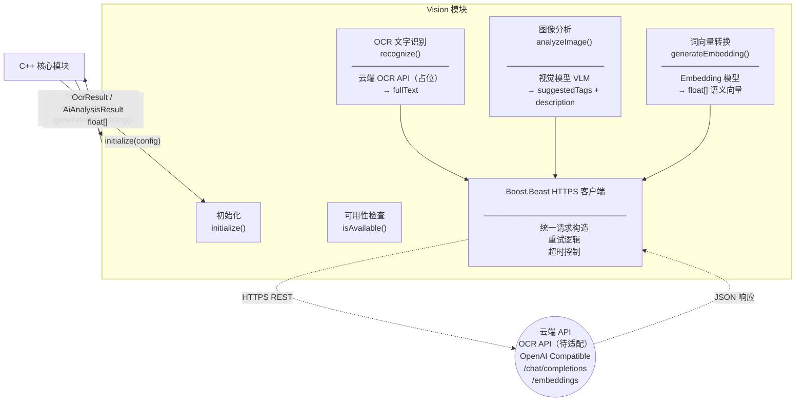
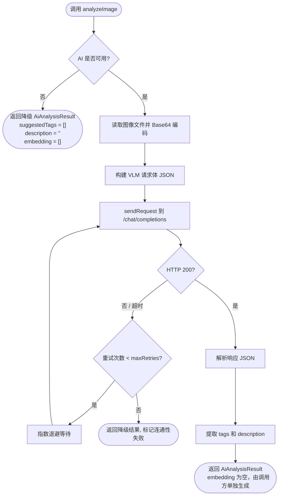
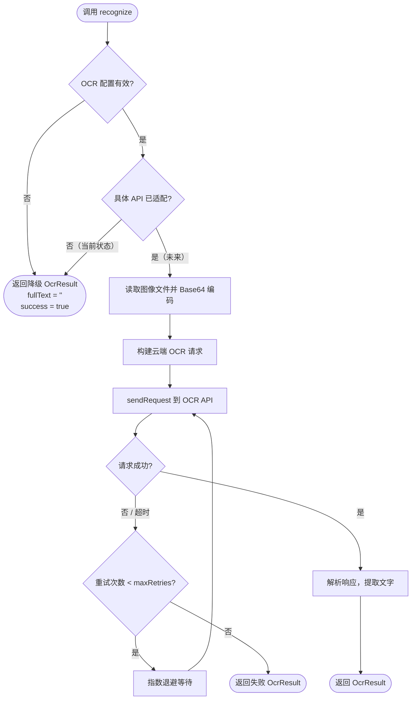

# Vision 模块

> **所属层级**：C++ 后端层（云端 OCR / LLM / VLM API）  
> **对应索引**：[Arch.md - Vision 模块](../02-Architecture/overview.md#vision-模块)

---

## Vision 能力概览

> 本模块统一管理所有云端视觉与 AI 能力的调用。按业务重要性分为三个层次：

| 优先级 | 能力             | 使用模型/服务          | 用途                                                                                  |
| ------ | ---------------- | ---------------------- | ------------------------------------------------------------------------------------- |
| 核心   | **OCR 文字识别** | 云端 OCR API（待适配） | 输入图片 → 提取图像中的文字内容，供搜索和向量化使用                                   |
| 核心   | **图像分析**     | 视觉模型 (VLM)         | 输入图片 → 输出描述文本 + 推荐 Tags                                                   |
| 核心   | **词向量转换**   | Embedding 模型         | 将 OCR 文本 / AI 描述 / Tags / 用户搜索关键词转换为语义向量，供 sqlite-vec 相似度搜索 |

> OCR 文字识别、图像分析和词向量转换是搜索与索引的基石，三者均为核心能力。

---

## 目录

- [模块职责与边界](#模块职责与边界)
- [模块架构图](#模块架构图)
- [模块独有数据结构](#模块独有数据结构)
- [函数规范](#函数规范)
- [处理流程](#处理流程)
- [错误处理与边界情况](#错误处理与边界情况)

---

## 模块职责与边界

**负责的事情：**
- 封装对云端第三方 OCR API 和 LLM / VLM API 的 HTTPS 请求发送和响应解析
- **OCR 文字识别（核心）**：通过云端 OCR API 识别图像中的文字内容（具体 API 提供商待适配，当前保留占位接口）
- **图像分析（核心）**：通过视觉模型分析图片内容，生成描述文本和推荐 Tags
- **词向量转换（核心）**：通过 Embedding 模型将 OCR 文本 / AI 描述 / Tags / 用户搜索关键词转换为语义向量，供 sqlite-vec 进行相似度搜索
- 检查服务可用性（网络连通 + 配置有效性）
- 实现网络不可用时的降级策略

**不负责的事情：**
- 向量的持久化存储（由持久化模块负责）
- 业务调度（由 C++ 核心模块负责）
- 本地模型推理（所有能力均通过云端 API 调用）

---

## 模块架构图



---

## 模块独有数据结构

### `VisionConfig` — Vision 模块配置（来自 Arch.md 全局部分，此处引用说明）

```
VisionConfig {
    apiKey          : string  // AI API 鉴权密钥（Header: Authorization: Bearer {apiKey}）
    apiBaseUrl      : string  // AI API 基础 URL（兼容 OpenAI 接口格式，如 https://api.openai.com/v1）
    visionModel     : string  // 图像分析模型名称（如 "gpt-4o"）
    embeddingModel  : string  // 向量化模型名称（如 "text-embedding-3-small"）
    timeoutSeconds  : int     // 单次 API 请求超时秒数（默认 30）
    maxRetries      : int     // 失败自动重试次数（默认 2，仅对网络错误重试）
    ocrApiKey       : string  // 云端 OCR API 密钥（可为空，空则 OCR 降级为空文本）
    ocrApiUrl       : string  // 云端 OCR API 地址（待适配具体提供商）
    ocrProvider     : string  // 云端 OCR 提供商标识（如 "baidu" / "tencent" / "google"，占位字段）
}
```

### `OcrResult` — OCR 识别结果

```
OcrResult {
    fullText  : string  // 识别出的完整文本
    success   : bool    // 是否成功
    error     : string  // 失败时的错误描述（可为空）
}
```

### `HttpRequest` — 内部 HTTP 请求描述

```
HttpRequest {
    method  : string            // HTTP 方法（"POST"）
    path    : string            // 接口路径（如 "/chat/completions"）
    headers : map<string, string>  // 请求头
    body    : string            // 序列化的 JSON 请求体
}
```

### `HttpResponse` — 内部 HTTP 响应描述

```
HttpResponse {
    statusCode : int     // HTTP 状态码
    body       : string  // 响应体原始字符串
    success    : bool    // statusCode 为 2xx 视为成功
}
```

### `VisionMessage` — 图像分析请求消息格式（OpenAI VLM 格式）

```
VisionMessage {
    role    : string  // "user"
    content : [
        { type: "image_url", image_url: { url: "data:image/png;base64,{base64}" } },
        { type: "text",      text: "分析这张图片，用中文输出5个描述标签和1句描述..." }
    ]
}
```

### `EmbeddingDimension` — 向量维度约定

```
// 向量维度由所配置的 embeddingModel 决定，存储前需与 sqlite-vec 建表时声明的维度一致
// 默认参考值（使用 text-embedding-3-small）：1536 维
// 模块初始化时通过一次 Embedding 调用自动探测并缓存实际维度
EmbeddingDimension : int  // 运行时确定
```

---

## 函数规范

### `initialize`

```
initialize(config: VisionConfig): bool
```

- **描述**：
  1. 保存 `VisionConfig` 配置，初始化 Boost.Beast HTTPS 客户端
  2. 调用 `isAvailable()` 发起一次轻量级 ping（向 `/models` 接口发送 GET 请求）
  3. 若 AI 可用，发起一次小文本 Embedding 请求探测并缓存 `EmbeddingDimension`
  4. 检查 OCR 配置是否有效（`ocrApiKey` / `ocrApiUrl` 非空），记录 OCR 可用性状态
  5. 记录初始化结果（各能力可用/不可用均不视为严重错误，系统可在部分能力不可用时降级运行）
- **输入**：`config`：Vision 配置对象
- **输出**：初始化（包含连通性检查）成功返回 `true`；配置无效（apiKey 为空等）返回 `false`

---

### `recognize`

```
recognize(imagePath: string): OcrResult
```

- **描述**：
  1. 检查 OCR 配置是否有效（`ocrApiKey` / `ocrApiUrl` 非空），无效则返回降级结果（空文本）
  2. 读取图像文件并编码为 Base64
  3. 根据 `ocrProvider` 构建对应云端 OCR API 的请求格式（当前为占位实现，返回降级结果）
  4. 发送请求（含重试逻辑），解析响应
  5. 提取识别文本，拼接为 `fullText`
  6. 返回 `OcrResult`

  > **当前状态**：占位接口。`recognize()` 内部目前直接返回降级结果 `OcrResult { fullText: "", success: true, error: "" }`。
- **输入**：`imagePath`：图像文件绝对路径
- **输出**：`OcrResult`

---

### `analyzeImage`

```
analyzeImage(imagePath: string): AiAnalysisResult
```

- **描述**：
  1. 检查 `isAvailable()`，不可用立即返回降级结果
  2. 读取图像文件并编码为 Base64（PNG 格式）
  3. 构建 OpenAI `/chat/completions` 请求，使用预设提示词要求模型以 JSON 格式返回 `{ tags: string[], description: string }`
  4. 发送请求（含重试逻辑），解析响应 JSON
  5. 提取 `tags` 列表（最多 10 个）和 `description` 文本
  6. 返回 `AiAnalysisResult`（`embedding` 字段为空向量，向量生成由调用方 C++ 核心模块负责，使用 `ocrText + description + tags` 拼接后调用 `generateEmbedding()` 单独生成）
- **输入**：`imagePath`：图像文件绝对路径
- **输出**：`AiAnalysisResult`（`embedding` 为空，待调用方填充）

---

### `generateEmbedding`

```
generateEmbedding(text: string): float[]
```

- **描述**：
  1. 检查 `isAvailable()`，不可用返回空向量 `[]`
  2. 若 `text` 为空字符串，返回全零向量（维度为 `EmbeddingDimension`）
  3. 若文本过长（超过模型 token 限制），截断至最大长度（约 8000 字符）
  4. 构建 `/embeddings` 请求，发送并解析响应中的 `data[0].embedding` 浮点数组
- **输入**：`text`：需要向量化的文本
- **输出**：`float[]` 语义向量；失败时返回空向量 `[]`

---

### `isAvailable`

```
isAvailable(): bool
```

- **描述**：检查 AI 服务（VLM + Embedding）当前是否可用，条件为：
  1. `VisionConfig.apiKey` 非空
  2. `VisionConfig.apiBaseUrl` 非空且格式合法
  3. 最近一次调用未因网络错误失败（使用缓存的连通性状态，每 60 秒重新探测一次）
- **输入**：无
- **输出**：满足以上条件为 `true`

> 注意：`isAvailable()` 仅检查 AI 服务（VLM/Embedding）的可用性。OCR 的可用性通过 `ocrApiKey` / `ocrApiUrl` 非空独立判断。

---

### `isOcrAvailable`

```
isOcrAvailable(): bool
```

- **描述**：检查云端 OCR 服务当前是否可用，条件为：
  1. `VisionConfig.ocrApiKey` 非空
  2. `VisionConfig.ocrApiUrl` 非空
  3. `VisionConfig.ocrProvider` 非空
- **输入**：无
- **输出**：满足以上条件为 `true`

---

### `reconfigure`

```
reconfigure(config: VisionConfig): void
```

- **描述**：在运行时替换 Vision 模块的内部配置，用于 `PATCH /api/config` 热更新场景。接收新的 `VisionConfig`，替换 API Key、基础 URL、模型名称、OCR 配置、超时和重试策略等。若 `apiKey` 变为空，则标记 AI 不可用。调用后立即重新探测连通性（通过 `isAvailable()`）并更新 `EmbeddingDimension` 缓存（若 `embeddingModel` 变更）。
- **输入**：`config`：新的 Vision 配置对象
- **输出**：无

---

### `shutdown`

```
shutdown(): void
```

- **描述**：关闭 Boost.Beast HTTPS 客户端，释放 SSL 上下文和连接池资源。
- **输入**：无
- **输出**：无

---

### `sendRequest`（内部函数）

```
sendRequest(req: HttpRequest): HttpResponse
```

- **描述**：
  1. 通过 Boost.Beast 发送 HTTPS 请求，设置 `Authorization: Bearer {apiKey}` 和 `Content-Type: application/json` 请求头
  2. 等待响应，超时时间为 `VisionConfig.timeoutSeconds`
  3. 若发生网络错误（连接失败、超时），按 `maxRetries` 进行指数退避重试
  4. 返回 `HttpResponse`（含状态码和响应体）
- **输入**：`req`：内部 HTTP 请求描述对象
- **输出**：`HttpResponse`

---

## 处理流程

### `analyzeImage` 调用完整流程



### `recognize` 调用完整流程



---

## 错误处理与边界情况

| 场景                                                 | 处理策略                                                                                                                                          |
| ---------------------------------------------------- | ------------------------------------------------------------------------------------------------------------------------------------------------- |
| `apiKey` 未配置（空字符串）                          | `isAvailable()` 返回 `false`，图像分析和词向量功能静默降级，不报错                                                                                |
| `ocrApiKey` 未配置（空字符串）                       | `isOcrAvailable()` 返回 `false`，OCR 降级为空文本，`ocrStatus` 设为 `SKIPPED`                                                                     |
| 网络不可用（API 服务器无法连接）                     | `sendRequest` 重试 `maxRetries` 次后标记连通性失败，`analyzeImage` / `generateEmbedding` / `recognize` 返回降级结果                               |
| API 返回 HTTP 401（认证失败）                        | 不重试，标记连通性失败（API Key 无效），记录错误日志，返回降级结果                                                                                |
| API 返回 HTTP 429（限额超限）                        | 不重试，返回 `ERR_QUOTA_EXCEEDED`，对于 `analyzeImage` / `recognize` 返回降级结果                                                                 |
| VLM 响应的 JSON 格式非预期（模型未按指令格式化输出） | 尝试使用正则提取 `tags` 和 `description` 字段；提取失败则返回降级结果                                                                             |
| 图像文件过大（Base64 编码超过模型限制，通常约 20MB） | 调用前缩放图像至 ≤1024px 长边后再 Base64 编码                                                                                                     |
| `generateEmbedding` 输入文本超长                     | 截断至约 8000 字符（保留语义关键词部分），不抛出错误                                                                                              |
| 多线程并发调用 API 接口                              | Boost.Beast 客户端基于 Boost.Asio 异步 I/O，并发请求同时发出，无串行化限制（受制于 API 限速）                                                     |
| 连通性探测失败后服务重新上线                         | 每 60 秒自动重新探测 `isAvailable()`，恢复后自动重启相关功能                                                                                      |
| Embedding 模型切换（`embeddingModel` 变更）          | 前端配置模块在检测到 `embeddingModel` 变更时弹出警告提示用户需重建向量索引；C++ 核心模块提供 `handleRebuildEmbeddings()` 异步重建所有 Meme 的向量 |
| AI 不可用时的向量降级                                | 不生成 embedding 向量（设 `aiStatus = SKIPPED`），向量搜索自动跳过无向量的 Meme 条目                                                              |
| 云端 OCR API 适配（未来）                            | 当前 `recognize()` 为占位实现，返回降级结果。后续适配具体 API 时实现完整调用逻辑                                                                  |
