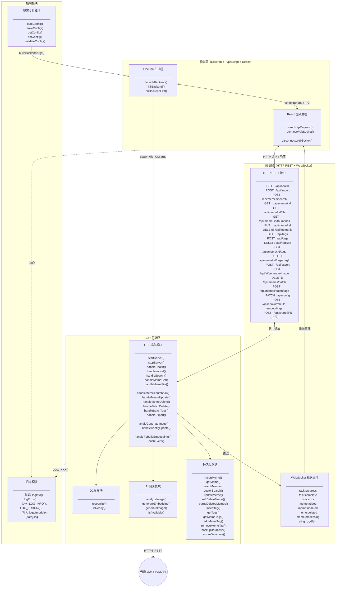

# QuickMemes 技术架构总索引

> 本文件为 QuickMemes 项目技术规划主索引，包含全局架构图、全局共享数据结构，以及各模块的职责描述与对外接口摘要。  
> 各模块详细规划请通过各节末尾链接跳转至对应 B 文件查阅。

---

## 目录

- [QuickMemes 技术架构总索引](#quickmemes-技术架构总索引)
  - [目录](#目录)
  - [全局架构图](#全局架构图)
  - [全局共享数据结构](#全局共享数据结构)
    - [`MemeEntry` — Meme 条目](#memeentry--meme-条目)
    - [`Tag` — 标签](#tag--标签)
    - [`SearchQuery` — 搜索查询参数](#searchquery--搜索查询参数)
    - [`ImportTask` — 导入任务](#importtask--导入任务)
    - [`AiAnalysisResult` — AI 分析结果](#aianalysisresult--ai-分析结果)
    - [`OcrResult` — OCR 识别结果](#ocrresult--ocr-识别结果)
    - [`WsEvent` — WebSocket 推送事件](#wsevent--websocket-推送事件)
  - [模块索引](#模块索引)
    - [前端模块](#前端模块)
    - [通信协议模块](#通信协议模块)
    - [C++ 核心模块](#c-核心模块)
    - [OCR 模块](#ocr-模块)
    - [AI 网关模块](#ai-网关模块)
    - [持久化模块](#持久化模块)
    - [日志模块](#日志模块)
    - [配置文件模块](#配置文件模块)

---

## 全局架构图

> 此图描述各层次之间的进程拓扑、数据流向以及各模块对外暴露的核心接口函数。



---

## 全局共享数据结构

> 以下数据结构在多个模块间共享传递，采用 `nlohmann/json` 序列化后通过 HTTP/WebSocket 跨进程传输。  
> C++ 端以 `struct` 定义，前端以 `TypeScript interface` 对应映射。

---

### `MemeEntry` — Meme 条目

```
MemeEntry {
    id          : int64            // 数据库自增主键
    filePath    : string           // 本地文件绝对路径
    fileHash    : string           // SHA-256 文件哈希（用于去重）
    mimeType    : string           // 文件 MIME 类型，如 "image/png"
    fileSize    : int64            // 文件大小，单位字节
    width       : int32            // 图像宽度（像素）
    height      : int32            // 图像高度（像素）
    sourceName  : string           // 来源名称，如 "Twitter"（可为空）
    sourceUrl   : string           // 来源 URL（可为空）
    name        : string           // 用户自定义名称（可为空，默认文件名）
    description : string           // 用户自定义描述（可为空）
    ocrText     : string           // OCR 识别出的全文（可为空）
    ocrStatus   : ProcessingStatus // OCR 处理状态
    aiStatus    : ProcessingStatus // AI 分析处理状态
    tagIds      : int64[]          // 关联标签 ID 列表
    createdAt   : int64            // Unix 时间戳（毫秒）
    updatedAt   : int64            // Unix 时间戳（毫秒）
    deletedAt   : int64            // 软删除时间戳（毫秒，0 表示未删除）
}

// ProcessingStatus 枚举
ProcessingStatus : "PENDING" | "PROCESSING" | "DONE" | "FAILED" | "SKIPPED"

// 注意：embedding 向量仅在数据库内部存储和使用，HTTP 响应中不包含此字段，
// 以减少网络传输开销。向量搜索时，结果中会包含 similarityScore 字段。
```

---

### `Tag` — 标签

```
Tag {
    id        : int64    // 数据库自增主键
    name      : string   // 标签名称，全局唯一
    color     : string   // 显示颜色，HEX 格式，如 "#FF5733"（可为空）
    createdAt : int64    // Unix 时间戳（毫秒）
}
```

---

### `SearchQuery` — 搜索查询参数

```
SearchQuery {
    keyword    : string    // 关键词，用于模糊匹配名称/描述/OCR 文本（可为空）
    tagIds     : int64[]   // 按标签过滤（空表示不过滤）
    source     : string    // 按来源名称过滤（可为空）
    timeFrom   : int64     // 时间范围起始时间戳（毫秒，0 表示不限）
    timeTo     : int64     // 时间范围结束时间戳（毫秒，0 表示不限）
    formats    : string[]  // 文件格式过滤，如 ["image/gif"]（空表示不过滤）
    sizeMin    : int64     // 最小文件大小（字节，0 表示不限）
    sizeMax    : int64     // 最大文件大小（字节，0 表示不限）
    regex      : string    // 正则表达式，匹配名称/描述/OCR 文本（可为空）
    useVector  : bool      // 是否启用语义向量搜索
    sortBy     : string    // 排序字段："createdAt" | "name" | "fileSize" | "updatedAt"
    sortOrder  : string    // 排序方向："ASC" | "DESC"
    limit      : int32     // 每页结果数量（默认 50，最大 200）
    offset     : int32     // 分页偏移量（默认 0）
}
```

---

### `ImportTask` — 导入任务

```
ImportTask {
    taskId     : string        // UUID，唯一任务标识
    source     : ImportSource  // 导入来源枚举
    inputs     : string[]      // 输入内容列表（URL 列表 / 文件路径列表）
    status     : TaskStatus    // 当前状态枚举
    total      : int32         // 总任务数
    processed  : int32         // 已处理数
    succeeded  : int32         // 成功数
    failed     : int32         // 失败数
    errors     : string[]      // 各失败项的错误描述
    createdAt  : int64         // 任务创建时间戳（毫秒）
}

// ImportSource 枚举
ImportSource : "URL" | "CLIPBOARD" | "LOCAL_FILE" | "SCREENSHOT" | "DRAG_DROP"

// TaskStatus 枚举
TaskStatus : "PENDING" | "PROCESSING" | "DONE" | "FAILED" | "CANCELLED"
```

---

### `AiAnalysisResult` — AI 分析结果

```
AiAnalysisResult {
    suggestedTags : string[]  // AI 建议的标签列表
    description   : string    // AI 生成的描述文本
    embedding     : float[]   // 语义向量（维度由配置的模型决定）
    success       : bool      // 是否成功
    error         : string    // 失败时的错误描述（可为空）
}
```

---

### `OcrResult` — OCR 识别结果

```
OcrResult {
    fullText  : string       // 识别出的完整文本拼接
    blocks    : TextBlock[]  // 各独立文字块列表
    success   : bool         // 是否成功
    error     : string       // 失败时的错误描述（可为空）
}

TextBlock {
    text        : string   // 该块文字内容
    confidence  : float    // 识别置信度（0.0 ~ 1.0）
    x           : int32    // 边框左上角 X 坐标
    y           : int32    // 边框左上角 Y 坐标
    w           : int32    // 边框宽度
    h           : int32    // 边框高度
}
```

---

### `WsEvent` — WebSocket 推送事件

```
WsEvent {
    event   : string  // 事件类型名称
    payload : any     // 事件负载（JSON 对象，各事件不同）
}

// 各事件 payload 类型：
// "task:progress"    -> { taskId: string, processed: int, total: int }
// "task:complete"    -> { taskId: string, succeeded: int, failed: int }
// "task:error"       -> { taskId: string, error: string }
// "meme:added"       -> MemeEntry
// "meme:updated"     -> MemeEntry
// "meme:deleted"     -> { id: int64 }
// "meme:processing"  -> { id: int64, ocrStatus: ProcessingStatus, aiStatus: ProcessingStatus }
// "ping"             -> {}（心跳帧，每 30 秒发送一次）
```

> 其余协议专用数据结构（`ImportRequest`、`MemePatch`、`ExportRequest`、`ExportResult`、`GeneratedImage`、`ShareOptions`、`ShareResult`、`RuntimeConfigPatch` 等）定义于 [ipc_protocol.md](./arch/ipc_protocol.md#模块独有数据结构)。

---

## 模块索引

---

### 前端模块

**职责**：管理 Electron 主进程生命周期（包括 C++ 后端子进程的启动与销毁），提供 React 渲染进程的 UI 展示、用户交互响应、全局快捷键绑定及剪贴板操作。

**对外接口（Electron 主进程，暴露给渲染进程）**

| 函数签名                                                              | 说明                       | 参数                                      | 返回值                                     |
| --------------------------------------------------------------------- | -------------------------- | ----------------------------------------- | ------------------------------------------ |
| `launchBackend(): Promise<void>`                                      | 启动 C++ 后端子进程        | 无                                        | 启动成功后 resolve                         |
| `killBackend(): Promise<void>`                                        | 终止 C++ 后端子进程        | 无                                        | 终止完成后 resolve                         |
| `onBackendExit(callback: (code: number) => void): void`               | 监听后端进程退出事件       | `callback`：退出回调函数                  | 无                                         |
| `readClipboardImage(): Promise<string \| null>`                       | 读取剪贴板中的图像数据     | 无                                        | Base64 编码图像字符串，无图像时返回 `null` |
| `writeClipboardImage(filePath: string): Promise<void>`                | 将图像写入剪贴板           | `filePath`：本地文件路径                  | 无                                         |
| `registerGlobalShortcut(key: string, callback: () => void): void`     | 注册全局快捷键             | `key`：快捷键字符串；`callback`：触发回调 | 无                                         |
| `unregisterGlobalShortcut(key: string): void`                         | 注销全局快捷键             | `key`：快捷键字符串                       | 无                                         |
| `showMemePanel(): void`                                               | 显示 Meme 快速取用面板窗口 | 无                                        | 无                                         |
| `hideMemePanel(): void`                                               | 隐藏 Meme 快速取用面板窗口 | 无                                        | 无                                         |
| `openFileDialog(options: FileDialogOptions): Promise<string[]>`       | 打开系统文件选择对话框     | `options`：过滤器等配置                   | 用户选择的文件路径列表                     |
| `saveFileDialog(options: SaveDialogOptions): Promise<string \| null>` | 打开系统文件保存对话框     | `options`：默认文件名等配置               | 用户选择的保存路径                         |

> 📄 详细规划 → [docs/arch/frontend.md](./arch/frontend.md)

---

### 通信协议模块

**职责**：定义前端 React 与 C++ 后端之间通信的完整协议，包括 HTTP REST 端点规范和 WebSocket 推送事件规范。本模块不包含业务逻辑，仅作协议契约。

**对外接口（HTTP REST，由 C++ 后端暴露）**

| 端点                            | 方法     | 说明                                 |
| ------------------------------- | -------- | ------------------------------------ |
| `/api/health`                   | `GET`    | 健康检查（各子模块就绪状态）         |
| `/api/import`                   | `POST`   | 提交导入任务                         |
| `/api/memes/search`             | `POST`   | 搜索 Meme 列表                       |
| `/api/meme/:id`                 | `GET`    | 获取单个 Meme                        |
| `/api/meme/:id/file`            | `GET`    | 获取 Meme 原始图像文件（二进制流）   |
| `/api/meme/:id/thumbnail`       | `GET`    | 获取 Meme 缩略图（二进制流）         |
| `/api/meme/:id`                 | `PUT`    | 更新 Meme 元数据                     |
| `/api/meme/:id`                 | `DELETE` | 软删除 Meme（移入回收站）            |
| `/api/tags`                     | `GET`    | 获取全部标签                         |
| `/api/tags`                     | `POST`   | 创建新标签                           |
| `/api/tags/:id`                 | `DELETE` | 删除标签                             |
| `/api/meme/:id/tags`            | `POST`   | 为 Meme 添加标签                     |
| `/api/meme/:id/tags/:tagId`     | `DELETE` | 移除 Meme 的标签                     |
| `/api/export`                   | `POST`   | 导出 Meme 到本地文件                 |
| `/api/ai/generate-image`        | `POST`   | AI 根据文本生成配图                  |
| `/api/memes/batch`              | `DELETE` | 批量软删除 Meme                      |
| `/api/memes/batch/tags`         | `POST`   | 批量为 Meme 添加标签                 |
| `/api/config`                   | `PATCH`  | 运行时配置热更新                     |
| `/api/admin/rebuild-embeddings` | `POST`   | 重建所有 Meme 的语义向量（异步任务） |
| `/api/share/link`               | `POST`   | 生成分享链接（🚧 占位，待完善）       |

**WebSocket 推送事件（C++ 后端 → 前端）**

| 事件名            | 说明                                |
| ----------------- | ----------------------------------- |
| `task:progress`   | 导入/处理任务进度更新               |
| `task:complete`   | 任务完成通知                        |
| `task:error`      | 任务失败通知                        |
| `meme:added`      | 新 Meme 已入库通知                  |
| `meme:updated`    | Meme 元数据更新通知                 |
| `meme:deleted`    | Meme 已删除通知                     |
| `meme:processing` | Meme OCR/AI 处理状态变更通知        |
| `ping`            | 心跳帧（每 30 秒，客户端回复 pong） |

> 📄 详细规划 → [docs/arch/ipc_protocol.md](./arch/ipc_protocol.md)

---

### C++ 核心模块

**职责**：作为整个后端的调度中枢，启动 HTTP 服务器和 WebSocket 服务器，将前端的请求路由到对应处理逻辑，并协调 OCR、AI 网关、持久化三个子模块完成业务处理，通过 WebSocket 向前端推送异步事件。

**对外接口（HTTP 路由处理函数）**

| 函数签名                                                       | 说明                                | 参数                             | 返回值               |
| -------------------------------------------------------------- | ----------------------------------- | -------------------------------- | -------------------- |
| `startServer(config: ServerConfig): bool`                      | 启动 HTTP + WebSocket 服务器        | `config`：服务器配置             | 启动成功返回 `true`  |
| `stopServer(): void`                                           | 停止服务器并释放资源                | 无                               | 无                   |
| `handleHealth(): HealthStatus`                                 | 返回各子模块就绪状态                | 无                               | 健康状态对象         |
| `handleImport(req: ImportRequest): ImportTask`                 | 处理导入请求，先入库后异步 OCR/AI   | `req`：导入请求参数              | 创建的 `ImportTask`  |
| `handleSearch(query: SearchQuery): SearchResult`               | 处理搜索请求                        | `query`：搜索参数                | 带分数的 Meme 列表   |
| `handleMemeGet(id: int64): MemeEntry`                          | 获取单个 Meme                       | `id`：Meme ID                    | 对应 `MemeEntry`     |
| `handleMemeFile(id: int64): BinaryStream`                      | 返回 Meme 原始图像二进制流          | `id`：Meme ID                    | 图像二进制流         |
| `handleMemeThumbnail(id: int64): BinaryStream`                 | 返回 Meme 缩略图二进制流            | `id`：Meme ID                    | 缩略图二进制流       |
| `handleMemeUpdate(id: int64, patch: MemePatch): MemeEntry`     | 更新 Meme 元数据                    | `id`：Meme ID；`patch`：变更字段 | 更新后的 `MemeEntry` |
| `handleMemeDelete(id: int64): bool`                            | 软删除 Meme（移入回收站）           | `id`：Meme ID                    | 操作成功返回 `true`  |
| `handleBatchDelete(ids: int64[]): BatchResult`                 | 批量软删除 Meme                     | `ids`：Meme ID 列表              | 批量操作结果         |
| `handleBatchTags(memeIds: int64[], tagId: int64): BatchResult` | 批量为 Meme 添加标签                | `memeIds`：Meme ID 列表；`tagId` | 批量操作结果         |
| `handleExport(req: ExportRequest): ExportResult`               | 导出 Meme 到本地路径                | `req`：导出目标路径等参数        | 导出结果             |
| `handleGenerateImage(prompt: string): GeneratedImage`          | 调用 AI 根据文本生成图片            | `prompt`：文字描述               | 生成的图像数据       |
| `handleConfigUpdate(patch: RuntimeConfigPatch): bool`          | 运行时配置热更新                    | `patch`：变更字段                | 更新成功返回 `true`  |
| `handleRebuildEmbeddings(): ImportTask`                        | 重建所有 Meme 语义向量（异步）      | 无                               | 重建任务对象         |
| `pushEvent(event: WsEvent): void`                              | 向所有已连接前端推送 WebSocket 事件 | `event`：事件对象                | 无                   |

> 📄 详细规划 → [docs/arch/cpp_core.md](./arch/cpp_core.md)

---

### OCR 模块

**职责**：封装 PaddleOCR PP-OCRv5，对输入的图像文件执行本地 CPU 推理，提取图像中的文字信息，输出结构化识别结果，供 C++ 核心模块用于入库存储和向量化。

**对外接口**

| 函数签名                                                                  | 说明                          | 参数                                              | 返回值                |
| ------------------------------------------------------------------------- | ----------------------------- | ------------------------------------------------- | --------------------- |
| `initialize(modelDir: string): bool`                                      | 初始化 OCR 引擎，加载模型文件 | `modelDir`：模型文件目录路径                      | 初始化成功返回 `true` |
| `recognize(imagePath: string): OcrResult`                                 | 对指定图像执行 OCR 文字识别   | `imagePath`：图像文件本地路径                     | `OcrResult` 识别结果  |
| `recognizeBuffer(imageData: uint8[], width: int, height: int): OcrResult` | 对内存中图像数据执行识别      | `imageData`：原始图像字节；`width`/`height`：尺寸 | `OcrResult` 识别结果  |
| `isReady(): bool`                                                         | 检查 OCR 引擎是否已就绪       | 无                                                | 就绪返回 `true`       |
| `shutdown(): void`                                                        | 释放 OCR 引擎资源             | 无                                                | 无                    |

> 📄 详细规划 → [docs/arch/ocr.md](./arch/ocr.md)

---

### AI 网关模块

**职责**：封装对云端第三方 LLM / VLM API 的调用，提供图像内容分析（打标签/描述生成）、文本转语义向量（用于 sqlite-vec 模糊搜索）以及 AI 配图生成三项能力。包含网络不可用时的降级策略。

**对外接口**

| 函数签名                                            | 说明                                            | 参数                      | 返回值                |
| --------------------------------------------------- | ----------------------------------------------- | ------------------------- | --------------------- |
| `initialize(config: AiConfig): bool`                | 初始化 AI 网关，配置 API Key 和模型参数         | `config`：API 配置对象    | 初始化成功返回 `true` |
| `analyzeImage(imagePath: string): AiAnalysisResult` | 对图像进行多模态分析，返回标签和描述            | `imagePath`：图像文件路径 | `AiAnalysisResult`    |
| `generateEmbedding(text: string): float[]`          | 将文本转换为语义向量                            | `text`：输入文本          | 浮点数向量            |
| `generateImage(prompt: string): GeneratedImage`     | 根据文本描述生成图像                            | `prompt`：文字描述        | `GeneratedImage`      |
| `isAvailable(): bool`                               | 检查 AI 服务当前是否可用（网络连通 + 配置有效） | 无                        | 可用返回 `true`       |
| `shutdown(): void`                                  | 释放 HTTP 客户端资源                            | 无                        | 无                    |

> 📄 详细规划 → [docs/arch/ai_gateway.md](./arch/ai_gateway.md)

---

### 持久化模块

**职责**：封装所有 SQLite 数据库读写操作，通过 SQLiteCpp 管理 Meme 条目、标签及其关联关系；通过 sqlite-vec 扩展支持语义向量的存储与相似度查询；提供软删除回收站机制和数据库自动备份/恢复功能。

**对外接口**

| 函数签名                                                    | 说明                             | 参数                                     | 返回值                |
| ----------------------------------------------------------- | -------------------------------- | ---------------------------------------- | --------------------- |
| `initialize(dbPath: string): bool`                          | 打开数据库连接，执行建表迁移     | `dbPath`：数据库文件路径                 | 初始化成功返回 `true` |
| `insertMeme(meme: MemeEntry): int64`                        | 插入新 Meme 记录                 | `meme`：Meme 数据对象                    | 新记录的 ID           |
| `getMeme(id: int64): MemeEntry`                             | 按 ID 查询单个 Meme              | `id`：Meme ID                            | `MemeEntry`           |
| `searchMemes(query: SearchQuery): MemeEntry[]`              | 按条件搜索 Meme 列表             | `query`：搜索参数                        | 匹配结果列表          |
| `vectorSearch(embedding: float[], limit: int): MemeEntry[]` | 按语义向量相似度查询 Meme        | `embedding`：查询向量；`limit`：返回数量 | 相似度排序结果列表    |
| `updateMeme(id: int64, patch: MemePatch): bool`             | 更新 Meme 字段                   | `id`：Meme ID；`patch`：变更字段集合     | 更新成功返回 `true`   |
| `softDeleteMeme(id: int64): bool`                           | 软删除 Meme（设置 `deleted_at`） | `id`：Meme ID                            | 操作成功返回 `true`   |
| `restoreMeme(id: int64): bool`                              | 从回收站恢复 Meme                | `id`：Meme ID                            | 恢复成功返回 `true`   |
| `purgeDeletedMemes(olderThanDays: int): int`                | 彻底清理过期软删除记录           | `olderThanDays`：超过天数                | 清理的记录数          |
| `insertTag(tag: Tag): int64`                                | 插入新标签记录                   | `tag`：标签数据对象                      | 新标签 ID             |
| `getTags(): Tag[]`                                          | 获取全部标签列表                 | 无                                       | 标签列表              |
| `getMemeTags(memeId: int64): Tag[]`                         | 获取指定 Meme 的所有标签         | `memeId`：Meme ID                        | 标签列表              |
| `addMemeTag(memeId: int64, tagId: int64): bool`             | 为 Meme 添加标签关联             | `memeId`：Meme ID；`tagId`：Tag ID       | 操作成功返回 `true`   |
| `removeMemeTag(memeId: int64, tagId: int64): bool`          | 移除 Meme 的标签关联             | `memeId`：Meme ID；`tagId`：Tag ID       | 操作成功返回 `true`   |
| `backupDatabase(): string`                                  | 创建数据库备份文件               | 无                                       | 备份文件路径          |
| `restoreDatabase(backupPath: string): bool`                 | 从备份恢复数据库                 | `backupPath`：备份文件路径               | 恢复成功返回 `true`   |
| `shutdown(): void`                                          | 关闭数据库连接，释放资源         | 无                                       | 无                    |

> 📄 详细规划 → [docs/arch/persistence.md](./arch/persistence.md)

---

### 日志模块

**职责**：横切关注点模块，覆盖前端 Electron 层和 C++ 后端层。提供统一的结构化日志接口，输出至控制台和文件（`logs/{module}-{YYYY-MM-DD}.log`）。支持五个等级（`DEBUG / INFO / WARN / ERROR / FATAL`），C++ 端线程安全，`FATAL` 级自动终止进程。支持日志文件自动清理（可配置保留天数和开关）。

**对外接口**

| 函数签名                                                                       | 适用层               | 说明                                                        |
| ------------------------------------------------------------------------------ | -------------------- | ----------------------------------------------------------- |
| `logDebug(module, msg) / logInfo / logWarn / logError / logFatal`              | TypeScript（前端）   | 各等级日志输出快捷函数，渲染进程通过 IPC 转发至主进程写文件 |
| `setMinLevel(level: LogLevel): void`                                           | TypeScript（主进程） | 设置最低输出等级                                            |
| `LOG_DEBUG(module, msg)` / `LOG_INFO` / `LOG_WARN` / `LOG_ERROR` / `LOG_FATAL` | C++（宏）            | 各等级日志宏，调用全局 Logger 单例写入文件和 stderr         |
| `Logger::initialize(logDir: string, minLevel: LogLevel): void`                 | C++                  | 初始化 Logger，设置日志目录和最低等级                       |

> 📄 详细规划 → [docs/arch/logger.md](./arch/logger.md)

---

### 配置文件模块

**职责**：管理 `{app_dir}/config.json` 配置文件的读写和校验（由 Electron 主进程负责）。C++ 后端通过启动时的命令行参数接收所有配置项，不直接读写配置文件。提供 React 设置页面读取和修改配置的接口。

**对外接口（TypeScript，暴露给渲染进程）**

| 函数签名                                      | 说明                                          | 参数                 | 返回值           |
| --------------------------------------------- | --------------------------------------------- | -------------------- | ---------------- |
| `loadConfig(): AppConfig`                     | 从 `config.json` 加载配置，不存在则创建默认值 | 无                   | `AppConfig`      |
| `saveConfig(config: AppConfig): void`         | 将配置序列化写入 `config.json`                | `config`：完整配置   | 无               |
| `getConfig(): AppConfig`                      | 返回内存缓存中的当前配置                      | 无                   | `AppConfig`      |
| `setConfig(patch: Partial<AppConfig>): void`  | 合并变更并持久化，检测是否需要重启            | `patch`：变更字段    | 无               |
| `validateConfig(config: AppConfig): string[]` | 校验配置合法性，返回错误列表                  | `config`：待校验配置 | 错误描述列表     |
| `resetToDefaults(): AppConfig`                | 重置为默认值并写入磁盘                        | 无                   | 默认 `AppConfig` |

**C++ 命令行参数（Electron 启动时传入）**

```
--port --storage-path --db-path --model-dir --log-dir --log-level
--log-retention-enabled --log-retention-days
--api-key --api-base-url --vision-model --embedding-model --image-gen-model
--api-timeout --api-retries
--thumbnail-enabled --thumbnail-max-size
--backup-enabled --backup-retention-days
```

> 📄 详细规划 → [docs/arch/config.md](./arch/config.md)
