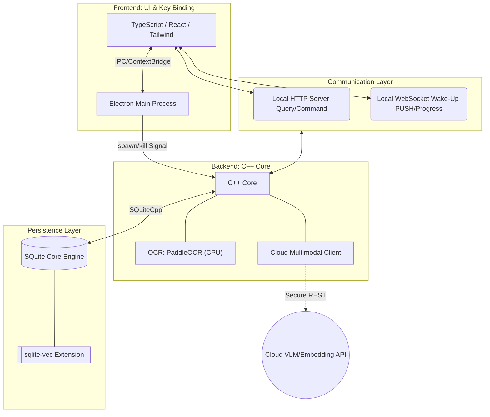

# QuickMemes 架构设计与技术栈规范

## 技术栈速览

**前后端分离**：UI与系统调用交互由前端 UI 框架管理，核心底层持久化策略与多模态匹配由独立后端进程执行。

| 模块         | 技术栈                        | 额外信息                             | 开源协议            | 外部链接/源                                            |
| ------------ | ----------------------------- | ------------------------------------ | ------------------- | ------------------------------------------------------ |
| **UI 框架**  | `Electron`                    | 生命周期管理与跨平台UI支持           | 开源 (MIT)          | [electronjs.org](https://www.electronjs.org)           |
| **前端语言** | `TypeScript`                  |                                      | 开源 (Apache-2.0)   | [typescriptlang.org](https://www.typescriptlang.org)   |
| **UI 构建**  | `React` + `Tailwind CSS`      |                                      | 开源 (MIT)          | [react.dev](https://react.dev)                         |
| **核心**     | `C++23` (基于 CMake 构建)     | C++23 后端                           | -                   | [isocpp.org](https://isocpp.org)                       |
| **通信**     | `cpp-httplib` + `WebSocket++` | HTTP REST API + WebSocket长链通信    | 开源 (MIT, BSD-3)   | [cpp-httplib](https://github.com/yhirose/cpp-httplib)  |
| **数据传输** | `nlohmann/json`               | 前后端数据通信                       | 开源 (MIT)          | [nlohmann/json](https://github.com/nlohmann/json)      |
| **持久化**   | `SQLite3` + `SQLiteCpp`       | Tags、时间戳与索引等内容存储         | 开源 (PD, MIT)      | [sqlite.org](https://www.sqlite.org)                   |
| **向量查询** | `sqlite-vec`                  | 用于词向量模糊查询                   | 开源 (MIT)          | [sqlite-vec](https://github.com/asg017/sqlite-vec)     |
| **文字识别** | `PaddleOCR PP-OCRv5`          | OCR 文字识别                         | 开源 (Apache-2.0)   | [PaddleOCR](https://github.com/PaddlePaddle/PaddleOCR) |
| **云端AI**   | `第三方 LLM 接口`             | AI 打标签和 AI 表情包帮选 词向量转换 | 闭源 (商用网络 API) | -                                                      |

---

## 分层架构设计与交互拓扑

> 此图描述进程拓扑结构及其控制流数据链路。

---

