# 用户交互流程

> **所属层级**：前端 UI 设计 — 交互规范  
> **索引**：[UI.md](UI.md) · [布局规格](layout.md) · [组件规格](components.md) · [弹窗规格](dialogs.md)

---

## 目录

- [导入流程](#导入流程)
- [搜索流程](#搜索流程)
- [浏览与选择](#浏览与选择)
- [拖拽归类](#拖拽归类)
- [删除与回收站](#删除与回收站)
- [导出流程](#导出流程)
- [右键上下文菜单](#右键上下文菜单)
- [快捷键映射](#快捷键映射)

---

## 导入流程

QuickMemes 提供 4 种导入方式，全部通过顶栏搜索框内的 **⊕ 按钮**下拉菜单触发：

### 方式 1：快捷导入（拖拽文件）

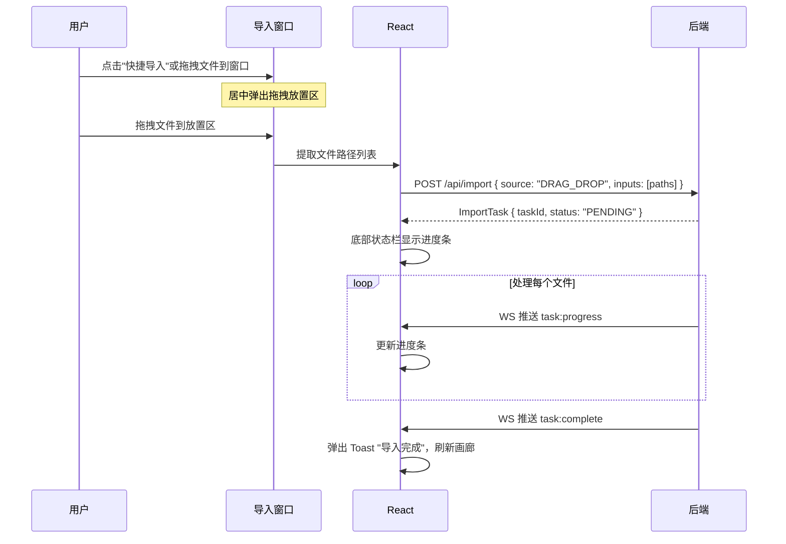

> **全局拖拽感知**：在任何时候，只要用户从系统文件管理器拖拽图片文件到 QuickMemes 窗口上方，快捷导入窗口会**自动弹出**并高亮放置区域。

### 方式 2：从剪贴板导入

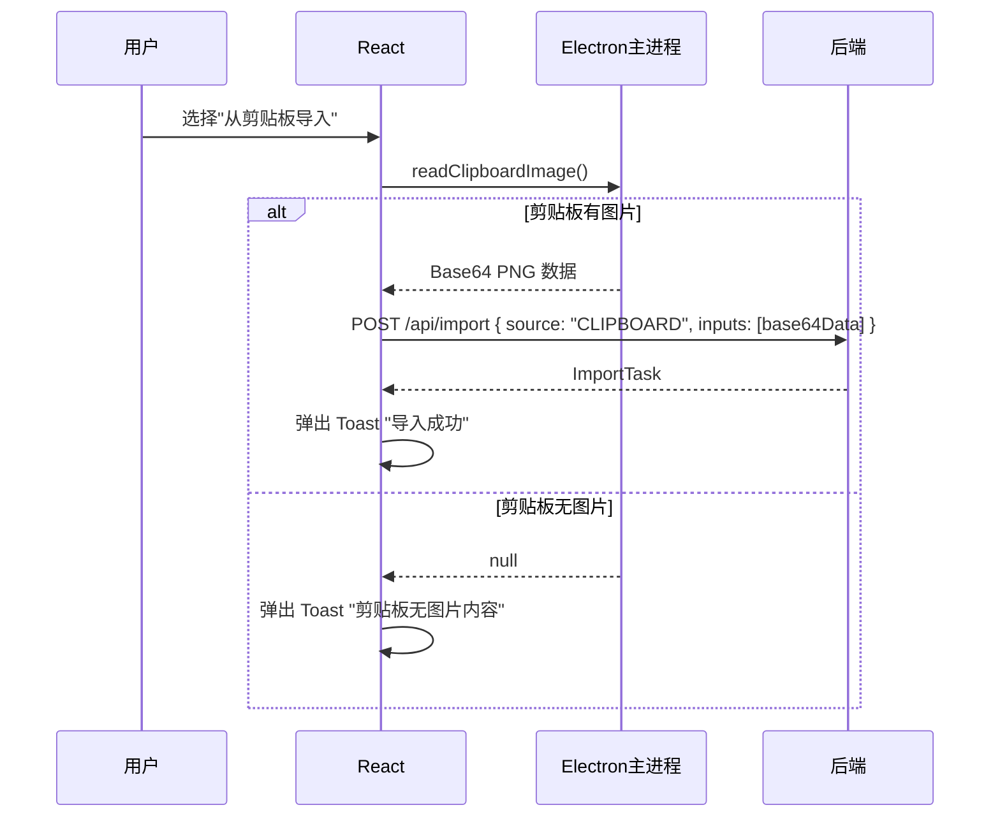

### 方式 3：从文件导入

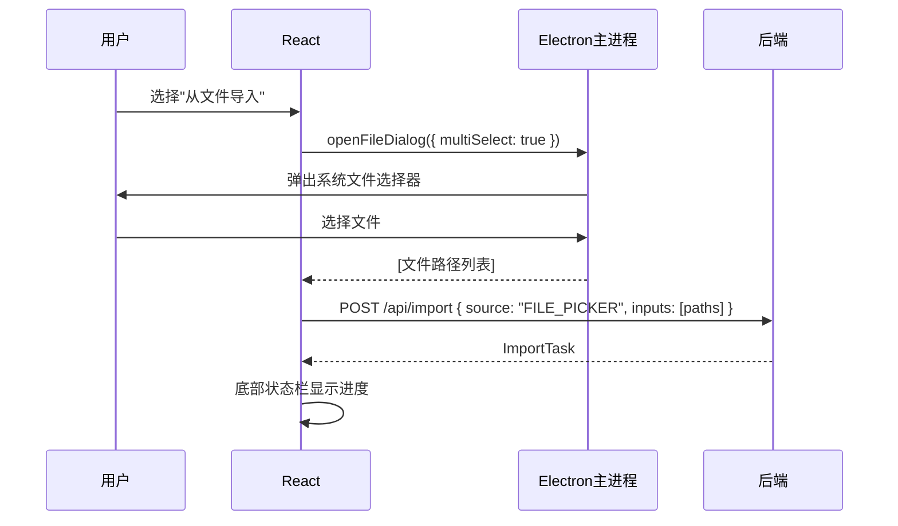

### 方式 4：从 URL 导入

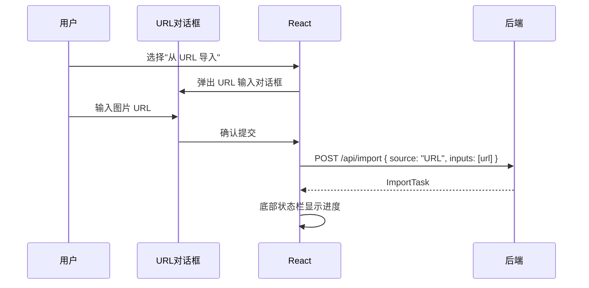

---

## 搜索流程

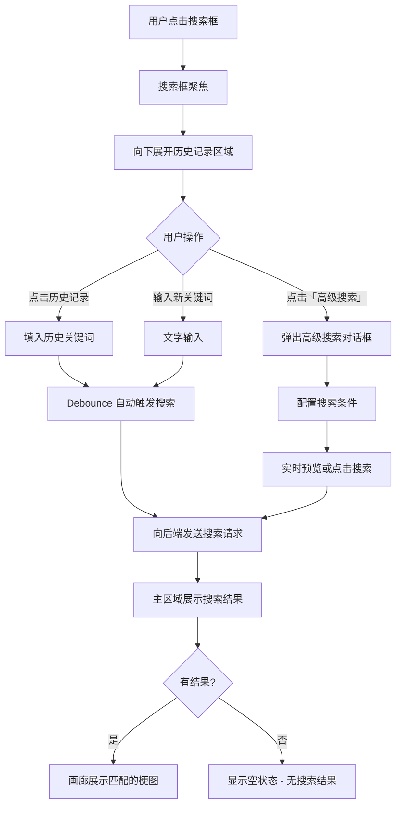

### 搜索范围

搜索请求会查询以下字段：

| 字段         | 搜索方式   |
| ------------ | ---------- |
| 文件名       | 关键词匹配 |
| 标签         | 精确匹配   |
| OCR 识别文本 | 全文搜索   |

### 高级搜索

高级搜索对话框提供的匹配模式选项：

| 模式     | 说明               |
| -------- | ------------------ |
| 词匹配   | 按完整词语匹配     |
| 模糊匹配 | 包含即匹配（默认） |
| 正则搜索 | 使用正则表达式匹配 |

---

## 浏览与选择

### 单击操作（效率复制）

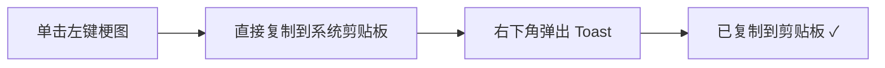

### 唤出属性面板（编辑模式）

> 属性面板默认隐藏，专注视觉浏览。

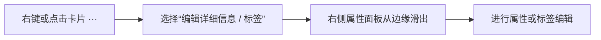

### 多选操作

| 操作方式               | 行为                                               |
| ---------------------- | -------------------------------------------------- |
| `Ctrl` + 左键          | 在已选集合中追加或取消该梗图                       |
| `Shift` + 左键         | 选中从上一个选中项到当前点击项之间的所有梗图       |
| 鼠标框选 (Rubber Band) | 在空白区域按住左键拖动，画出矩形，框内梗图全部选中 |

### 多选后的右侧面板

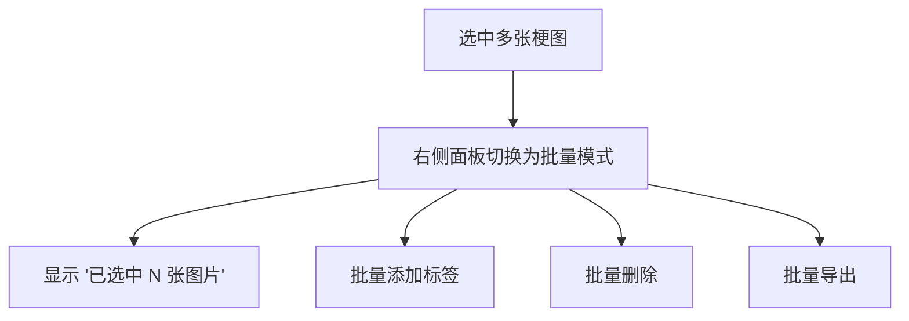

---

## 拖拽归类

将梗图从中间主区域拖拽到左侧导航栏的分类项上，实现快速归类。

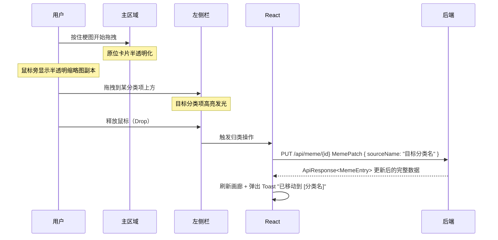

### 拖拽视觉反馈

| 阶段         | 视觉效果                                 |
| ------------ | ---------------------------------------- |
| 开始拖拽     | 原位卡片变为半透明，鼠标旁出现缩略图跟随 |
| 悬停有效目标 | 目标分类项高亮发光边框                   |
| 悬停无效目标 | 无特殊视觉提示                           |
| 释放成功     | 高亮消失，弹出成功 Toast                 |
| 释放到空白   | 取消拖拽，恢复原状                       |

---

## 删除与回收站

### 删除流程

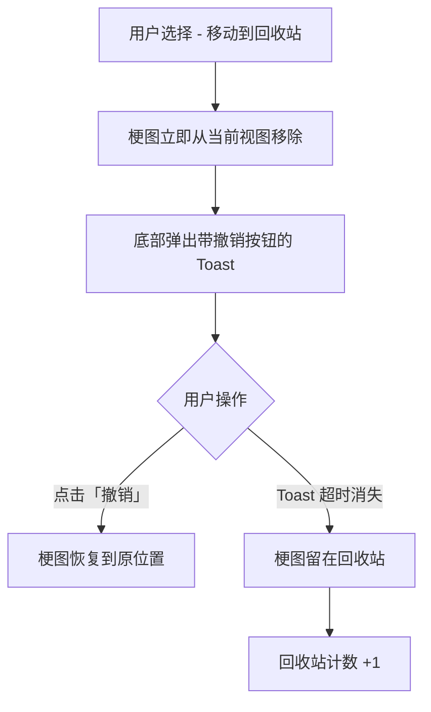

### 回收站内操作

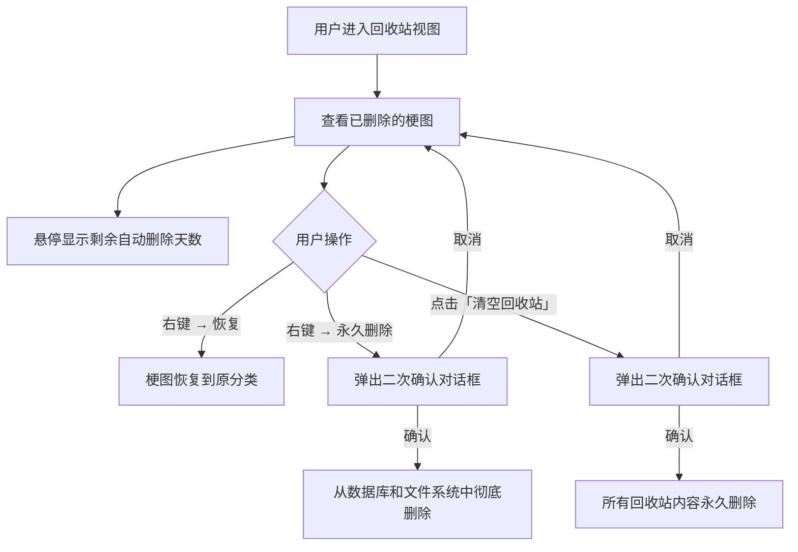

### 回收站特殊排序

| 排序选项           | 说明                     |
| ------------------ | ------------------------ |
| 按删除时间排序     | 最近删除的排在前面       |
| 按剩余生命周期排序 | 即将被自动删除的排在前面 |

---

## 导出流程

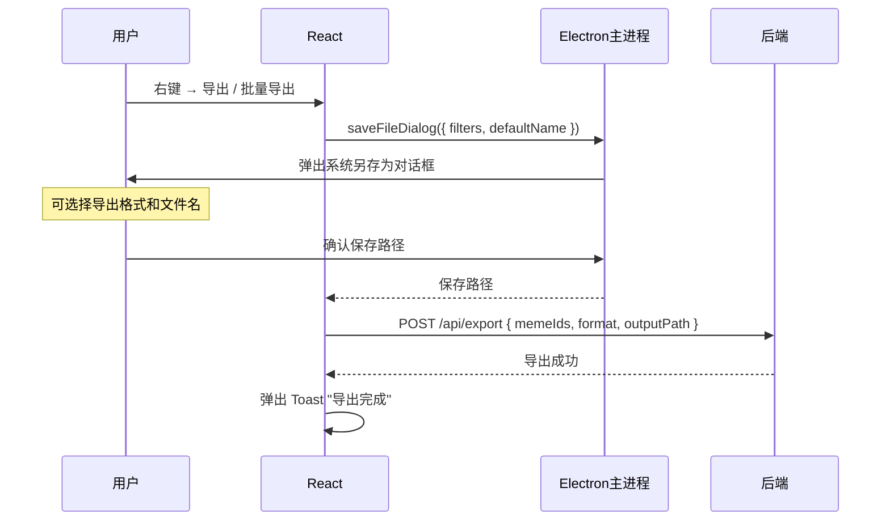

### 支持的导出格式

| 格式   | 说明                 |
| ------ | -------------------- |
| 原格式 | 保持导入时的原始格式 |
| PNG    | 转换为 PNG           |
| JPG    | 转换为 JPG           |

---

## 右键上下文菜单

### 菜单项列表

| 菜单项        | 快捷键   | 行为                        |
| ------------- | -------- | --------------------------- |
| 复制到剪贴板  | `Ctrl+C` | 将梗图写入系统剪贴板        |
| 导出          | `Ctrl+S` | 弹出另存为对话框            |
| 编辑详情/标签 | —        | 唤出并聚焦右侧面板          |
| 查看原图      | `Enter`  | 打开灯箱预览                |
| 移动到        | —        | 展开子菜单列出所有分类      |
| 移动到回收站  | `Delete` | 移入回收站 + 弹出撤销 Toast |

---

## 快捷键映射

### 全局快捷键（应用窗口内随时可用）

| 快捷键   | 操作                    |
| -------- | ----------------------- |
| `Ctrl+F` | 聚焦顶栏搜索框          |
| `Ctrl+V` | 从剪贴板导入梗图        |
| `Ctrl+,` | 打开设置对话框          |
| `Esc`    | 关闭当前弹窗 / 取消操作 |

### 画廊区域快捷键（焦点在主区域时）

| 快捷键          | 操作                       |
| --------------- | -------------------------- |
| `←` `→` `↑` `↓` | 在画廊梗图之间移动选中焦点 |
| `Enter`         | 打开灯箱预览               |
| `Ctrl+C`        | 复制选中梗图到剪贴板       |
| `Ctrl+S`        | 导出选中梗图               |
| `Delete`        | 移动选中梗图到回收站       |
| `Ctrl+A`        | 全选当前视图内所有梗图     |
| `Ctrl+D`        | 取消所有选择               |

### 灯箱预览快捷键

| 快捷键    | 操作                 |
| --------- | -------------------- |
| `←` / `→` | 切换上一张 / 下一张  |
| `+` / `-` | 放大 / 缩小          |
| `0`       | 恢复原始尺寸         |
| `Ctrl+C`  | 复制当前梗图到剪贴板 |
| `Esc`     | 关闭灯箱             |
