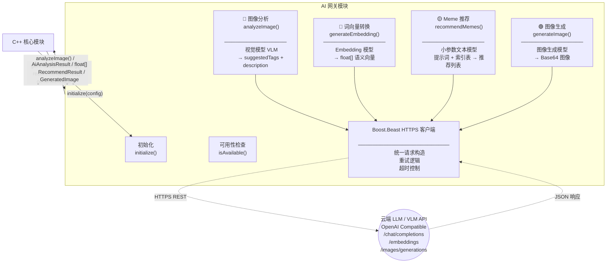
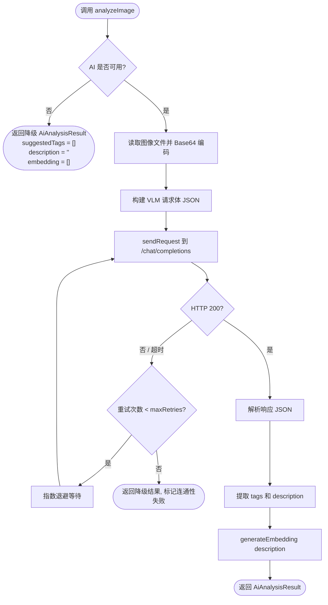
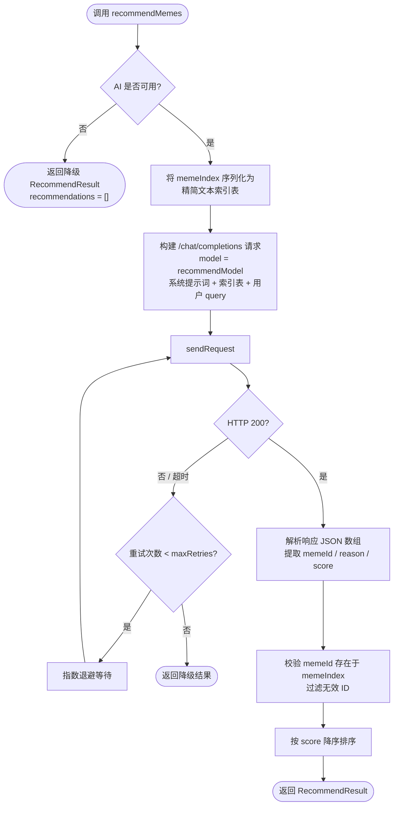

# AI 网关模块

> **所属层级**：C++ 后端层（云端第三方 LLM / VLM API）  
> **对应索引**：[Arch.md - AI 网关模块](../Arch.md#ai-网关模块)

---

## AI 能力概览

> 本模块统一管理所有云端 AI 能力的调用。按业务重要性分为四个层次：

| 优先级 | 能力           | 使用模型       | 用途                                                                                  |
| ------ | -------------- | -------------- | ------------------------------------------------------------------------------------- |
| 🔴 核心 | **图像分析**   | 视觉模型 (VLM) | 输入图片 → 输出描述文本 + 推荐 Tags                                                   |
| 🔴 核心 | **词向量转换** | Embedding 模型 | 将 OCR 文本 / AI 描述 / Tags / 用户搜索关键词转换为语义向量，供 sqlite-vec 相似度搜索 |
| 🟡 次要 | **Meme 推荐**  | 小参数文本模型 | 纯文本交互：提示词 + Meme 索引表 → 推荐匹配的 Meme                                    |
| 🟢 末位 | **图像生成**   | 图像生成模型   | 根据文字描述生成配图（辅助功能）                                                      |

> 其中图像分析和词向量转换是搜索与索引的基石，必须优先保障；Meme 推荐为增值功能（已有关键词搜索 + 向量搜索兜底）；图像生成为锦上添花。

---

## 目录

- [模块职责与边界](#模块职责与边界)
- [模块架构图](#模块架构图)
- [模块独有数据结构](#模块独有数据结构)
- [函数规范](#函数规范)
- [处理流程](#处理流程)
- [错误处理与边界情况](#错误处理与边界情况)

---

## 模块职责与边界

**负责的事情：**
- 封装对云端第三方 LLM / VLM API 的 HTTPS 请求发送和响应解析
- **图像分析（核心）**：通过视觉模型分析图片内容，生成描述文本和推荐 Tags
- **词向量转换（核心）**：通过 Embedding 模型将 OCR 文本 / AI 描述 / Tags / 用户搜索关键词转换为语义向量，供 sqlite-vec 进行相似度搜索
- **Meme 推荐（次要）**：通过小参数文本模型，根据用户文字描述和 Meme 索引表上下文，智能推荐匹配的 Meme
- **图像生成（末位）**：根据文字描述调用图像生成 API 生成配图
- 检查 AI 服务可用性（网络连通 + 配置有效性）
- 实现网络不可用时的降级策略

**不负责的事情：**
- 向量的持久化存储（由持久化模块负责）
- 业务调度与 Meme 索引表构建（由 C++ 核心模块负责）
- OCR 文字识别（由 OCR 模块负责）
- 本地模型推理（所有模型均通过云端 API 调用）

---

## 模块架构图



---

## 模块独有数据结构

### `AiConfig` — AI 网关配置（来自 Arch.md 全局部分，此处引用说明）

```
AiConfig {
    apiKey          : string  // API 鉴权密钥（Header: Authorization: Bearer {apiKey}）
    apiBaseUrl      : string  // API 基础 URL（兼容 OpenAI 接口格式，如 https://api.openai.com/v1）
    visionModel     : string  // 🔴 图像分析模型名称（如 "gpt-4o"）
    embeddingModel  : string  // 🔴 向量化模型名称（如 "text-embedding-3-small"）
    recommendModel  : string  // 🟡 Meme 推荐模型名称（小参数文本模型，如 "Qwen2.5-7B-Instruct"）
    imageGenModel   : string  // 🟢 图像生成模型名称（如 "dall-e-3"）
    timeoutSeconds  : int     // 单次 API 请求超时秒数（默认 30）
    maxRetries      : int     // 失败自动重试次数（默认 2，仅对网络错误重试）
}
```

### `HttpRequest` — 内部 HTTP 请求描述

```
HttpRequest {
    method  : string            // HTTP 方法（"POST"）
    path    : string            // 接口路径（如 "/chat/completions"）
    headers : map<string, string>  // 请求头
    body    : string            // 序列化的 JSON 请求体
}
```

### `HttpResponse` — 内部 HTTP 响应描述

```
HttpResponse {
    statusCode : int     // HTTP 状态码
    body       : string  // 响应体原始字符串
    success    : bool    // statusCode 为 2xx 视为成功
}
```

### `VisionMessage` — 图像分析请求消息格式（OpenAI VLM 格式）

```
VisionMessage {
    role    : string  // "user"
    content : [
        { type: "image_url", image_url: { url: "data:image/png;base64,{base64}" } },
        { type: "text",      text: "分析这张图片，用中文输出5个描述标签和1句描述..." }
    ]
}
```

### `EmbeddingDimension` — 向量维度约定

```
// 向量维度由所配置的 embeddingModel 决定，存储前需与 sqlite-vec 建表时声明的维度一致
// 默认参考值（使用 text-embedding-3-small）：1536 维
// 模块初始化时通过一次 Embedding 调用自动探测并缓存实际维度
EmbeddingDimension : int  // 运行时确定
```

### `MemeIndexItem` — Meme 索引摘要（传入推荐模型的上下文）

```
MemeIndexItem {
    id          : int64    // Meme ID
    name        : string   // 名称
    description : string   // 描述文本（AI 生成或用户编辑）
    ocrText     : string   // OCR 识别文本（截断前 200 字符）
    tags        : string[] // 关联标签名称列表
}
```

### `RecommendResult` — Meme 推荐结果

```
RecommendResult {
    recommendations : RecommendItem[]  // 推荐条目列表
    success         : bool             // 是否成功
    error           : string           // 失败时的错误描述（可为空）
}

RecommendItem {
    memeId : int64   // 推荐的 Meme ID
    reason : string  // 推荐理由（模型生成的简短说明）
    score  : float   // 推荐置信度（0.0~1.0，由模型输出或后处理归一化）
}
```

---

## 函数规范

### `initialize`

```
initialize(config: AiConfig): bool
```

- **描述**：
  1. 保存 `AiConfig` 配置，初始化 Boost.Beast HTTPS 客户端
  2. 调用 `isAvailable()` 发起一次轻量级 ping（向 `/models` 接口发送 GET 请求）
  3. 若可用，发起一次小文本 Embedding 请求探测并缓存 `EmbeddingDimension`
  4. 记录初始化结果（可用/不可用均不视为严重错误，系统可在 AI 不可用时降级运行）
- **输入**：`config`：AI 配置对象
- **输出**：初始化（包含连通性检查）成功返回 `true`；配置无效（apiKey 为空等）返回 `false`

---

### `analyzeImage`

```
analyzeImage(imagePath: string): AiAnalysisResult
```

- **描述**：
  1. 检查 `isAvailable()`，不可用立即返回降级结果
  2. 读取图像文件并编码为 Base64（PNG 格式）
  3. 构建 OpenAI `/chat/completions` 请求，使用预设提示词要求模型以 JSON 格式返回 `{ tags: string[], description: string }`
  4. 发送请求（含重试逻辑），解析响应 JSON
  5. 提取 `suggestedTags` 列表（最多 10 个）和 `description` 文本
  6. 调用 `generateEmbedding(description)` 生成语义向量填入结果
- **输入**：`imagePath`：图像文件绝对路径
- **输出**：`AiAnalysisResult`

---

### `generateEmbedding`

```
generateEmbedding(text: string): float[]
```

- **描述**：
  1. 检查 `isAvailable()`，不可用返回空向量 `[]`
  2. 若 `text` 为空字符串，返回全零向量（维度为 `EmbeddingDimension`）
  3. 若文本过长（超过模型 token 限制），截断至最大长度（约 8000 字符）
  4. 构建 `/embeddings` 请求，发送并解析响应中的 `data[0].embedding` 浮点数组
- **输入**：`text`：需要向量化的文本
- **输出**：`float[]` 语义向量；失败时返回空向量 `[]`

---

### `generateImage`

```
generateImage(prompt: string): GeneratedImage
```

- **描述**：
  1. 检查 `isAvailable()`，不可用抛出 `ERR_AI_UNAVAILABLE` 错误（此接口无降级，前端需感知）
  2. 构建 `/images/generations` 请求（`response_format: "b64_json"`，`size: "1024x1024"`）
  3. 发送请求，解析响应中的 `data[0].b64_json` 字段
  4. 返回 `GeneratedImage`（含 Base64 编码 PNG 数据和尺寸信息）
- **输入**：`prompt`：图像描述文字
- **输出**：`GeneratedImage`

---

### `recommendMemes`

```
recommendMemes(query: string, memeIndex: MemeIndexItem[]): RecommendResult
```

- **描述**：
  1. 检查 `isAvailable()`，不可用返回降级结果（空推荐列表）
  2. 将 `memeIndex` 序列化为精简文本索引表（每个 Meme 一行：`ID | 名称 | 描述摘要 | Tags`）
  3. 构建 `/chat/completions` 请求，使用 `recommendModel`，系统提示词要求模型从索引表中选出最匹配用户描述的 Meme，以 JSON 数组格式返回 `[{ memeId, reason, score }]`
  4. 发送请求（含重试逻辑），解析响应 JSON
  5. 校验返回的 `memeId` 是否存在于传入的 `memeIndex` 中，过滤无效 ID
  6. 按 `score` 降序排序后返回 `RecommendResult`
- **输入**：`query`：用户的文字描述（如「找一张表示开心的表情包」）；`memeIndex`：当前可用的 Meme 索引摘要列表
- **输出**：`RecommendResult`（推荐的 Meme 列表及推荐理由）

---

### `isAvailable`

```
isAvailable(): bool
```

- **描述**：检查 AI 服务当前是否可用，条件为：
  1. `AiConfig.apiKey` 非空
  2. `AiConfig.apiBaseUrl` 非空且格式合法
  3. 最近一次调用未因网络错误失败（使用缓存的连通性状态，每 60 秒重新探测一次）
- **输入**：无
- **输出**：满足以上条件为 `true`

---

### `reconfigure`

```
reconfigure(config: AiConfig): void
```

- **描述**：在运行时替换 AI 网关的内部配置，用于 `PATCH /api/config` 热更新场景。接收新的 `AiConfig`，替换 API Key、基础 URL、所有模型名称（含 `recommendModel`）、超时和重试策略等配置。若 `apiKey` 变为空，则标记 AI 不可用。调用后立即重新探测连通性（通过 `isAvailable()`）并更新 `EmbeddingDimension` 缓存（若 `embeddingModel` 变更）。
- **输入**：`config`：新的 AI 配置对象
- **输出**：无

---

### `shutdown`

```
shutdown(): void
```

- **描述**：关闭 Boost.Beast HTTPS 客户端，释放 SSL 上下文和连接池资源。
- **输入**：无
- **输出**：无

---

### `sendRequest`（内部函数）

```
sendRequest(req: HttpRequest): HttpResponse
```

- **描述**：
  1. 通过 Boost.Beast 发送 HTTPS 请求，设置 `Authorization: Bearer {apiKey}` 和 `Content-Type: application/json` 请求头
  2. 等待响应，超时时间为 `AiConfig.timeoutSeconds`
  3. 若发生网络错误（连接失败、超时），按 `maxRetries` 进行指数退避重试
  4. 返回 `HttpResponse`（含状态码和响应体）
- **输入**：`req`：内部 HTTP 请求描述对象
- **输出**：`HttpResponse`

---

## 处理流程

### `analyzeImage` 调用完整流程



### `recommendMemes` 调用完整流程



---

## 错误处理与边界情况

| 场景                                                        | 处理策略                                                                                                                                                            |
| ----------------------------------------------------------- | ------------------------------------------------------------------------------------------------------------------------------------------------------------------- |
| `apiKey` 未配置（空字符串）                                 | `isAvailable()` 返回 `false`，所有 AI 功能静默降级，不报错                                                                                                          |
| 网络不可用（API 服务器无法连接）                            | `sendRequest` 重试 `maxRetries` 次后标记连通性失败，`analyzeImage` / `generateEmbedding` / `recommendMemes` 返回降级结果；`generateImage` 返回 `ERR_AI_UNAVAILABLE` |
| API 返回 HTTP 401（认证失败）                               | 不重试，标记连通性失败（API Key 无效），记录错误日志，返回降级结果                                                                                                  |
| API 返回 HTTP 429（限额超限）                               | 不重试，返回 `ERR_AI_QUOTA_EXCEEDED`（对于 `generateImage` 向前端返回错误）；对于 `analyzeImage` / `recommendMemes` 返回降级结果                                    |
| VLM 响应的 JSON 格式非预期（模型未按指令格式化输出）        | 尝试使用正则提取 `tags` 和 `description` 字段；提取失败则返回降级结果                                                                                               |
| 图像文件过大（Base64 编码超过模型限制，通常约 20MB）        | 调用前缩放图像至 ≤1024px 长边后再 Base64 编码                                                                                                                       |
| `generateEmbedding` 输入文本超长                            | 截断至约 8000 字符（保留语义关键词部分），不抛出错误                                                                                                                |
| `generateImage` 调用时 AI 不可用                            | 直接返回 `ERR_AI_UNAVAILABLE`（此功能无降级意义，前端需展示错误）                                                                                                   |
| `recommendMemes` 索引表过大（Meme 数量过多超出 token 限制） | 截断索引表至模型 token 限制内（优先保留最近创建的 Meme），后续可优化为先用向量搜索缩小候选范围再推荐                                                                |
| `recommendMemes` 模型返回无效 `memeId`                      | 过滤掉不在传入 `memeIndex` 中的 ID，仅返回合法推荐项；全部无效则返回空推荐列表                                                                                      |
| 多线程并发调用 AI 接口                                      | Boost.Beast 客户端基于 Boost.Asio 异步 I/O，并发请求同时发出，无串行化限制（受制于 API 限速）                                                                       |
| 连通性探测失败后 AI 重新上线                                | 每 60 秒自动重新探测 `isAvailable()`，恢复后自动重启 AI 功能                                                                                                        |
| Embedding 模型切换（`embeddingModel` 变更）                 | 前端配置模块在检测到 `embeddingModel` 变更时弹出警告提示用户需重建向量索引；C++ 核心模块提供 `handleRebuildEmbeddings()` 异步重建所有 Meme 的向量                   |
| AI 不可用时的向量降级                                       | 不生成 embedding 向量（设 `aiStatus = SKIPPED`），向量搜索自动跳过无向量的 Meme 条目                                                                                |
