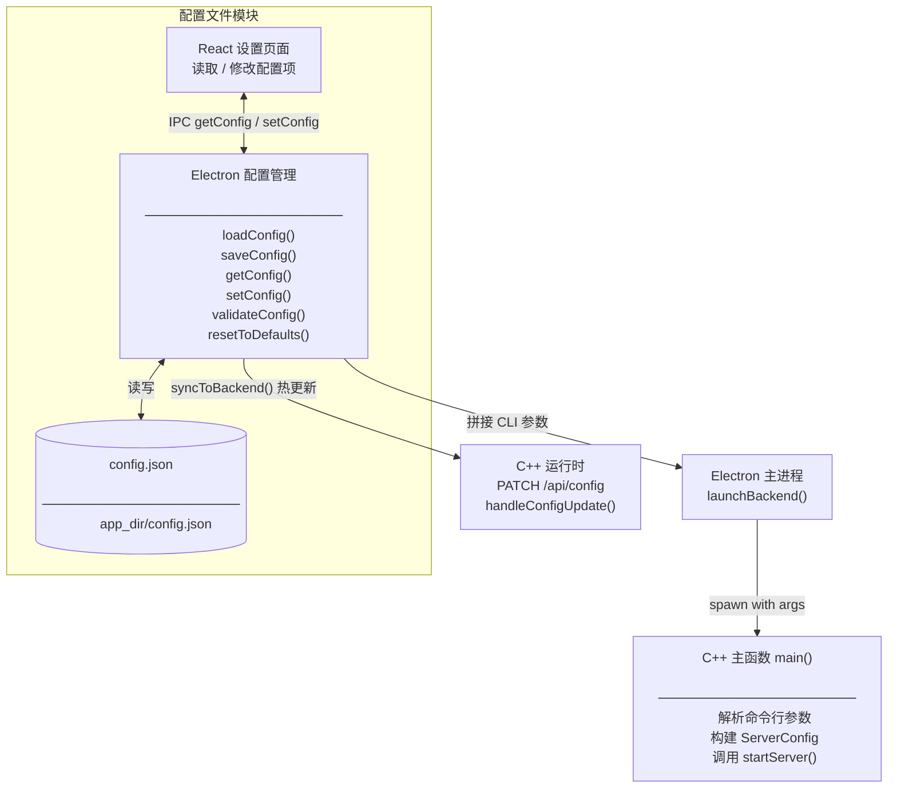
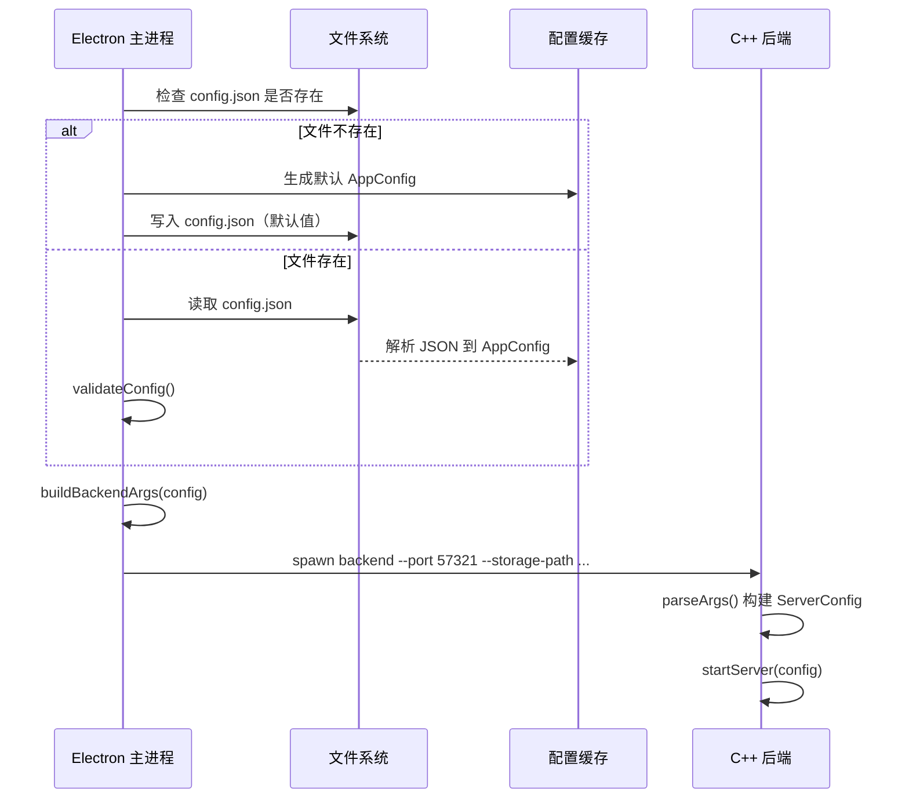
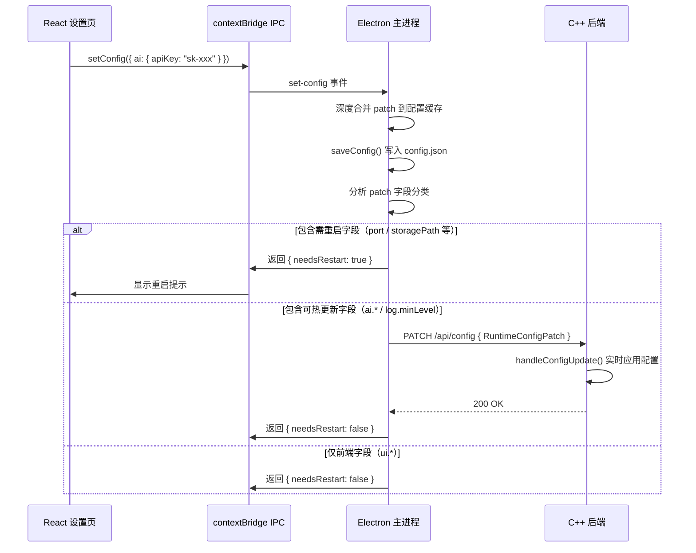

# 配置文件模块

> **所属层级**：前端层（配置管理端）+ C++ 后端层（配置消费端）  
> **对应索引**：[Arch.md - 配置文件模块](../Arch.md#配置文件模块)

---

## 目录

- [模块职责与边界](#模块职责与边界)
- [模块架构图](#模块架构图)
- [配置文件结构](#配置文件结构)
- [C++ 命令行参数规范](#c-命令行参数规范)
- [函数规范（TypeScript）](#函数规范typescript)
- [处理流程](#处理流程)
- [错误处理与边界情况](#错误处理与边界情况)

---

## 模块职责与边界

**负责的事情：**
- 定义 `config.json` 配置文件的完整结构和各字段默认值
- Electron 主进程负责读取、写入和验证配置文件
- 在应用启动时将必要配置项作为命令行参数传入 C++ 后端进程
- 提供前端 React 页面读取和修改配置的接口

**不负责的事情：**
- C++ 后端自行持久化配置（C++ 只读取启动参数，不写配置文件）
- 配置项的加密存储（API Key 等敏感信息以明文存储于本地 JSON，接受这一设计）
- 多用户配置隔离

**配置文件位置：**
```
{app_dir}/config.json
```
> `app_dir` 为 Electron 应用可执行文件所在目录（通过 `app.getAppPath()` 获取）。

---

## 模块架构图



---

## 配置文件结构

### `config.json` 完整结构

```json
{
    "backendPort": 57321,
    "storagePath": "{app_dir}/storage",
    "dbPath": "{app_dir}/data/quickmemes.db",
    "modelDir": "{app_dir}/models/ocr",
    "logDir": "{app_dir}/logs",
    "ai": {
        "apiKey": "",
        "apiBaseUrl": "https://api.openai.com/v1",
        "visionModel": "gpt-4o",
        "embeddingModel": "text-embedding-3-small",
        "imageGenModel": "dall-e-3",
        "timeoutSeconds": 30,
        "maxRetries": 2
    },
    "ui": {
        "panelShortcut": "Alt+M",
        "theme": "system",
        "viewMode": "grid",
        "language": "zh-CN"
    },
    "log": {
        "minLevel": "INFO",
        "retentionEnabled": true,
        "retentionDays": 30
    },
    "thumbnail": {
        "enabled": true,
        "maxSize": 300
    },
    "backup": {
        "enabled": true,
        "retentionDays": 30
    }
}
```

### 字段说明

| 字段路径               | 类型     | 默认值                         | 说明                                        |
| ---------------------- | -------- | ------------------------------ | ------------------------------------------- |
| `backendPort`          | `int`    | `57321`                        | C++ 后端 HTTP / WS 监听端口                 |
| `storagePath`          | `string` | `{app_dir}/storage`            | Meme 图像文件存储根目录                     |
| `dbPath`               | `string` | `{app_dir}/data/quickmemes.db` | SQLite 数据库文件路径                       |
| `modelDir`             | `string` | `{app_dir}/models/ocr`         | PaddleOCR 模型文件目录                      |
| `logDir`               | `string` | `{app_dir}/logs`               | 日志文件输出目录                            |
| `ai.apiKey`            | `string` | `""`                           | 云端 AI API 密钥（空字符串表示禁用 AI）     |
| `ai.apiBaseUrl`        | `string` | OpenAI URL                     | AI API 基础 URL（兼容 OpenAI 格式）         |
| `ai.visionModel`       | `string` | `"gpt-4o"`                     | 图像理解模型名称                            |
| `ai.embeddingModel`    | `string` | `"text-embedding-3-small"`     | 文本向量化模型名称                          |
| `ai.imageGenModel`     | `string` | `"dall-e-3"`                   | 图像生成模型名称                            |
| `ai.timeoutSeconds`    | `int`    | `30`                           | AI API 单次请求超时秒数                     |
| `ai.maxRetries`        | `int`    | `2`                            | AI API 失败重试次数                         |
| `ui.panelShortcut`     | `string` | `"Alt+M"`                      | 快速面板全局快捷键                          |
| `ui.theme`             | `string` | `"system"`                     | 界面主题：`"light"` / `"dark"` / `"system"` |
| `ui.viewMode`          | `string` | `"grid"`                       | Meme 画廊视图：`"grid"` / `"list"`          |
| `ui.language`          | `string` | `"zh-CN"`                      | 界面语言（当前仅支持 `"zh-CN"`）            |
| `log.minLevel`         | `string` | `"INFO"`                       | 最低日志输出等级                            |
| `log.retentionEnabled` | `bool`   | `true`                         | 是否启用日志自动清理                        |
| `log.retentionDays`    | `int`    | `30`                           | 日志保留天数                                |
| `thumbnail.enabled`    | `bool`   | `true`                         | 是否启用缩略图生成                          |
| `thumbnail.maxSize`    | `int`    | `300`                          | 缩略图最大边长像素                          |
| `backup.enabled`       | `bool`   | `true`                         | 是否启用数据库自动备份                      |
| `backup.retentionDays` | `int`    | `30`                           | 备份文件保留天数                            |

---

## C++ 命令行参数规范

> Electron 启动 C++ 后端时拼接以下命令行参数，C++ `main()` 函数负责解析。

### 完整参数列表

```
QuickMemes-backend \
    --port            <int>     \   # HTTP / WS 监听端口
    --storage-path    <string>  \   # Meme 文件存储根目录
    --db-path         <string>  \   # SQLite 数据库文件路径
    --model-dir       <string>  \   # OCR 模型文件目录
    --log-dir         <string>  \   # 日志文件输出目录
    --log-level       <string>  \   # 最低日志等级：DEBUG/INFO/WARN/ERROR/FATAL
    --log-retention-enabled <bool>  \   # 日志自动清理开关
    --log-retention-days    <int>   \   # 日志保留天数
    --api-key         <string>  \   # AI API 密钥（可为空字符串）
    --api-base-url    <string>  \   # AI API 基础 URL
    --vision-model    <string>  \   # VLM 模型名称
    --embedding-model <string>  \   # Embedding 模型名称
    --image-gen-model <string>  \   # 图像生成模型名称
    --api-timeout     <int>     \   # AI API 请求超时秒数
    --api-retries     <int>     \   # AI API 失败重试次数
    --thumbnail-enabled  <bool> \   # 缩略图开关
    --thumbnail-max-size <int>  \   # 缩略图最大边长
    --backup-enabled       <bool>  \   # 自动备份开关
    --backup-retention-days <int>      # 备份保留天数
```

### 参数解析函数（C++ 核心模块内）

```
parseArgs(argc: int, argv: char*[]): ServerConfig
```

- **描述**：在 `main()` 中调用，遍历 `argv` 按 `--key value` 格式解析所有参数，构建并返回 `ServerConfig` 对象。所有参数均为必传（Electron 启动时保证传入），缺失任意参数时输出错误并以非零退出码终止。
- **输入**：`argc` / `argv`：标准 C 命令行参数
- **输出**：完整填充的 `ServerConfig` 对象

---

## 函数规范（TypeScript）

### `loadConfig`

```
loadConfig(): AppConfig
```

- **描述**：读取 `{app_dir}/config.json`，解析为 `AppConfig` 对象，对缺失字段用默认值补全（支持旧版配置文件的向前兼容）。文件不存在时自动创建默认配置并写入磁盘。
- **输入**：无
- **输出**：完整的 `AppConfig` 对象

---

### `saveConfig`

```
saveConfig(config: AppConfig): void
```

- **描述**：将 `AppConfig` 序列化为格式化 JSON（2 空格缩进）并写入 `{app_dir}/config.json`，覆盖全部内容。
- **输入**：`config`：完整配置对象
- **输出**：无

---

### `getConfig`

```
getConfig(): AppConfig
```

- **描述**：返回内存中缓存的当前配置（启动时通过 `loadConfig` 加载，此后直接读缓存）。供 Electron 主进程内部和渲染进程通过 IPC 调用。
- **输入**：无
- **输出**：当前 `AppConfig` 缓存值

---

### `setConfig`

```
setConfig(patch: Partial<AppConfig>): void
```

- **描述**：深度合并 `patch` 到当前配置缓存，然后调用 `saveConfig` 持久化。流程如下：
  1. 将 `patch` 录入的字段分为三类：
     - **需要重启**：`backendPort` / `storagePath` / `dbPath` / `modelDir`
     - **可热更新**：`ai.*`、`log.minLevel`、`thumbnail.*`（可直接同步到 C++ 后端）
     - **仅前端生效**：`ui.*`（无需通知 C++ 后端）
  2. 调用 `saveConfig` 将全量配置写入 `config.json`
  3. 若存在需要重启的字段，设置 `needsRestart` 标记并返回给 React 显示提示
  4. 若存在可热更新的字段，调用 `syncToBackend(runtimePatch)` 将变更实时同步到 C++ 后端
  5. 若 `ai.embeddingModel` 发生变更，返回 `{ embeddingModelChanged: true }` 提示前端显示“切换模型后需重建向量索引”警告
- **输入**：`patch`：仅含需变更字段的部分配置对象
- **输出**：无

---

### `validateConfig`

```
validateConfig(config: AppConfig): string[]
```

- **描述**：对配置进行合法性校验，返回所有错误描述列表（空列表表示配置合法）。校验规则：
  - `backendPort`：1024 ≤ port ≤ 65535
  - `storagePath` / `dbPath` / `modelDir` / `logDir`：非空字符串
  - `ai.timeoutSeconds`：1 ≤ value ≤ 300
  - `ai.maxRetries`：0 ≤ value ≤ 10
  - `ui.theme`：值为 `"light"` / `"dark"` / `"system"` 之一
  - `log.minLevel`：值为 `"DEBUG"` / `"INFO"` / `"WARN"` / `"ERROR"` / `"FATAL"` 之一
- **输入**：`config`：待校验的配置对象
- **输出**：错误描述字符串列表（空列表表示合法）

---

### `resetToDefaults`

```
resetToDefaults(): AppConfig
```

- **描述**：将配置重置为所有默认值（路径类字段基于当前 `app_dir` 重新计算），写入磁盘并更新缓存，返回默认配置对象。
- **输入**：无
- **输出**：默认 `AppConfig` 对象

---

### `buildBackendArgs`（内部函数）

```
buildBackendArgs(config: AppConfig): string[]
```

- **描述**：根据当前 `AppConfig` 拼接 C++ 后端启动所需的完整命令行参数数组，供 `launchBackend()` 传入 `child_process.spawn`。
- **输入**：`config`：当前配置
- **输出**：命令行参数字符串数组，如 `["--port", "57321", "--storage-path", "/app/storage", ...]`

---

### `syncToBackend`（内部函数）

```
syncToBackend(patch: RuntimeConfigPatch): Promise<void>
```

- **描述**：将可热更新的配置变更实时同步到 C++ 后端。向 `PATCH http://localhost:{port}/api/config` 发送请求，请求体为 `RuntimeConfigPatch`（仅含实际变更的字段）。仅在后端进程运行期间调用，如果后端未运行则跳过。
- **输入**：`patch`：仅含可热更新字段的 `RuntimeConfigPatch`
- **输出**：无（失败时记录日志，不向用户报错，配置已写入 config.json 下次重启后仍然生效）

---

## 处理流程

### 应用启动配置加载与后端启动流程



### React 修改配置流程



---

## 错误处理与边界情况

| 场景                                                               | 处理策略                                                                                                       |
| ------------------------------------------------------------------ | -------------------------------------------------------------------------------------------------------------- |
| `config.json` 文件损坏（非法 JSON）                                | 记录错误日志，使用全默认值启动，并用默认值覆盖写入修复文件                                                     |
| 旧版 `config.json` 缺失新字段                                      | `loadConfig` 对缺失字段自动补充默认值，随后保存（向前兼容）                                                    |
| 配置校验失败（如端口非法）                                         | `validateConfig` 返回错误列表，设置页面显示具体错误，不允许保存                                                |
| C++ 启动参数缺失任意必传项                                         | `main()` 中 `parseArgs` 检测到缺失，立即输出错误信息并以退出码 `1` 终止，Electron 捕获到非零退出码弹出错误提示 |
| `config.json` 写入失败（磁盘满）                                   | `saveConfig` 捕获异常，记录错误日志，内存缓存仍为最新值（下次启动可能回退）                                    |
| 用户修改了 `backendPort` 等需重启字段                              | 设置页面显示"修改将在重启后生效"提示，当前会话不受影响                                                         |
| `storagePath` 或 `dbPath` 目录不存在                               | C++ 启动时 `startServer` 尝试创建目录，创建失败则记录 FATAL 并退出                                             |
| `syncToBackend` 请求失败（后端未运行或网络错误）                   | 记录警告日志，不向用户报错；config.json 已写入，等到下次重启后配置自然生效                                     |
| `handleConfigUpdate` 收到非法字段值（如 `logMinLevel: "VERBOSE"`） | 返回 `ERR_INVALID_PARAMS`，Electron 记录日志，其余合法字段正常应用                                             |
