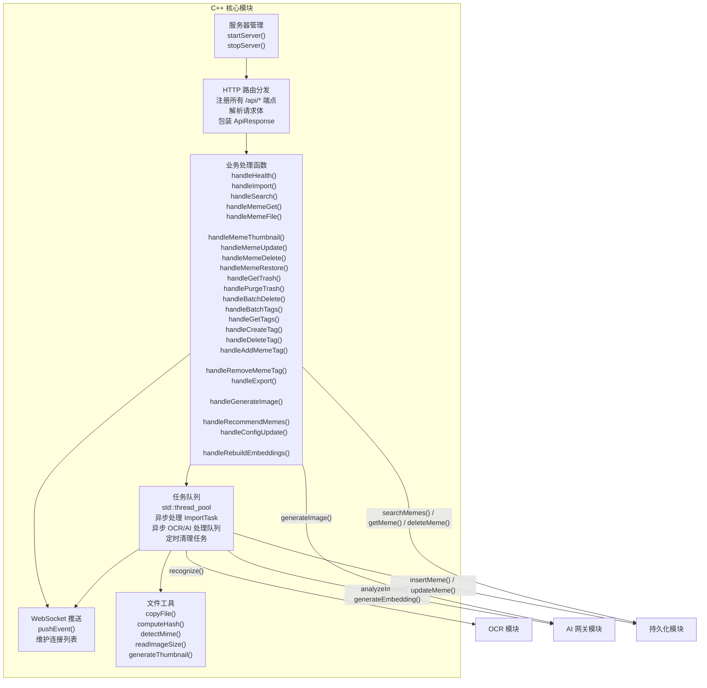
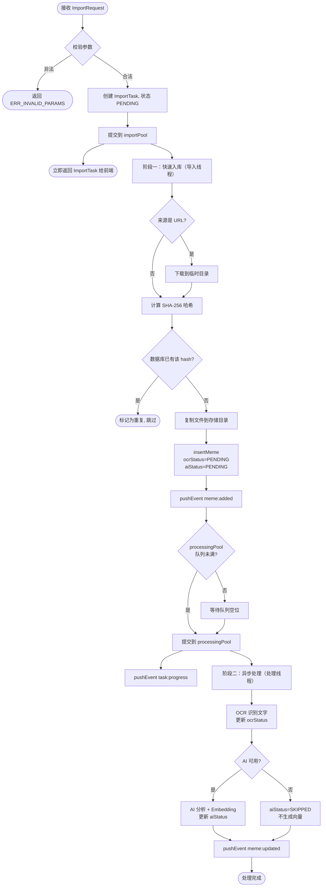

# C++ 核心模块

> **所属层级**：C++ 后端层（C++23，CMake 构建）  
> **对应索引**：[Arch.md - C++ 核心模块](../Arch.md#c-核心模块)

---

## 目录

- [模块职责与边界](#模块职责与边界)
- [模块架构图](#模块架构图)
- [模块独有数据结构](#模块独有数据结构)
- [函数规范](#函数规范)
- [处理流程](#处理流程)
- [错误处理与边界情况](#错误处理与边界情况)

---

## 模块职责与边界

**负责的事情：**
- 启动和管理本地 HTTP 服务器及 WebSocket 服务器（均基于 Boost.Beast / Boost.Asio）
- 将 HTTP 请求路由到对应处理函数，校验请求携带的 Auth Token
- 协调 OCR、AI 网关、持久化三个子模块的调用顺序与数据流
- 管理导入任务的异步执行（多线程任务队列）
- 文件 I/O：图像文件的复制、移动、哈希计算、MIME 类型识别、尺寸读取
- 通过 WebSocket 向前端推送异步处理结果

**不负责的事情：**
- OCR 推理实现（由 OCR 模块负责）
- AI API 调用实现（由 AI 网关模块负责）
- 数据库读写实现（由持久化模块负责）
- 前端 UI 渲染和 Electron 进程管理

---

## 模块架构图



---

## 模块独有数据结构

### `ImportPipeline` — 单个文件的导入处理管线状态

```
ImportPipeline {
    taskId      : string       // 所属任务 ID
    inputPath   : string       // 原始输入路径（本地路径或下载后的临时路径）
    destPath    : string       // 最终存储路径
    fileHash    : string       // SHA-256 哈希
    mimeType    : string       // 检测到的 MIME 类型
    width       : int32        // 图像宽度
    height      : int32        // 图像高度
    memeEntry   : MemeEntry    // 构建的 Meme 对象
    stage       : PipelineStage    // 当前所在阶段
    error       : string       // 失败描述（可为空）
}

// PipelineStage 枚举（导入阶段，不含 OCR/AI）
PipelineStage : "DOWNLOAD" | "HASH" | "COPY" | "INSERT" | "DONE" | "FAILED"
```

### `TaskQueue` — 任务队列（单例）

```
TaskQueue {
    tasks          : map<string, ImportTask>    // taskId -> ImportTask
    importPool     : ThreadPool                  // 导入线程池（默认 4 线程）
    processingPool : ThreadPool                  // OCR/AI 异步处理线程池（默认 2 线程）
    maxQueueSize   : int                         // 处理队列最大深度（默认 500，满时新导入暂停入队）
    mutex          : mutex                       // 保护 tasks map 的互斥锁
}
```

### `ServerConfig` — 服务器配置

```
ServerConfig {
    bindAddress       : string  // HTTP 和 WS 绑定地址（默认 "127.0.0.1"，仅回环）
    port              : int     // HTTP 和 WS 监听端口
    authToken         : string  // 请求校验令牌（由 Electron 启动时生成并传入）
    storagePath       : string  // Meme 文件存储根目录
    dbPath            : string  // SQLite 数据库文件路径
    modelDir          : string  // OCR 模型文件目录
    logDir            : string  // 日志文件输出目录
    logLevel          : string  // 最低日志输出等级
    aiConfig          : AiConfig // AI 网关配置
    workerCount       : int     // 导入任务线程池线程数（默认 4）
    maxQueueSize      : int     // 处理队列最大深度（默认 500）
    thumbnailEnabled  : bool    // 是否启用缩略图生成（默认 true）
    thumbnailMaxSize  : int     // 缩略图最大边长像素（默认 300）
    backupEnabled     : bool    // 是否启用自动备份（默认 true）
    backupRetentionDays : int   // 备份保留天数（默认 30）
    logRetentionEnabled : bool  // 是否启用日志自动清理（默认 true）
    logRetentionDays    : int   // 日志保留天数（默认 30）
}
```

### `AiConfig` — AI 网关配置（传递给 AI 模块）

```
AiConfig {
    apiKey         : string  // API 鉴权密钥
    apiBaseUrl     : string  // API 基础 URL
    visionModel    : string  // 图像分析模型名称
    embeddingModel : string  // 向量化模型名称
    recommendModel : string  // Meme 推荐模型名称（小参数文本模型，如 "Qwen2.5-7B-Instruct"）
    imageGenModel  : string  // 图像生成模型名称
    timeoutSeconds : int     // 请求超时秒数（默认 30）
    maxRetries     : int     // 失败自动重试次数（默认 2，仅对网络错误重试）
}
```

---

## 函数规范

### `parseArgs`

```
parseArgs(argc: int, argv: char*[]): ServerConfig
```

- **描述**：在 `main()` 入口中调用，遍历 `argv` 按 `--key value` 格式解析全部命令行参数，构建并返回 `ServerConfig`。需要解析的参数包括：`--bind-address`、`--port`、`--auth-token`、`--storage-path`、`--db-path`、`--model-dir`、`--log-dir`、`--log-level`、`--api-key`、`--api-base-url`、`--vision-model`、`--embedding-model`、`--image-gen-model`、`--api-timeout`、`--api-retries`、`--max-queue-size`。任意必传参数缺失时，输出错误信息并以退出码 `1` 终止。
- **输入**：`argc` / `argv`：标准 C 命令行参数
- **输出**：完整填充的 `ServerConfig` 对象

---

### `startServer`

```
startServer(config: ServerConfig): bool
```

- **描述**：
  1. 调用 `Logger::initialize(config.logDir, config.logLevel)` 完成日志模块初始化
  2. 根据配置初始化并启动 HTTP 服务器（绑定 `config.bindAddress`）与 WebSocket 服务器（Boost.Beast），注册所有 `/api/*` 路由，所有请求经过 `authToken` 校验中间件
  3. 完成 OCR、AI 网关、持久化三个子模块的初始化
  4. 创建导入线程池和 OCR/AI 异步处理线程池
  5. 若启用备份，调用 `Persistence.backupDatabase()` 创建启动备份，并检测数据库完整性
  6. 若检测到数据库损坏，自动从最新备份恢复
  7. 数据库 Schema 迁移前自动创建备份（通过调用 `Persistence.backupDatabase()`），确保迁移失败时可恢复
  8. 启动定时任务：① 每 30 秒 WebSocket 心跳 ② 每日清理过期软删除记录 ③ 每日清理过期备份和日志
- **输入**：`config`：完整服务器配置
- **输出**：各子系统全部启动成功返回 `true`；任意子系统初始化失败返回 `false` 并记录日志

---

### `stopServer`

```
stopServer(): void
```

- **描述**：停止接受新连接，等待所有正在处理的 HTTP 请求完成，关闭所有 WebSocket 连接，等待两个线程池中已提交的任务完成（最多 10 秒），最后依次调用三个子模块的 `shutdown()` 并关闭服务器。
- **输入**：无
- **输出**：无

---

### `handleImport`

```
handleImport(req: ImportRequest): ImportTask
```

- **描述**：
  1. 校验 `req.inputs` 非空
  2. 生成唯一 `taskId`（UUID v4），创建 `ImportTask`，状态设为 `"PENDING"`
  3. 检查 `TaskQueue.processingPool` 队列深度是否已达 `maxQueueSize`，若已满则返回错误提示“处理队列已满，请稍候”
  4. 将任务提交到 `TaskQueue.importPool`，异步执行 `runImportPipeline()`
  5. 立即返回初始 `ImportTask` 给前端
- **输入**：`req`：导入请求参数
- **输出**：创建的 `ImportTask`（此时状态为 `"PENDING"`）

---

### `runImportPipeline`（内部，在导入线程中执行）

```
runImportPipeline(pipeline: ImportPipeline): void
```

- **描述**：对单个文件执行快速入库流程（不包含 OCR/AI），使 Meme 尽快对前端可见：
  1. **DOWNLOAD**：若 `source == "URL"` 则下载到临时目录；其余来源直接使用原始路径
  2. **HASH**：计算文件 SHA-256 哈希，检查数据库是否已存在该 hash（去重）
  3. **COPY**：复制文件到 `storagePath/{yyyy-MM}/{hash}.{ext}` 永久存储路径
  4. **INSERT**：构建 `MemeEntry`（`ocrStatus=PENDING`，`aiStatus=PENDING`），调用 `Persistence.insertMeme()`
  5. **DONE**：通过 `pushEvent("meme:added", memeEntry)` 通知前端
  6. 将该 Meme 的 ID 提交到 `TaskQueue.processingPool`，异步执行 `runProcessingPipeline()`
  7. 每步完成后更新 `ImportTask.processed`，推送 `task:progress`
- **输入**：`pipeline`：管线状态对象
- **输出**：无（通过 WebSocket 推送结果）

---

### `runProcessingPipeline`（内部，在处理线程中执行）

```
runProcessingPipeline(memeId: int64): void
```

- **描述**：对已入库的 Meme 异步执行 OCR 和 AI 分析，不阻塞导入流程：
  1. 更新 `ocrStatus = PROCESSING`，推送 `meme:processing` 事件
  2. 调用 `OcrModule.recognize(filePath)` 提取文字
  3. 更新 `ocrText` 和 `ocrStatus = DONE`（失败则 `FAILED`），推送 `meme:processing`
  4. 若 AI 可用且 `autoAiAnalyze == true`：
     - 更新 `aiStatus = PROCESSING`，推送 `meme:processing`
     - 调用 `AiGateway.analyzeImage(filePath)` 获取标签和描述
     - 调用 `AiGateway.generateEmbedding(ocrText + description)` 生成向量
     - 更新描述、标签关联、embedding，`aiStatus = DONE`
  5. 若 AI 不可用，设置 `aiStatus = SKIPPED`，**不生成 embedding 向量**
  6. 推送 `meme:updated` 通知前端更新完整数据
- **输入**：`memeId`：已入库的 Meme ID
- **输出**：无（通过 WebSocket 推送状态变更）

---

### `handleSearch`

```
handleSearch(query: SearchQuery): SearchResult
```

- **描述**：
  1. 校验并规范化 `SearchQuery` 参数（limit 限制 ≤200，offset ≥0）
  2. 默认过滤已软删除的 Meme（`deleted_at == 0`）
  3. 若 `query.useVector == true` 且 `query.keyword` 非空：
     - 调用 `AiGateway.generateEmbedding(keyword)` 生成查询向量
     - 同时执行 `Persistence.vectorSearch()` 和 `Persistence.searchMemes(query)` 获取两路结果
     - 使用加权融合排序：`finalScore = vectorWeight × vectorSimilarity + (1 - vectorWeight) × textRelevance`，其中 `vectorWeight` 默认 0.7
  4. 若 `useVector == false`，调用 `Persistence.searchMemes(query)` 执行普通搜索（使用 FTS5 全文索引），`similarityScore` 设为 `-1`
  5. 包装为 `SearchResult` 返回
- **输入**：`query`：搜索参数
- **输出**：`SearchResult`（含 `items` 列表和 `total`）

---

### `handleMemeGet`

```
handleMemeGet(id: int64): MemeEntry
```

- **描述**：调用 `Persistence.getMeme(id)` 查询单个 Meme，同时附加查询 `Persistence.getMemeTags(id)` 并填充 `tagIds` 字段。
- **输入**：`id`：Meme ID
- **输出**：完整的 `MemeEntry`（含标签）；不存在时抛出 `ERR_NOT_FOUND` 错误

---

### `handleMemeUpdate`

```
handleMemeUpdate(id: int64, patch: MemePatch): MemeEntry
```

- **描述**：校验 `id` 存在且未软删除，调用 `Persistence.updateMeme(id, patch)` 更新字段，查询并返回更新后的完整 `MemeEntry`，同时通过 `pushEvent("meme:updated", memeEntry)` 广播更新通知。
- **输入**：`id`：Meme ID；`patch`：仅含变更字段的对象
- **输出**：更新后的 `MemeEntry`

---

### `handleMemeDelete`

```
handleMemeDelete(id: int64): bool
```

- **描述**：将 Meme 软删除（调用 `Persistence.softDeleteMeme(id)` 设置 `deleted_at` 时间戳），不立即删除文件。通过 `pushEvent("meme:deleted", {id})` 广播通知。软删除的 Meme 在配置的保留天数后由定时清理任务彻底删除。
- **输入**：`id`：Meme ID
- **输出**：操作成功返回 `true`；ID 不存在抛出 `ERR_NOT_FOUND`

---

### `handleBatchDelete`

```
handleBatchDelete(ids: int64[]): BatchResult
```

- **描述**：批量软删除多个 Meme，逐个调用 `softDeleteMeme`，每个成功的推送 `meme:deleted` 事件。
- **输入**：`ids`：Meme ID 列表
- **输出**：`BatchResult`

---

### `handleBatchTags`

```
handleBatchTags(memeIds: int64[], tagId: int64): BatchResult
```

- **描述**：为多个 Meme 批量添加同一标签，逐个调用 `addMemeTag`。
- **输入**：`memeIds`：Meme ID 列表；`tagId`：标签 ID
- **输出**：`BatchResult`

---

### `handleMemeFile`

```
handleMemeFile(id: int64): BinaryStream
```

- **描述**：查询 Meme 获取 `filePath` 和 `mimeType`，读取文件返回二进制流，设置 `Content-Type` 响应头。
- **输入**：`id`：Meme ID
- **输出**：图像二进制流；文件不存在时抛出 `ERR_IO`

---

### `handleMemeThumbnail`

```
handleMemeThumbnail(id: int64): BinaryStream
```

- **描述**：查询 Meme，查找 `storagePath/thumbnails/{hash}.webp` 缩略图文件。若存在则返回缩略图；若不存在且缩略图功能已启用，则**即时生成缩略图并缓存**，然后返回；若缩略图功能未启用，回退返回原始图像。
- **输入**：`id`：Meme ID
- **输出**：缩略图或原始图像二进制流

---

### `handleMemeRestore`

```
handleMemeRestore(id: int64): MemeEntry
```

- **描述**：将已软删除的 Meme 从回收站恢复（调用 `Persistence.restoreMeme(id)` 将 `deleted_at` 重置为 0）。通过 `pushEvent("meme:added", memeEntry)` 广播恢复通知。
- **输入**：`id`：Meme ID
- **输出**：恢复后的完整 `MemeEntry`；ID 不存在或未被软删除时抛出 `ERR_NOT_FOUND`

---

### `handleGetTrash`

```
handleGetTrash(limit: int32, offset: int32): SearchResult
```

- **描述**：查询 `memes` 表中 `deleted_at > 0` 的记录，按 `deleted_at` 降序排列（最近删除的在前），支持分页。
- **输入**：`limit`：每页数量（默认 50）；`offset`：偏移量
- **输出**：`SearchResult`（含回收站中的 Meme 列表和总数）

---

### `handlePurgeTrash`

```
handlePurgeTrash(): int
```

- **描述**：彻底删除回收站中所有已软删除的 Meme（调用 `Persistence.deleteMeme` 删除数据库记录，同时删除本地文件和缩略图）。通过 `pushEvent("meme:deleted", {id})` 逐个广播通知。
- **输入**：无
- **输出**：清理的记录数量

---

### `handleHealth`

```
handleHealth(): HealthStatus
```

- **描述**：检查各子模块状态，返回 `HealthStatus { status, modules: { ocr, ai, db } }`。所有模块就绪时 `status="ok"`，任一不可用时 `status="degraded"`。
- **输入**：无
- **输出**：`HealthStatus`

---

### `handleRebuildEmbeddings`

```
handleRebuildEmbeddings(): ImportTask
```

- **描述**：创建异步任务，遍历所有 Meme，对每个 Meme 重新调用 `AiGateway.generateEmbedding()` 更新向量。用于 Embedding 模型切换后。通过 WebSocket 推送进度。
- **输入**：无
- **输出**：重建任务对象

---

### `handleExport`

```
handleExport(req: ExportRequest): ExportResult
```

- **描述**：批量查询 `req.memeIds`（排除已软删除），将每个 Meme 的本地文件复制到 `req.destDir`，文件名按 `keepNames` 配置决定使用原文件名或 ID 命名。
- **输入**：`req`：导出请求参数
- **输出**：`ExportResult`（成功/失败数量及错误描述）

---

### `handleGenerateImage`

```
handleGenerateImage(prompt: string): GeneratedImage
```

- **描述**：校验 `prompt` 非空，调用 `AiGateway.generateImage(prompt)` 生成图像并返回结果。
- **输入**：`prompt`：文字描述
- **输出**：`GeneratedImage`（含 Base64 编码图像数据）

---

### `handleRecommendMemes`

```
handleRecommendMemes(query: string): RecommendResult
```

- **描述**：
  1. 校验 `query` 非空
  2. 从数据库查询所有未软删除的 Meme，构建 `MemeIndexItem[]` 列表（包含 ID、名称、描述摘要、OCR 文本截断前 200 字符、Tags）
  3. 调用 `AiGateway.recommendMemes(query, memeIndex)` 获取推荐结果
  4. 返回 `RecommendResult`
- **输入**：`query`：用户的文字描述
- **输出**：`RecommendResult`（推荐的 Meme 列表及推荐理由）

---

### `handleGetTags`

```
handleGetTags(): Tag[]
```

- **描述**：调用 `Persistence.getTags()` 获取全部标签列表。
- **输入**：无
- **输出**：`Tag[]` 全量标签列表

---

### `handleCreateTag`

```
handleCreateTag(name: string, color: string): Tag
```

- **描述**：校验 `name` 非空，调用 `Persistence.insertTag(tag)` 创建新标签，通过 `pushEvent("tag:created", tag)` 广播通知。
- **输入**：`name`：标签名称；`color`：显示颜色 HEX（可为空）
- **输出**：新创建的 `Tag` 对象；名称已存在时抛出 `ERR_DUPLICATE`

---

### `handleDeleteTag`

```
handleDeleteTag(id: int64): bool
```

- **描述**：删除指定标签，通过数据库外键 `ON DELETE CASCADE` 自动移除所有 Meme 与该标签的关联。通过 `pushEvent("tag:deleted", {id})` 广播通知。
- **输入**：`id`：Tag ID
- **输出**：操作成功返回 `true`；ID 不存在抛出 `ERR_NOT_FOUND`

---

### `handleAddMemeTag`

```
handleAddMemeTag(memeId: int64, tagId: int64): bool
```

- **描述**：建立 Meme 与标签的关联，调用 `Persistence.addMemeTag(memeId, tagId)`。通过 `pushEvent("meme:updated", memeEntry)` 广播更新。
- **输入**：`memeId`：Meme ID；`tagId`：Tag ID
- **输出**：操作成功返回 `true`；Meme 或 Tag 不存在抛出 `ERR_NOT_FOUND`

---

### `handleRemoveMemeTag`

```
handleRemoveMemeTag(memeId: int64, tagId: int64): bool
```

- **描述**：移除 Meme 与标签的关联，调用 `Persistence.removeMemeTag(memeId, tagId)`。通过 `pushEvent("meme:updated", memeEntry)` 广播更新。
- **输入**：`memeId`：Meme ID；`tagId`：Tag ID
- **输出**：操作成功返回 `true`；关联不存在返回 `false`

---

### `pushEvent`

```
pushEvent(event: WsEvent): void
```

- **描述**：将 `WsEvent` 序列化为 JSON 字符串，广播给所有当前已连接的 WebSocket 客户端。已断开的连接自动从连接列表中移除。
- **输入**：`event`：事件对象
- **输出**：无

---

### `handleConfigUpdate`

```
handleConfigUpdate(patch: RuntimeConfigPatch): bool
```

- **描述**：接收 `PATCH /api/config` 请求，将可热更新的配置变更实时应用到运行中的各子模块：
  1. 若 patch 中包含任意 AI 字段（`aiApiKey` / `aiApiBaseUrl` / `aiVisionModel` / `aiRecommendModel` 等），构建新 `AiConfig` 并调用 `AiGateway::reconfigure(newConfig)` 替换内部配置
  2. 若 patch 中包含 `logMinLevel`，调用 `Logger::get().setMinLevel(level)` 实时生效
  3. 对接收到的字段进行有效性校验，失败时返回 `ERR_INVALID_PARAMS`
- **输入**：`patch`：`RuntimeConfigPatch` 对象（仅含需要变更的字段）
- **输出**：更新全部成功返回 `true`；参数非法抛出 `ERR_INVALID_PARAMS`

---

### `computeHash`（内部工具函数）

```
computeHash(filePath: string): string
```

- **描述**：读取文件内容，计算其 SHA-256 哈希，返回十六进制字符串。
- **输入**：`filePath`：文件绝对路径
- **输出**：64 位十六进制 SHA-256 哈希字符串

---

### `detectMimeType`（内部工具函数）

```
detectMimeType(filePath: string): string
```

- **描述**：读取文件头部魔数（Magic Bytes）来识别实际 MIME 类型，而非仅依赖扩展名，防止文件名欺骗。支持 `image/png`、`image/jpeg`、`image/gif`、`image/webp`、`image/avif` 等常见图像格式。
- **输入**：`filePath`：文件绝对路径
- **输出**：MIME 类型字符串；无法识别时返回 `"application/octet-stream"`

---

### `readImageSize`（内部工具函数）

```
readImageSize(filePath: string): { width: int32, height: int32 }
```

- **描述**：通过读取文件头部元数据（不完整解码图像）快速获取图像宽高。
- **输入**：`filePath`：图像文件绝对路径
- **输出**：包含 `width` 和 `height` 的结构体

---

### `generateThumbnail`（内部工具函数）

```
generateThumbnail(srcPath: string, destPath: string, maxSize: int): bool
```

- **描述**：使用 OpenCV 读取图像，按比例缩放至长边不超过 `maxSize` 像素，以 WebP 格式保存到 `destPath`。
- **输入**：`srcPath`：原始图像路径；`destPath`：缩略图目标路径；`maxSize`：最大边长
- **输出**：生成成功返回 `true`；失败记录日志返回 `false`（缩略图生成失败不影响导入流程）

---

## 处理流程

### 单文件导入管线（两阶段）



---

## 错误处理与边界情况

| 场景                                        | 处理策略                                                                          |
| ------------------------------------------- | --------------------------------------------------------------------------------- |
| 导入文件 MIME 类型非图像                    | 标记该文件失败，记录错误信息，继续处理批次中其他文件                              |
| 文件哈希重复（已存在）                      | 跳过导入，在 `ImportTask.errors` 中记录"已存在"，`succeeded` 不计                 |
| URL 下载失败（网络错误 / 超时）             | 标记该文件失败，继续处理其他文件                                                  |
| OCR 识别失败                                | `ocrStatus` 设为 `FAILED`，`ocrText` 置空，推送 `meme:processing`，不影响 AI 步骤 |
| AI 分析失败（网络错误 / API 限额）          | `aiStatus` 设为 `FAILED`，不生成 embedding 向量，推送 `meme:processing`           |
| AI 不可用                                   | `aiStatus` 设为 `SKIPPED`，不生成 embedding 向量                                  |
| 文件复制到存储目录失败（磁盘满 / 权限不足） | 整个管线标记 `FAILED`，推送 `task:error`                                          |
| 数据库写入失败                              | 管线标记 `FAILED`，删除已复制的文件（回滚），推送 `task:error`                    |
| 线程池工作线程崩溃（未捕获异常）            | 捕获顶层 `std::exception`，将任务标记为 `FAILED`，线程继续工作                    |
| 多线程并发写入同一数据库                    | SQLiteCpp 使用 WAL 模式，序列化写操作，无需额外锁                                 |
| WebSocket 推送时客户端已断开                | 捕获发送异常，从连接列表移除，忽略推送失败                                        |
| 停止服务器时仍有未完成任务                  | 等待两个线程池排空队列（最多 10 秒），超时则强制终止                              |
| 缩略图生成失败                              | 记录警告日志，不影响导入流程，前端回退使用原图                                    |
| 数据库损坏检测                              | `startServer` 时执行 `PRAGMA integrity_check`，损坏则自动从最新备份恢复           |
| 软删除 Meme 定时清理                        | 每日执行 `purgeDeletedMemes()`，彻底删除超过保留天数的记录和文件                  |
| 处理队列已满（达到 maxQueueSize）           | 返回错误提示“处理队列已满，请稍候”，前端显示等待提示                              |
| 数据库 Schema 迁移前                        | 自动创建数据库备份，确保迁移失败时可恢复                                          |
| 请求缺少或错误的 Auth Token                 | 返回 HTTP 401/403，拒绝处理                                                       |
```
