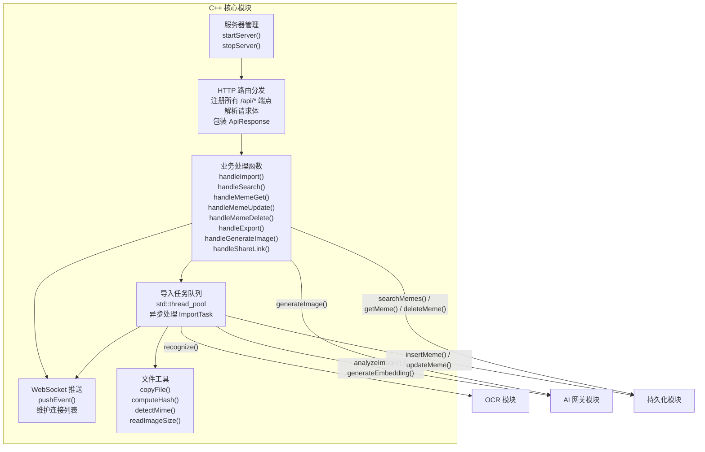
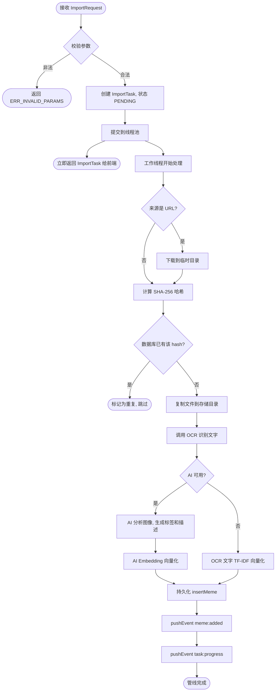

# C++ 核心模块

> **所属层级**：C++ 后端层（C++23，CMake 构建）  
> **对应索引**：[Arch.md - C++ 核心模块](../Arch.md#c-核心模块)

---

## 目录

- [模块职责与边界](#模块职责与边界)
- [模块架构图](#模块架构图)
- [模块独有数据结构](#模块独有数据结构)
- [函数规范](#函数规范)
- [处理流程](#处理流程)
- [错误处理与边界情况](#错误处理与边界情况)

---

## 模块职责与边界

**负责的事情：**
- 启动和管理本地 HTTP 服务器（cpp-httplib）及 WebSocket 服务器（WebSocket++）
- 将 HTTP 请求路由到对应处理函数
- 协调 OCR、AI 网关、持久化三个子模块的调用顺序与数据流
- 管理导入任务的异步执行（多线程任务队列）
- 文件 I/O：图像文件的复制、移动、哈希计算、MIME 类型识别、尺寸读取
- 将异步处理结果通过 WebSocket 推送给前端
- 生成分享短链接与二维码

**不负责的事情：**
- OCR 推理实现（由 OCR 模块负责）
- AI API 调用实现（由 AI 网关模块负责）
- 数据库读写实现（由持久化模块负责）
- 前端 UI 渲染和 Electron 进程管理

---

## 模块架构图



---

## 模块独有数据结构

### `ImportPipeline` — 单个文件的导入处理管线状态

```
ImportPipeline {
    taskId      : string       // 所属任务 ID
    inputPath   : string       // 原始输入路径（本地路径或下载后的临时路径）
    destPath    : string       // 最终存储路径
    fileHash    : string       // SHA-256 哈希
    mimeType    : string       // 检测到的 MIME 类型
    width       : int32        // 图像宽度
    height      : int32        // 图像高度
    ocrResult   : OcrResult    // OCR 识别结果
    aiResult    : AiAnalysisResult  // AI 分析结果
    memeEntry   : MemeEntry    // 最终构建的 Meme 对象
    stage       : PipelineStage    // 当前所在阶段
    error       : string       // 失败描述（可为空）
}

// PipelineStage 枚举
PipelineStage : "DOWNLOAD" | "HASH" | "OCR" | "AI_ANALYZE" | "EMBED" | "INSERT" | "DONE" | "FAILED"
```

### `TaskQueue` — 导入任务队列（单例）

```
TaskQueue {
    tasks      : map<string, ImportTask>    // taskId -> ImportTask
    workerPool : ThreadPool                  // 固定线程数线程池（默认 4 线程）
    mutex      : mutex                       // 保护 tasks map 的互斥锁
}
```

### `ServerConfig` — 服务器配置

```
ServerConfig {
    port         : int     // HTTP 和 WS 监听端口
    storagePath  : string  // Meme 文件存储根目录
    dbPath       : string  // SQLite 数据库文件路径
    modelDir     : string  // OCR 模型文件目录
    aiConfig     : AiConfig // AI 网关配置
    workerCount  : int     // 导入任务线程池线程数（默认 4）
}
```

### `AiConfig` — AI 网关配置（传递给 AI 模块）

```
AiConfig {
    apiKey        : string  // API 鉴权密钥
    apiBaseUrl    : string  // API 基础 URL
    visionModel   : string  // 图像分析模型名称
    embeddingModel: string  // 向量化模型名称
    imageGenModel : string  // 图像生成模型名称
    timeoutSeconds: int     // 请求超时秒数（默认 30）
}
```

---

## 函数规范

### `startServer`

```
startServer(config: ServerConfig): bool
```

- **描述**：根据配置初始化并启动 HTTP 服务器与 WebSocket 服务器，注册所有 `/api/*` 路由，完成 OCR、AI 网关、持久化三个子模块的初始化，以及导入任务线程池的创建。
- **输入**：`config`：完整服务器配置
- **输出**：各子系统全部启动成功返回 `true`；任意子系统初始化失败返回 `false` 并记录日志

---

### `stopServer`

```
stopServer(): void
```

- **描述**：停止接受新连接，等待所有正在处理的 HTTP 请求完成，关闭所有 WebSocket 连接，等待线程池中已提交的任务完成（最多 10 秒），最后依次调用三个子模块的 `shutdown()` 并关闭服务器。
- **输入**：无
- **输出**：无

---

### `handleImport`

```
handleImport(req: ImportRequest): ImportTask
```

- **描述**：
  1. 校验 `req.inputs` 非空
  2. 生成唯一 `taskId`（UUID v4），创建 `ImportTask`，状态设为 `"PENDING"`
  3. 将任务提交到 `TaskQueue.workerPool`，异步执行 `runImportPipeline()`
  4. 立即返回初始 `ImportTask` 给前端
- **输入**：`req`：导入请求参数
- **输出**：创建的 `ImportTask`（此时状态为 `"PENDING"`）

---

### `runImportPipeline`（内部，在工作线程中执行）

```
runImportPipeline(pipeline: ImportPipeline): void
```

- **描述**：对单个文件按顺序执行以下管线步骤：
  1. **DOWNLOAD**：若 `source == "URL"` 则下载到临时目录；其余来源直接使用原始路径
  2. **HASH**：计算文件 SHA-256 哈希，检查数据库是否已存在该 hash（去重）
  3. 复制文件到 `storagePath/{yyyy-MM}/{hash}.{ext}` 永久存储路径
  4. **OCR**：调用 `OcrModule.recognize()`，提取文字
  5. **AI_ANALYZE**：若 AI 可用，调用 `AiGateway.analyzeImage()`，获取标签和描述
  6. **EMBED**：若 AI 可用，调用 `AiGateway.generateEmbedding(ocrText + aiDescription)`，生成向量；否则对 OCR 文字做简单 TF-IDF 向量
  7. **INSERT**：构建 `MemeEntry`，调用 `Persistence.insertMeme()`，关联 AI 建议的标签
  8. **DONE**：通过 `pushEvent("meme:added", memeEntry)` 通知前端
  9. 每步完成后更新 `ImportTask.processed`，推送 `task:progress`
- **输入**：`pipeline`：管线状态对象
- **输出**：无（通过 WebSocket 推送结果）

---

### `handleSearch`

```
handleSearch(query: SearchQuery): MemeEntry[]
```

- **描述**：
  1. 校验并规范化 `SearchQuery` 参数（limit 限制 ≤200，offset ≥0）
  2. 若 `query.useVector == true` 且 `query.keyword` 非空，调用 `AiGateway.generateEmbedding(keyword)` 生成查询向量，再调用 `Persistence.vectorSearch()`
  3. 否则调用 `Persistence.searchMemes(query)` 执行普通搜索
  4. 合并去重结果并返回
- **输入**：`query`：搜索参数
- **输出**：匹配的 `MemeEntry[]` 列表

---

### `handleMemeGet`

```
handleMemeGet(id: int64): MemeEntry
```

- **描述**：调用 `Persistence.getMeme(id)` 查询单个 Meme，同时附加查询 `Persistence.getMemeTags(id)` 并填充 `tagIds` 字段。
- **输入**：`id`：Meme ID
- **输出**：完整的 `MemeEntry`（含标签）；不存在时抛出 `ERR_NOT_FOUND` 错误

---

### `handleMemeUpdate`

```
handleMemeUpdate(id: int64, patch: MemePatch): MemeEntry
```

- **描述**：校验 `id` 存在，调用 `Persistence.updateMeme(id, patch)` 更新字段，查询并返回更新后的完整 `MemeEntry`，同时通过 `pushEvent("meme:updated", memeEntry)` 广播更新通知。
- **输入**：`id`：Meme ID；`patch`：仅含变更字段的对象
- **输出**：更新后的 `MemeEntry`

---

### `handleMemeDelete`

```
handleMemeDelete(id: int64): bool
```

- **描述**：先查询 `MemeEntry` 获取 `filePath`，调用 `Persistence.deleteMeme(id)` 删除数据库记录，然后删除本地文件（若删除文件失败，记录警告并继续），最后通过 `pushEvent("meme:deleted", {id})` 广播删除通知。
- **输入**：`id`：Meme ID
- **输出**：删除成功返回 `true`；ID 不存在抛出 `ERR_NOT_FOUND`

---

### `handleExport`

```
handleExport(req: ExportRequest): ExportResult
```

- **描述**：批量查询 `req.memeIds`，将每个 Meme 的本地文件复制到 `req.destDir`，文件名按 `keepNames` 配置决定使用原文件名或 ID 命名。
- **输入**：`req`：导出请求参数
- **输出**：`ExportResult`（成功/失败数量及错误描述）

---

### `handleGenerateImage`

```
handleGenerateImage(prompt: string): GeneratedImage
```

- **描述**：校验 `prompt` 非空，调用 `AiGateway.generateImage(prompt)` 生成图像并返回结果。
- **输入**：`prompt`：文字描述
- **输出**：`GeneratedImage`（含 Base64 编码图像数据）

---

### `handleShareLink`

```
handleShareLink(id: int64, options: ShareOptions): ShareResult
```

- **描述**：验证 Meme 存在，生成带 hash 的短链接 URL，若 `options.generateQr == true` 则同时调用二维码生成库生成 PNG 并转 Base64。
- **输入**：`id`：Meme ID；`options`：分享配置（有效期、是否生成二维码）
- **输出**：`ShareResult`（短链接 URL 和可选的二维码 Base64）

---

### `pushEvent`

```
pushEvent(event: WsEvent): void
```

- **描述**：将 `WsEvent` 序列化为 JSON 字符串，广播给所有当前已连接的 WebSocket 客户端。已断开的连接自动从连接列表中移除。
- **输入**：`event`：事件对象
- **输出**：无

---

### `computeHash`（内部工具函数）

```
computeHash(filePath: string): string
```

- **描述**：读取文件内容，计算其 SHA-256 哈希，返回十六进制字符串。
- **输入**：`filePath`：文件绝对路径
- **输出**：64 位十六进制 SHA-256 哈希字符串

---

### `detectMimeType`（内部工具函数）

```
detectMimeType(filePath: string): string
```

- **描述**：读取文件头部魔数（Magic Bytes）来识别实际 MIME 类型，而非仅依赖扩展名，防止文件名欺骗。支持 `image/png`、`image/jpeg`、`image/gif`、`image/webp`、`image/avif` 等常见图像格式。
- **输入**：`filePath`：文件绝对路径
- **输出**：MIME 类型字符串；无法识别时返回 `"application/octet-stream"`

---

### `readImageSize`（内部工具函数）

```
readImageSize(filePath: string): { width: int32, height: int32 }
```

- **描述**：通过读取文件头部元数据（不完整解码图像）快速获取图像宽高。
- **输入**：`filePath`：图像文件绝对路径
- **输出**：包含 `width` 和 `height` 的结构体

---

## 处理流程

### 单文件完整导入管线



---

## 错误处理与边界情况

| 场景                                        | 处理策略                                                            |
| ------------------------------------------- | ------------------------------------------------------------------- |
| 导入文件 MIME 类型非图像                    | 标记该文件失败，记录错误信息，继续处理批次中其他文件                |
| 文件哈希重复（已存在）                      | 跳过导入，在 `ImportTask.errors` 中记录"已存在"，`succeeded` 不计   |
| URL 下载失败（网络错误 / 超时）             | 标记该文件失败，继续处理其他文件                                    |
| OCR 识别失败                                | 记录错误，`ocrText` 置为空字符串，继续后续步骤不中断管线            |
| AI 分析失败（网络错误 / API 限额）          | 降级处理：跳过 AI 步骤，`suggestedTags` 为空，继续 Embedding 和入库 |
| 文件复制到存储目录失败（磁盘满 / 权限不足） | 整个管线标记 `FAILED`，推送 `task:error`                            |
| 数据库写入失败                              | 管线标记 `FAILED`，删除已复制的文件（回滚），推送 `task:error`      |
| 线程池工作线程崩溃（未捕获异常）            | 捕获顶层 `std::exception`，将任务标记为 `FAILED`，线程继续工作      |
| 多线程并发写入同一数据库                    | SQLiteCpp 使用 WAL 模式，序列化写操作，无需额外锁                   |
| WebSocket 推送时客户端已断开                | 捕获发送异常，从连接列表移除，忽略推送失败                          |
| 停止服务器时仍有未完成导入任务              | 等待线程池排空队列（最多 10 秒），超时则强制终止                    |
