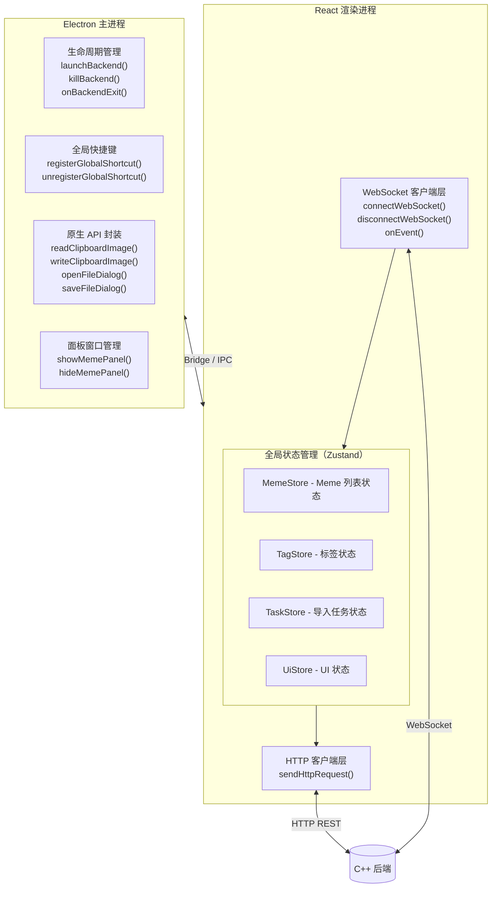
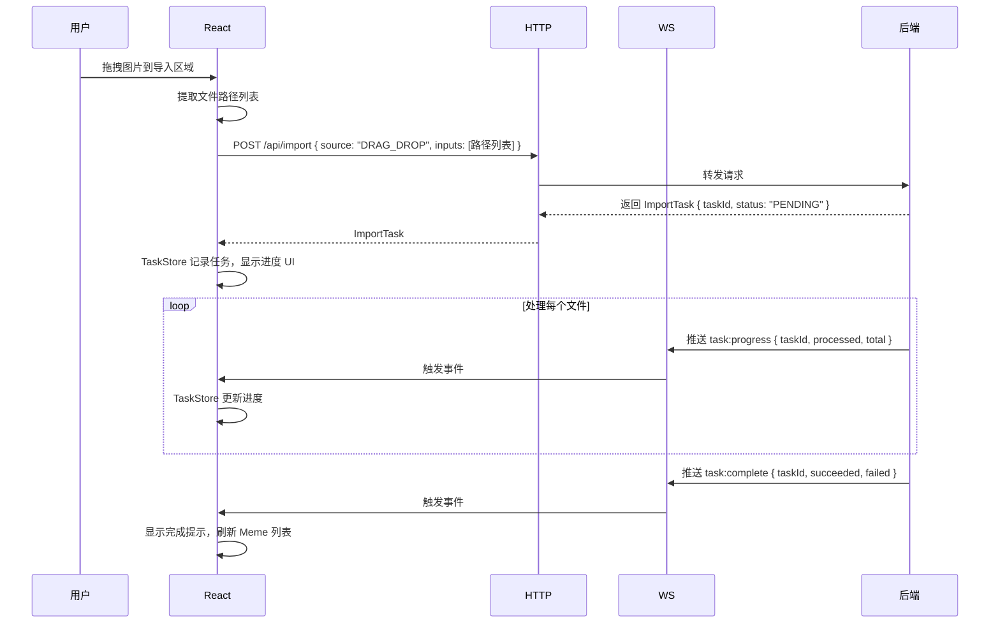
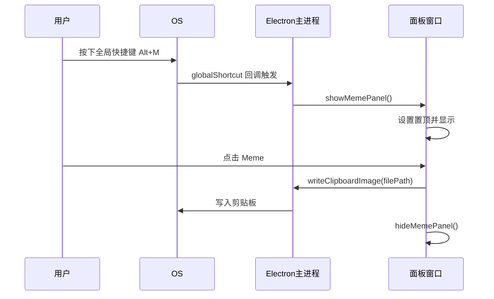

# 前端模块

> **所属层级**：前端层（Electron + TypeScript + React + Tailwind CSS）  
> **对应索引**：[Arch.md - 前端模块](../Arch.md#前端模块)

> [!NOTE]
> **UI 界面设计文档**请参阅 [docs/UI/UI.md](../UI/UI.md)，包含布局规格、组件库、交互流程、弹窗规格和视觉风格规范。本文档侧重于 Electron 主进程与 React 渲染进程的技术架构。

---

## 目录

- [模块职责与边界](#模块职责与边界)
- [模块架构图](#模块架构图)
- [模块独有数据结构](#模块独有数据结构)
- [Electron 主进程函数](#electron-主进程函数)
- [React 渲染进程函数](#react-渲染进程函数)
- [处理流程](#处理流程)
- [错误处理与边界情况](#错误处理与边界情况)

---

## 模块职责与边界

**负责的事情：**
- 通过 Electron 主进程管理 C++ 后端子进程的生命周期（启动、监控、销毁）
- 提供用户界面：Meme 浏览、搜索、详情查看、导入、编辑、导出
- 注册全局系统快捷键，支持在任意应用内唤起 Meme 面板
- 通过 HTTP 客户端向 C++ 后端发送请求
- 通过 WebSocket 接收 C++ 后端的异步推送事件
- 剪贴板图像读取与写入（通过 Electron 原生 API）
- 原生系统对话框（文件选择、保存）

**不负责的事情：**
- 任何业务逻辑处理（OCR、AI、数据库等）
- C++ 内部的通信协议实现
- 文件路径解析超出 UI 需要的范围

---

## 模块架构图



---

## 模块独有数据结构

### `FileDialogOptions` — 文件选择对话框配置

```
FileDialogOptions {
    title       : string    // 对话框标题
    filters     : FileFilter[]  // 文件类型过滤器
    multiSelect : bool      // 是否允许多选（默认 false）
    defaultPath : string    // 默认打开路径（可为空）
}

FileFilter {
    name       : string    // 过滤器显示名称，如 "图片文件"
    extensions : string[]  // 扩展名列表，如 ["png", "jpg", "gif"]
}
```

### `SaveDialogOptions` — 文件保存对话框配置

```
SaveDialogOptions {
    title        : string  // 对话框标题
    defaultName  : string  // 默认文件名
    filters      : FileFilter[]
    defaultPath  : string  // 默认保存路径（可为空）
}
```

### `AppConfig` — 应用本地配置（持久化到本地 JSON）

```
AppConfig {
    backendPort  : int      // C++ 后端监听端口（默认 57321）
    bindAddress  : string   // HTTP / WS 绑定地址（默认 "127.0.0.1"）
    storagePath  : string   // Meme 文件存储根目录
    dbPath       : string   // SQLite 数据库文件路径
    logDir       : string   // 日志文件输出目录
    maxQueueSize : int      // 处理队列最大深度（默认 500）

    vision : {
        apiKey         : string  // AI API 密钥（空字符串表示禁用 AI）
        apiBaseUrl     : string  // AI API 基础 URL（兼容 OpenAI 格式）
        visionModel    : string  // 图像理解模型名称
        embeddingModel : string  // 文本向量化模型名称
        timeoutSeconds : int     // AI API 单次请求超时秒数
        maxRetries     : int     // AI API 失败重试次数
    }

    ocr : {
        apiKey   : string  // 云端 OCR API 密钥（空表示禁用 OCR）
        apiUrl   : string  // 云端 OCR API 地址（待适配）
        provider : string  // 云端 OCR 提供商标识（占位字段）
    }

    ui : {
        panelShortcut : string  // 快速面板快捷键（默认 "Alt+M"）
        theme         : string  // 主题 "light" | "dark" | "system"
        viewMode      : string  // Meme 画廊视图 "grid" | "list"
        language      : string  // 界面语言（当前仅 "zh-CN"）
    }

    log : {
        minLevel         : string  // 最低日志输出等级
        retentionEnabled : bool    // 是否启用日志自动清理（默认 true）
        retentionDays    : int     // 日志保留天数（默认 30）
    }

    thumbnail : {
        enabled : bool  // 是否启用缩略图（默认 true）
        maxSize : int   // 缩略图最大边长像素（默认 300）
    }

    backup : {
        enabled       : bool  // 是否启用自动备份（默认 true）
        retentionDays : int   // 备份保留天数（默认 30）
    }
}
```

### `UiState` — UI 全局状态（Zustand UiStore）

```
UiState {
    isPanelOpen    : bool    // 快速面板是否打开
    isImporting    : bool    // 是否正在导入
    activeTaskId   : string  // 当前激活的导入任务 ID
    selectedMemeId : int64   // 当前选中的 Meme ID（-1 表示无）
    searchQuery    : SearchQuery  // 当前搜索条件
    viewMode       : string  // 视图模式 "grid" | "list"
}
```

---

## Electron 主进程函数

### `launchBackend`

```
launchBackend(): Promise<void>
```

- **描述**：读取 `AppConfig.backendPort` 配置，生成随机 Auth Token（UUID v4），使用 `child_process.spawn` 启动 C++ 后端可执行文件，通过 `buildBackendArgs()` 将端口号、Auth Token 和其他配置作为命令行参数传入。Token 缓存在 Electron 主进程内存中，通过 `contextBridge` IPC 暴露给渲染进程，供 `sendHttpRequest()` 和 `connectWebSocket()` 使用。同时设置 `onBackendExit` 监听后端异常退出。
- **输入**：无（从 `AppConfig` 读取端口）
- **输出**：后端进程启动并监听端口后 resolve；若启动超时（默认 5 秒）或进程立即退出则 reject

---

### `killBackend`

```
killBackend(): Promise<void>
```

- **描述**：向后端子进程发送 `SIGTERM` 信号，等待进程退出（最多 2 秒），超时则发送 `SIGKILL` 强制终止。
- **输入**：无
- **输出**：进程退出后 resolve

---

### `onBackendExit`

```
onBackendExit(callback: (code: number) => void): void
```

- **描述**：注册监听函数，当后端子进程异常退出时触发回调。UI 层收到回调后弹出错误提示并尝试重启。
- **输入**：`callback`：接收退出码的回调函数
- **输出**：无

---

### `readClipboardImage`

```
readClipboardImage(): Promise<string | null>
```

- **描述**：使用 Electron `clipboard.readImage()` 读取系统剪贴板中的图像，将其转换为 Base64 编码的 PNG 字符串返回给渲染进程。
- **输入**：无
- **输出**：Base64 编码的 PNG 字符串；剪贴板无图像时返回 `null`

---

### `writeClipboardImage`

```
writeClipboardImage(filePath: string): Promise<void>
```

- **描述**：读取指定路径的图像文件，通过 Electron `clipboard.writeImage()` 写入系统剪贴板。
- **输入**：`filePath`：本地图像文件的绝对路径
- **输出**：写入成功后 resolve；文件不存在或格式不支持则 reject

---

### `registerGlobalShortcut`

```
registerGlobalShortcut(key: string, callback: () => void): void
```

- **描述**：使用 Electron `globalShortcut.register()` 注册系统级快捷键。快捷键在任意应用聚焦时均可触发。
- **输入**：`key`：快捷键字符串（Electron 格式，如 `"Alt+M"`）；`callback`：触发时调用的函数
- **输出**：无

---

### `unregisterGlobalShortcut`

```
unregisterGlobalShortcut(key: string): void
```

- **描述**：注销已注册的全局快捷键，释放系统资源。
- **输入**：`key`：快捷键字符串
- **输出**：无

---

### `showMemePanel`

```
showMemePanel(): void
```

- **描述**：将 Meme 快速取用面板窗口（独立 `BrowserWindow`）设置为可见，并将其置于所有窗口最前。该面板为无边框、半透明的浮动窗口。详细的面板 UI 设计规格见 [floating-panel.md](../UI/floating-panel.md)。
- **输入**：无
- **输出**：无

---

### `hideMemePanel`

```
hideMemePanel(): void
```

- **描述**：隐藏 Meme 快速取用面板窗口。详见 [floating-panel.md](../UI/floating-panel.md)。
- **输入**：无
- **输出**：无

---

### `openFileDialog`

```
openFileDialog(options: FileDialogOptions): Promise<string[]>
```

- **描述**：弹出系统原生文件选择对话框，返回用户选择的文件绝对路径列表。
- **输入**：`options`：对话框配置（标题、过滤器、是否多选等）
- **输出**：用户选择的文件路径数组；用户取消则返回空数组

---

### `saveFileDialog`

```
saveFileDialog(options: SaveDialogOptions): Promise<string | null>
```

- **描述**：弹出系统原生文件保存对话框，返回用户选择的保存路径。
- **输入**：`options`：对话框配置（标题、默认文件名等）
- **输出**：用户选择的路径字符串；用户取消则返回 `null`

---

## React 渲染进程函数

### `sendHttpRequest`

```
sendHttpRequest<T>(method: string, path: string, body?: object): Promise<T>
```

- **描述**：封装 `fetch` API，向本地 C++ 后端发送 HTTP 请求。自动拼接 `http://localhost:{port}` 基础 URL，序列化请求体，反序列化响应 JSON，并统一处理 HTTP 错误码。
- **输入**：`method`：HTTP 方法；`path`：端点路径；`body`：请求体对象（可选）
- **输出**：反序列化后的响应数据 `T`；请求失败抛出包含状态码和错误信息的异常

---

### `connectWebSocket`

```
connectWebSocket(): void
```

- **描述**：建立到本地 C++ 后端的 WebSocket 长连接，注册各类事件的分发处理。连接断开时自动以指数退避策略重连（最大等待 30 秒）。
- **输入**：无
- **输出**：无

---

### `disconnectWebSocket`

```
disconnectWebSocket(): void
```

- **描述**：主动关闭 WebSocket 连接，停止自动重连。
- **输入**：无
- **输出**：无

---

### `onEvent`

```
onEvent(eventName: string, handler: (payload: any) => void): () => void
```

- **描述**：为指定 WebSocket 事件类型注册处理函数。返回取消订阅函数，供 React 组件 cleanup 时调用。
- **输入**：`eventName`：事件名称；`handler`：事件处理函数
- **输出**：取消订阅函数

---

## 处理流程

### 导入 Meme 流程（拖拽为例）



### 快速面板唤起流程



---

## 错误处理与边界情况

| 场景                                  | 处理策略                                                          |
| ------------------------------------- | ----------------------------------------------------------------- |
| 后端子进程启动超时（>5 秒未监听端口） | 重试一次，仍失败则弹出错误对话框提示检查可执行文件                |
| 后端进程意外退出（退出码非 0）        | `onBackendExit` 触发，弹出错误提示，等待 2 秒后自动重启           |
| HTTP 请求超时（默认 10 秒）           | 显示网络错误提示，不自动重试（由用户手动触发）                    |
| HTTP 返回 4xx                         | 解析错误响应体，显示具体错误信息                                  |
| HTTP 返回 5xx                         | 显示"后端处理失败"提示，记录日志                                  |
| WebSocket 连接断开                    | 自动以指数退避重连（1s → 2s → 4s … 最大 30s），状态栏显示"重连中" |
| 剪贴板中无图像                        | `readClipboardImage` 返回 `null`，UI 显示"剪贴板无图像"提示       |
| 拖拽了非图像文件                      | 前端过滤非图像 MIME 类型，显示"不支持的文件类型"提示              |
| 全局快捷键被其他应用占用              | `registerGlobalShortcut` 返回 `false`，弹出提示建议用户更改快捷键 |
