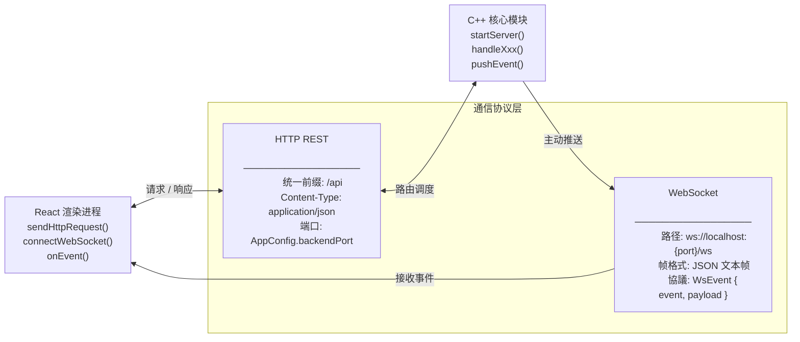
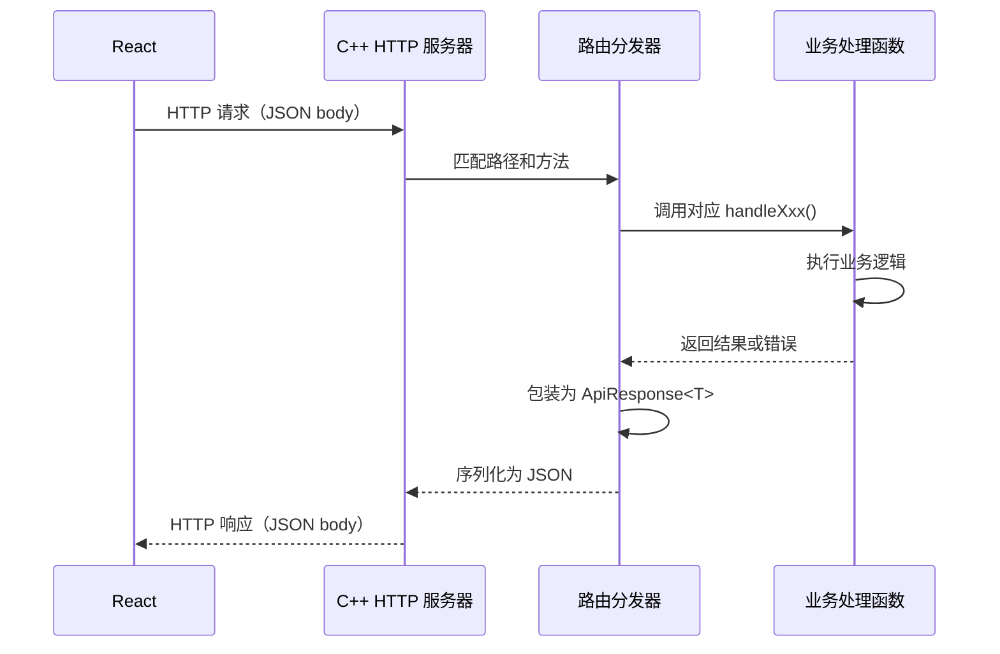
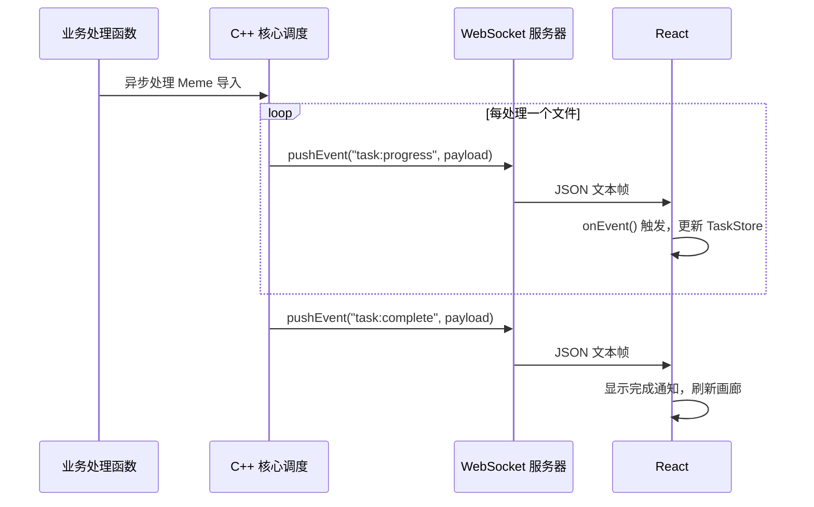

# 通信协议模块

> **所属层级**：通信层（cpp-httplib HTTP REST + WebSocket++）  
> **对应索引**：[Arch.md - 通信协议模块](../Arch.md#通信协议模块)

---

## 目录

- [模块职责与边界](#模块职责与边界)
- [模块架构图](#模块架构图)
- [模块独有数据结构](#模块独有数据结构)
- [HTTP REST 接口规范](#http-rest-接口规范)
- [WebSocket 事件规范](#websocket-事件规范)
- [处理流程](#处理流程)
- [错误处理与边界情况](#错误处理与边界情况)

---

## 模块职责与边界

**负责的事情：**
- 定义前端与 C++ 后端之间通信的完整协议契约
- 约定所有 HTTP 端点的路径、方法、请求/响应体格式
- 约定所有 WebSocket 推送事件的名称和负载格式
- 定义统一的错误响应格式

**不负责的事情：**
- 业务逻辑处理（由 C++ 核心模块负责）
- 协议实现细节（由 C++ 核心模块实现，前端通过 `sendHttpRequest` / `onEvent` 消费）

---

## 模块架构图



---

## 模块独有数据结构

### `ApiResponse<T>` — 统一 HTTP 响应体格式

```
ApiResponse<T> {
    success : bool    // 请求是否成功
    data    : T       // 响应数据（success=true 时有效）
    error   : string  // 错误描述（success=false 时有效）
    code    : int     // 业务错误码（0 表示无错误）
}
```

### `业务错误码` — 错误码定义表

```
// 通用
ERR_OK                : 0
ERR_INVALID_PARAMS    : 1001  // 请求参数校验失败
ERR_NOT_FOUND         : 1002  // 目标资源不存在
ERR_DUPLICATE         : 1003  // 资源已存在（如 hash 重复）
ERR_IO                : 1004  // 文件读写失败
ERR_INTERNAL          : 1099  // 后端内部未预期错误

// OCR
ERR_OCR_NOT_READY     : 2001  // OCR 引擎未初始化
ERR_OCR_FAILED        : 2002  // OCR 识别失败

// AI
ERR_AI_UNAVAILABLE    : 3001  // AI 服务不可用
ERR_AI_REQUEST_FAILED : 3002  // AI API 调用失败
ERR_AI_QUOTA_EXCEEDED : 3003  // AI API 配额超限
```

### `ImportRequest` — 导入请求体

```
ImportRequest {
    source  : ImportSource  // 导入来源
    inputs  : string[]      // 输入内容列表（URL 或本地路径）
    options : ImportOptions // 导入选项
}

ImportOptions {
    autoOcr       : bool  // 是否自动执行 OCR（默认 true）
    autoAiAnalyze : bool  // 是否自动 AI 分析（默认 true，取决于 AI 是否可用）
    sourceName    : string // 来源名称（可手动指定，可为空）
    sourceUrl     : string // 来源 URL（可手动指定，可为空）
}
```

### `MemePatch` — Meme 更新请求体（仅含需更新的字段）

```
MemePatch {
    name?        : string    // 新名称（可选）
    description? : string    // 新描述（可选）
    sourceName?  : string    // 新来源名称（可选）
    sourceUrl?   : string    // 新来源 URL（可选）
}
```

### `ExportRequest` — 导出请求体

```
ExportRequest {
    memeIds    : int64[]  // 要导出的 Meme ID 列表
    destDir    : string   // 导出目标目录路径
    keepNames  : bool     // 是否保留原文件名（false 则用 ID 命名）
}

ExportResult {
    succeeded : int32     // 成功导出数量
    failed    : int32     // 失败数量
    errors    : string[]  // 各失败项的描述
}
```

### `GeneratedImage` — AI 生成图像结果

```
GeneratedImage {
    imageBase64 : string  // Base64 编码的 PNG 图像数据
    width       : int32   // 图像宽度
    height      : int32   // 图像高度
}
```

### `ShareOptions` — 分享选项

```
ShareOptions {
    expireHours : int32  // 链接有效期（小时，0 表示永不过期）
    generateQr  : bool   // 是否同时生成二维码
}

ShareResult {
    shortUrl   : string  // 短链接 URL
    qrBase64   : string  // 二维码图像 Base64（generateQr=true 时有效）
    expireAt   : int64   // 过期时间戳（毫秒，0 表示永不过期）
}
```

---

## HTTP REST 接口规范

> **基础 URL**：`http://localhost:{port}/api`  
> **请求格式**：`Content-Type: application/json`  
> **响应格式**：`ApiResponse<T>` 统一包装

---

### `POST /api/import` — 提交导入任务

- **描述**：提交一批 Meme 导入任务，后端立即返回任务对象，实际处理在后台异步进行，通过 WebSocket 推送进度
- **请求体**：`ImportRequest`
- **成功响应**：`ApiResponse<ImportTask>` — 创建的导入任务初始状态
- **可能错误**：`ERR_INVALID_PARAMS`（inputs 为空）

---

### `GET /api/memes/search` — 搜索 Meme 列表

- **描述**：按 `SearchQuery` 参数搜索 Meme，支持模糊搜索、标签过滤、时间/大小/格式过滤、正则匹配、向量相似度搜索
- **请求体**：`SearchQuery`（POST body 形式，避免 URL 长度限制）
- **成功响应**：`ApiResponse<{ items: MemeEntry[], total: int }>` — 结果列表及总数
- **可能错误**：`ERR_INVALID_PARAMS`（非法 regex）、`ERR_INTERNAL`

---

### `GET /api/meme/:id` — 获取单个 Meme

- **描述**：按 ID 查询单个 Meme 的完整信息，包含标签列表
- **路径参数**：`id`：Meme ID（`int64`）
- **成功响应**：`ApiResponse<MemeEntry>`
- **可能错误**：`ERR_NOT_FOUND`

---

### `PUT /api/meme/:id` — 更新 Meme 元数据

- **描述**：更新指定 Meme 的可编辑字段（名称、描述、来源等）
- **路径参数**：`id`：Meme ID（`int64`）
- **请求体**：`MemePatch`（仅传入需要变更的字段）
- **成功响应**：`ApiResponse<MemeEntry>` — 更新后的完整 Meme 数据
- **可能错误**：`ERR_NOT_FOUND`、`ERR_INVALID_PARAMS`

---

### `DELETE /api/meme/:id` — 删除 Meme

- **描述**：删除指定 Meme 的数据库记录和本地文件
- **路径参数**：`id`：Meme ID（`int64`）
- **成功响应**：`ApiResponse<null>`
- **可能错误**：`ERR_NOT_FOUND`、`ERR_IO`（文件删除失败，但记录仍会被删除）

---

### `GET /api/tags` — 获取全部标签

- **描述**：返回系统中所有已创建的标签列表，不分页
- **成功响应**：`ApiResponse<Tag[]>`

---

### `POST /api/tags` — 创建新标签

- **描述**：创建一个新标签，标签名在系统中必须唯一
- **请求体**：`{ name: string, color?: string }`
- **成功响应**：`ApiResponse<Tag>` — 新创建的标签对象
- **可能错误**：`ERR_DUPLICATE`（标签名已存在）、`ERR_INVALID_PARAMS`（名称为空）

---

### `DELETE /api/tags/:id` — 删除标签

- **描述**：删除指定标签，同时移除所有 Meme 与该标签的关联关系
- **路径参数**：`id`：Tag ID（`int64`）
- **成功响应**：`ApiResponse<null>`
- **可能错误**：`ERR_NOT_FOUND`

---

### `POST /api/meme/:id/tags` — 为 Meme 添加标签

- **描述**：建立指定 Meme 与指定标签的关联关系（多对多）
- **路径参数**：`id`：Meme ID（`int64`）
- **请求体**：`{ tagId: int64 }`
- **成功响应**：`ApiResponse<null>`
- **可能错误**：`ERR_NOT_FOUND`（Meme 或 Tag 不存在）、`ERR_DUPLICATE`（关联已存在）

---

### `DELETE /api/meme/:id/tags/:tagId` — 移除 Meme 的标签

- **描述**：移除指定 Meme 与指定标签的关联关系
- **路径参数**：`id`：Meme ID；`tagId`：Tag ID
- **成功响应**：`ApiResponse<null>`
- **可能错误**：`ERR_NOT_FOUND`

---

### `POST /api/export` — 导出 Meme 到本地文件

- **描述**：将指定 Meme 列表复制到目标目录，支持批量导出
- **请求体**：`ExportRequest`
- **成功响应**：`ApiResponse<ExportResult>`
- **可能错误**：`ERR_INVALID_PARAMS`（memeIds 为空或 destDir 无效）、`ERR_IO`

---

### `POST /api/ai/generate-image` — AI 生成配图

- **描述**：调用 AI 服务根据文字描述生成图像
- **请求体**：`{ prompt: string }`
- **成功响应**：`ApiResponse<GeneratedImage>`
- **可能错误**：`ERR_AI_UNAVAILABLE`、`ERR_AI_REQUEST_FAILED`、`ERR_AI_QUOTA_EXCEEDED`

---

### `POST /api/share/link` — 生成分享链接

- **描述**：为指定 Meme 生成短链接，可选同时生成二维码
- **请求体**：`{ memeId: int64, options: ShareOptions }`
- **成功响应**：`ApiResponse<ShareResult>`
- **可能错误**：`ERR_NOT_FOUND`、`ERR_INTERNAL`

---

## WebSocket 事件规范

> **连接地址**：`ws://localhost:{port}/ws`  
> **帧格式**：JSON 文本帧，结构为 `WsEvent { event: string, payload: any }`  
> **方向**：仅 C++ 后端 → 前端（单向推送，前端不向后端发送 WS 消息）

---

### `task:progress` — 任务进度更新

```
payload {
    taskId    : string  // 任务 ID
    processed : int32   // 已处理数量
    total     : int32   // 总数量
    current   : string  // 当前正在处理的输入项描述（如文件名）
}
```

---

### `task:complete` — 任务完成

```
payload {
    taskId    : string  // 任务 ID
    succeeded : int32   // 成功数量
    failed    : int32   // 失败数量
    errors    : string[]  // 各失败项错误描述列表
}
```

---

### `task:error` — 任务整体失败

```
payload {
    taskId : string  // 任务 ID
    error  : string  // 失败描述
}
```

---

### `meme:added` — 新 Meme 已入库

```
payload: MemeEntry  // 完整的新 Meme 数据
```

---

### `meme:updated` — Meme 数据已更新

```
payload: MemeEntry  // 更新后的完整 Meme 数据
```

---

### `meme:deleted` — Meme 已删除

```
payload {
    id : int64  // 被删除的 Meme ID
}
```

---

## 处理流程

### HTTP 请求完整处理链路



### WebSocket 异步推送链路



---

## 错误处理与边界情况

| 场景                          | 处理策略                                                                  |
| ----------------------------- | ------------------------------------------------------------------------- |
| 请求体 JSON 解析失败          | 返回 HTTP 400，`ApiResponse { success: false, code: ERR_INVALID_PARAMS }` |
| 路径参数 `id` 非数字          | 返回 HTTP 400，`ERR_INVALID_PARAMS`                                       |
| 路由未匹配任何端点            | 返回 HTTP 404，`ERR_NOT_FOUND`                                            |
| 后端内部异常（未捕获）        | 返回 HTTP 500，`ERR_INTERNAL`（不暴露堆栈信息给前端）                     |
| WebSocket 帧格式非法          | 服务端直接丢弃该帧，记录警告日志                                          |
| 并发多个 WebSocket 客户端连接 | 全部维护在连接列表中，推送时广播给所有连接                                |
| 前端 HTTP 请求超时（10 秒）   | 前端侧超时，显示网络错误提示                                              |
| 大文件上传请求体超限          | 后端限制请求体 ≤ 100MB（文件路径传递，非文件内容上传，实际不应触发）      |
