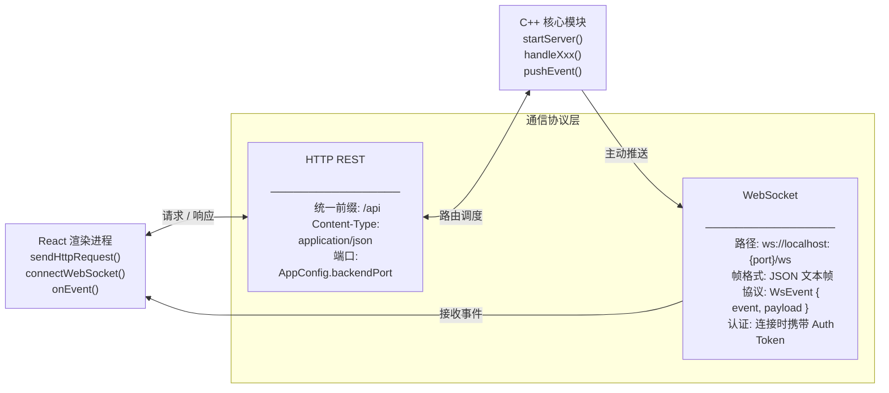
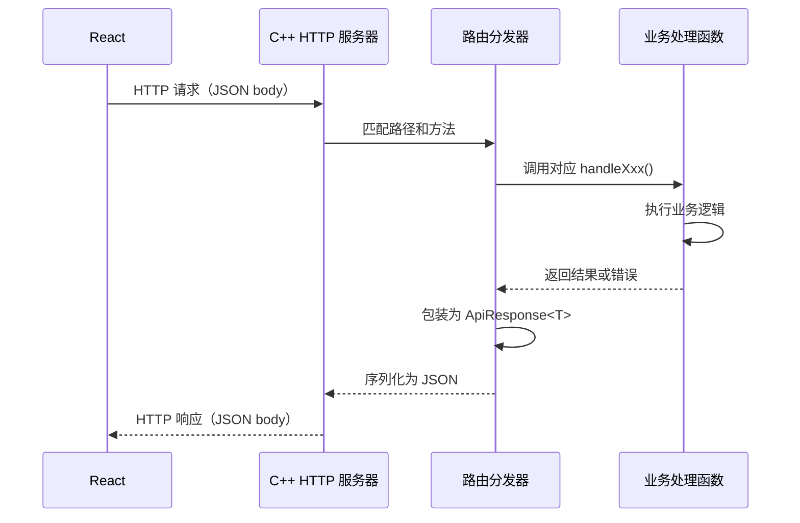
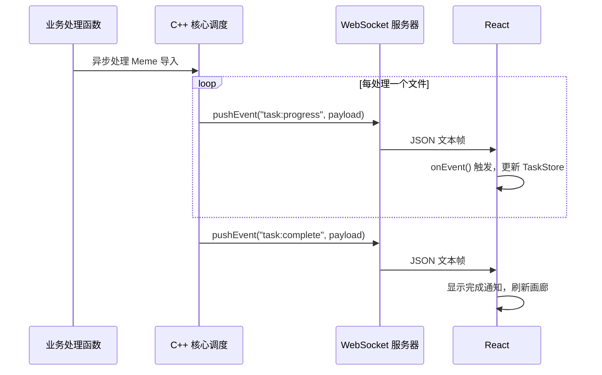

# 通信协议模块

> **所属层级**：通信层（Boost.Beast HTTP REST + WebSocket）  
> **对应索引**：[Arch.md - 通信协议模块](../Arch.md#通信协议模块)

---

## 目录

- [模块职责与边界](#模块职责与边界)
- [模块架构图](#模块架构图)
- [模块独有数据结构](#模块独有数据结构)
- [HTTP REST 接口规范](#http-rest-接口规范)
- [WebSocket 事件规范](#websocket-事件规范)
- [处理流程](#处理流程)
- [错误处理与边界情况](#错误处理与边界情况)

---

## 模块职责与边界

**负责的事情：**
- 定义前端与 C++ 后端之间通信的完整协议契约
- 约定所有 HTTP 端点的路径、方法、请求/响应体格式
- 约定所有 WebSocket 推送事件的名称和负载格式
- 定义统一的错误响应格式

**不负责的事情：**
- 业务逻辑处理（由 C++ 核心模块负责）
- 协议实现细节（由 C++ 核心模块实现，前端通过 `sendHttpRequest` / `onEvent` 消费）

---

## 模块架构图



---

## 模块独有数据结构

### `ApiResponse<T>` — 统一 HTTP 响应体格式

```
ApiResponse<T> {
    success : bool    // 请求是否成功
    data    : T       // 响应数据（success=true 时有效）
    error   : string  // 错误描述（success=false 时有效）
    code    : int     // 业务错误码（0 表示无错误）
}
```

### `业务错误码` — 错误码定义表

```
// 通用
ERR_OK                : 0
ERR_INVALID_PARAMS    : 1001  // 请求参数校验失败
ERR_NOT_FOUND         : 1002  // 目标资源不存在
ERR_DUPLICATE         : 1003  // 资源已存在（如 hash 重复）
ERR_IO                : 1004  // 文件读写失败
ERR_INTERNAL          : 1099  // 后端内部未预期错误

// OCR
ERR_OCR_NOT_READY     : 2001  // OCR 服务未配置
ERR_OCR_FAILED        : 2002  // OCR 识别失败

// AI
ERR_AI_UNAVAILABLE    : 3001  // AI 服务不可用
ERR_AI_REQUEST_FAILED : 3002  // AI API 调用失败

// 通用配额
ERR_QUOTA_EXCEEDED    : 4001  // API 配额超限（AI / OCR 共用）
```

### `ImportRequest` — 导入请求体

```
ImportRequest {
    source  : ImportSource  // 导入来源
    inputs  : string[]      // 输入内容列表（URL 或本地路径）
    options : ImportOptions // 导入选项
}

ImportOptions {
    autoOcr       : bool  // 是否自动执行 OCR（默认 true）
    autoAiAnalyze : bool  // 是否自动 AI 分析（默认 true，取决于 AI 是否可用）
    sourceName    : string // 来源名称（可手动指定，可为空）
    sourceUrl     : string // 来源 URL（可手动指定，可为空）
}
```

### `MemePatch` — Meme 更新请求体（仅含需更新的字段）

```
MemePatch {
    name?        : string    // 新名称（可选）
    description? : string    // 新描述（可选）
    sourceName?  : string    // 新来源名称（可选）
    sourceUrl?   : string    // 新来源 URL（可选）
}

Category {
    id        : int64
    uuid      : string
    name      : string
    color     : string
    createdAt : int64
    updatedAt : int64
}

CategoryPatch {
    name?  : string
    color? : string
}

BatchCategoryRequest {
    memeIds    : int64[]
    categoryId : int64
}
```

### `ExportRequest` — 导出请求体

```
ExportRequest {
    memeIds    : int64[]  // 要导出的 Meme ID 列表
    destDir    : string   // 导出目标目录路径
    keepNames  : bool     // 是否保留原文件名（false 则用 ID 命名）
}

ExportResult {
    succeeded : int32     // 成功导出数量
    failed    : int32     // 失败数量
    errors    : string[]  // 各失败项的描述
}
```

### `SearchResult` — 搜索响应结果

```
SearchResult {
    items : SearchResultItem[]  // 结果条目列表
    total : int32               // 匹配总数（用于分页）
}

SearchResultItem {
    meme            : MemeEntry  // Meme 数据（不含 embedding）
    similarityScore : float      // 向量搜索相似度分数（0.0~1.0，非向量搜索时为 -1）
}
```

### `BatchResult` — 批量操作结果

```
BatchResult {
    succeeded : int32     // 成功数量
    failed    : int32     // 失败数量
    errors    : string[]  // 各失败项描述
}
```

### `HealthStatus` — 健康检查结果

```
HealthStatus {
    status  : string  // "ok" | "degraded"
    modules : {
        vision : bool  // Vision 模块是否可用（AI + OCR）
        db     : bool  // 数据库是否正常
    }
}
```

### `RuntimeConfigPatch` — 运行时配置内容更新（仅含可热更新字段）

```
RuntimeConfigPatch {
    aiApiKey?          : string  // AI API 密钥（可选）
    aiApiBaseUrl?      : string  // AI API 基础 URL（可选）
    aiVisionModel?     : string  // VLM 模型名称（可选）
    aiEmbeddingModel?  : string  // Embedding 模型名称（可选）
    aiTimeoutSeconds?  : int     // AI API 请求超时秒数（可选）
    aiMaxRetries?      : int     // AI API 失败重试次数（可选）
    ocrApiKey?         : string  // 云端 OCR API 密钥（可选）
    ocrApiUrl?         : string  // 云端 OCR API 地址（可选）
    ocrProvider?       : string  // 云端 OCR 提供商（可选）
    logMinLevel?       : string  // 最低日志输出等级（可选）
}

// 需要重启后生效的字段（无法通过此接口修改）：
// backendPort 、 storagePath 、 dbPath
```

---

## HTTP REST 接口规范

> **基础 URL**：`http://localhost:{port}/api`  
> **请求格式**：`Content-Type: application/json`  
> **响应格式**：`ApiResponse<T>` 统一包装  
> **认证方式**：所有请求必须携带 `Authorization: Bearer <token>` 请求头（token 由 Electron 启动时随机生成并通过命令行参数传入 C++ 后端）

---

### `GET /api/health` — 健康检查

- **描述**：返回各子模块的就绪状态，前端启动时轮询此端点判断后端是否就绪
- **成功响应**：`ApiResponse<HealthStatus>`

---

### `POST /api/import` — 提交导入任务

- **描述**：提交一批 Meme 导入任务。后端先将文件入库（状态为 PENDING），立即返回任务对象，OCR 和 AI 分析在后台异步队列中执行，通过 WebSocket 推送进度和处理状态变更
- **请求体**：`ImportRequest`
- **成功响应**：`ApiResponse<ImportTask>` — 创建的导入任务初始状态
- **可能错误**：`ERR_INVALID_PARAMS`（inputs 为空）

---

### `POST /api/import/cancel` — 取消导入任务

- **描述**：取消指定的正在处理中的导入任务。
- **请求体**：`{ "taskId": string }`
- **成功响应**：`ApiResponse<{ "success": bool }>` — 操作是否成功
- **可能错误**：`ERR_INVALID_PARAMS`（Bad JSON 或 taskId 缺失）、`ERR_NOT_FOUND`（任务不存在或已结束）

### `POST /api/memes/search` — 搜索 Meme 列表

- **描述**：按 `SearchQuery` 参数搜索 Meme，支持模糊搜索、标签过滤、来源过滤、时间/大小/格式过滤、正则匹配、向量相似度搜索。默认不返回已软删除的 Meme
- **请求体**：`SearchQuery`
- **成功响应**：`ApiResponse<SearchResult>` — 包含 `items`（带 `similarityScore`）和 `total`
- **可能错误**：`ERR_INVALID_PARAMS`（非法 regex）、`ERR_INTERNAL`

---

### `GET /api/meme/:id` — 获取单个 Meme

- **描述**：按 ID 查询单个 Meme 的完整信息，包含标签列表和处理状态（不含 embedding 向量）
- **路径参数**：`id`：Meme ID（`int64`）
- **成功响应**：`ApiResponse<MemeEntry>`
- **可能错误**：`ERR_NOT_FOUND`

---

### `GET /api/meme/:id/file` — 获取 Meme 原始图像文件

- **描述**：返回指定 Meme 的原始图像文件二进制流，响应头包含正确的 `Content-Type`（如 `image/png`）
- **路径参数**：`id`：Meme ID（`int64`）
- **成功响应**：图像二进制流（非 JSON 包装）
- **可能错误**：`ERR_NOT_FOUND`、`ERR_IO`（文件不存在）

---

### `GET /api/meme/:id/thumbnail` — 获取 Meme 缩略图

- **描述**：返回指定 Meme 的缩略图二进制流。缩略图大小由配置中的 `thumbnail.maxSize` 决定（默认 300px）。若缩略图功能未启用或缩略图不存在，返回原始图像
- **路径参数**：`id`：Meme ID（`int64`）
- **成功响应**：缩略图二进制流（非 JSON 包装）
- **可能错误**：`ERR_NOT_FOUND`

---

### `PUT /api/meme/:id` — 更新 Meme 元数据

- **描述**：更新指定 Meme 的可编辑字段（名称、描述、来源等）
- **路径参数**：`id`：Meme ID（`int64`）
- **请求体**：`MemePatch`（仅传入需要变更的字段）
- **成功响应**：`ApiResponse<MemeEntry>` — 更新后的完整 Meme 数据
- **可能错误**：`ERR_NOT_FOUND`、`ERR_INVALID_PARAMS`

---

### `POST /api/meme/:id/use` — 记录 Meme 使用
 
 - **描述**：当用户将 Meme 复制到剪贴板或分发时调用，更新该 Meme 的 "最后使用时间" (`lastUsedAt`) 为当前时间戳。
 - **路径参数**：`id`：Meme ID（`int64`）
 - **成功响应**：`ApiResponse<null>`
 - **可能错误**：`ERR_NOT_FOUND`
 
 ---
 
 ### `DELETE /api/meme/:id` — 软删除 Meme

- **描述**：将指定 Meme 移入回收站（设置 `deleted_at` 时间戳），不立即删除文件。超过配置的保留天数后由后台任务彻底清理
- **路径参数**：`id`：Meme ID（`int64`）
- **成功响应**：`ApiResponse<null>`
- **可能错误**：`ERR_NOT_FOUND`

---

### `POST /api/meme/:id/restore` — 从回收站恢复 Meme

- **描述**：将已软删除的 Meme 从回收站恢复（将 `deleted_at` 重置为 0）
- **路径参数**：`id`：Meme ID（`int64`）
- **成功响应**：`ApiResponse<MemeEntry>` — 恢复后的完整 Meme 数据
- **可能错误**：`ERR_NOT_FOUND`（Meme 不存在或未被软删除）

---

### `GET /api/memes/trash` — 获取回收站 Meme 列表

- **描述**：返回所有已软删除的 Meme 列表，支持分页
- **查询参数**：`limit`（默认 50）、`offset`（默认 0）
- **成功响应**：`ApiResponse<SearchResult>` — 回收站中的 Meme 列表

---

### `DELETE /api/memes/trash/purge` — 手动清空回收站

- **描述**：彻底删除回收站中所有已软删除的 Meme（删除数据库记录和本地文件）
- **请求体**：无
- **成功响应**：`ApiResponse<{ purged: int32 }>` — 清理的记录数量

---

### `GET /api/categories` — 获取全部分类

- **描述**：返回系统中所有分类列表
- **成功响应**：`ApiResponse<Category[]>`

---

### `POST /api/categories` — 创建新分类

- **描述**：创建一个新分类，生成 UUID
- **请求体**：`{ name: string, color?: string }`
- **成功响应**：`ApiResponse<Category>`
- **可能错误**：`ERR_INVALID_PARAMS`（名称为空）

---

### `PUT /api/categories/:id` — 更新分类

- **描述**：更新分类名称或颜色
- **路径参数**：`id`：分类 ID（`int64`）
- **请求体**：`CategoryPatch`
- **成功响应**：`ApiResponse<Category>`
- **可能错误**：`ERR_NOT_FOUND`

---

### `DELETE /api/categories/:id` — 删除分类

- **描述**：删除指定分类，关联的 Meme 会被置为“未分类”状态（`categoryId=0`）
- **路径参数**：`id`：分类 ID（`int64`）
- **成功响应**：`ApiResponse<null>`
- **可能错误**：`ERR_NOT_FOUND`

---

### `POST /api/memes/batch/category` — 批量移动 Meme 到分类

- **描述**：将指定的多个 Meme 移动到目标分类
- **请求体**：`BatchCategoryRequest`
- **成功响应**：`ApiResponse<BatchResult>`
- **可能错误**：`ERR_INVALID_PARAMS`（memeIds 为空）

---

### `GET /api/tags` — 获取全部标签

- **描述**：返回系统中所有已创建的标签列表，不分页
- **成功响应**：`ApiResponse<Tag[]>`

---

### `POST /api/tags` — 创建新标签

- **描述**：创建一个新标签，标签名在系统中必须唯一
- **请求体**：`{ name: string, color?: string }`
- **成功响应**：`ApiResponse<Tag>` — 新创建的标签对象
- **可能错误**：`ERR_DUPLICATE`（标签名已存在）、`ERR_INVALID_PARAMS`（名称为空）

---

### `DELETE /api/tags/:id` — 删除标签

- **描述**：删除指定标签，同时移除所有 Meme 与该标签的关联关系
- **路径参数**：`id`：Tag ID（`int64`）
- **成功响应**：`ApiResponse<null>`
- **可能错误**：`ERR_NOT_FOUND`

---

### `POST /api/meme/:id/tags` — 为 Meme 添加标签

- **描述**：建立指定 Meme 与指定标签的关联关系（多对多）
- **路径参数**：`id`：Meme ID（`int64`）
- **请求体**：`{ tagId: int64 }`
- **成功响应**：`ApiResponse<null>`
- **可能错误**：`ERR_NOT_FOUND`（Meme 或 Tag 不存在）、`ERR_DUPLICATE`（关联已存在）

---

### `DELETE /api/meme/:id/tags/:tagId` — 移除 Meme 的标签

- **描述**：移除指定 Meme 与指定标签的关联关系
- **路径参数**：`id`：Meme ID；`tagId`：Tag ID
- **成功响应**：`ApiResponse<null>`
- **可能错误**：`ERR_NOT_FOUND`

---

### `POST /api/export` — 导出 Meme 到本地文件

- **描述**：将指定 Meme 列表复制到目标目录，支持批量导出
- **请求体**：`ExportRequest`
- **成功响应**：`ApiResponse<ExportResult>`
- **可能错误**：`ERR_INVALID_PARAMS`（memeIds 为空或 destDir 无效）、`ERR_IO`

---

### `DELETE /api/memes/batch` — 批量软删除 Meme

- **描述**：批量将多个 Meme 移入回收站
- **请求体**：`{ ids: int64[] }`
- **成功响应**：`ApiResponse<BatchResult>`
- **可能错误**：`ERR_INVALID_PARAMS`（ids 为空）

---

### `POST /api/memes/batch/tags` — 批量为 Meme 添加标签

- **描述**：为多个 Meme 批量添加同一标签
- **请求体**：`{ memeIds: int64[], tagId: int64 }`
- **成功响应**：`ApiResponse<BatchResult>`
- **可能错误**：`ERR_INVALID_PARAMS`（memeIds 为空）、`ERR_NOT_FOUND`（tagId 不存在）

---

### `POST /api/admin/rebuild-embeddings` — 重建语义向量

- **描述**：异步任务，对所有 Meme 重新调用 AI Embedding 生成语义向量。用于 Embedding 模型切换后的向量重建。通过 WebSocket 推送进度
- **请求体**：无
- **成功响应**：`ApiResponse<ImportTask>` — 重建任务对象
- **可能错误**：`ERR_AI_UNAVAILABLE`

---

### `PATCH /api/config` — 运行时配置热更新

- **描述**：将无需重启就能生效的配置变更实时同步到 C++ 后端，无需重启后端进程即可生效。仅允许修改 `RuntimeConfigPatch` 中定义的字段（Vision 配置、OCR 配置、日志等级）
- **请求体**：`RuntimeConfigPatch`（仅传入需要变更的字段，其余字段保持不变）
- **成功响应**：`ApiResponse<null>`
- **可能错误**：`ERR_INVALID_PARAMS`（字段值非法，如 `logMinLevel` 不在有效等级内）

---

## WebSocket 事件规范

> **连接地址**：`ws://localhost:{port}/ws`  
> **帧格式**：JSON 文本帧，结构为 `WsEvent { event: string, payload: any }`  
> **方向**：主要为 C++ 后端 → 前端单向推送；前端仅在收到 `ping` 时回复 `pong` 帧  
> **认证**：WebSocket 连接时通过查询参数携带 token：`ws://localhost:{port}/ws?token=<token>`

---

### `task:progress` — 任务进度更新

```
payload {
    taskId    : string  // 任务 ID
    processed : int32   // 已处理数量
    total     : int32   // 总数量
    current   : string  // 当前正在处理的输入项描述（如文件名）
}
```

---

### `task:complete` — 任务完成

```
payload {
    taskId    : string  // 任务 ID
    succeeded : int32   // 成功数量
    failed    : int32   // 失败数量
    errors    : string[]  // 各失败项错误描述列表
}
```

---

### `task:error` — 任务整体失败

```
payload {
    taskId : string  // 任务 ID
    error  : string  // 失败描述
}
```

---

### `meme:added` — 新 Meme 已入库

```
payload: MemeEntry  // 完整的新 Meme 数据（ocrStatus/aiStatus 为 PENDING）
```

---

### `meme:updated` — Meme 数据已更新
 
 ```
 payload: MemeEntry  // 更新后的完整 Meme 数据
 ```

---

### `meme:deleted` — Meme 已软删除

```
payload {
    id : int64  // 被软删除的 Meme ID
}
```

---

### `meme:used` — Meme 使用记录更新

```
payload {
    id         : int64  // 使用的 Meme ID
    lastUsedAt : int64  // 最新的使用时间戳（毫秒）
}
```

---

### `meme:processing` — Meme 处理状态变更

```
payload {
    id        : int64            // Meme ID
    ocrStatus : ProcessingStatus // 当前 OCR 处理状态
    aiStatus  : ProcessingStatus // 当前 AI 分析处理状态
    ocrText   : string           // OCR 识别结果（DONE 时有值）
    description : string         // AI 生成描述（DONE 时有值）
}
```

> 每当 Meme 的 OCR 或 AI 处理完成/失败时推送此事件，前端据此更新 UI 中的处理状态标识。

---

### `category:created` — 新分类已创建

```
payload: Category
```

---

### `category:updated` — 分类已更新

```
payload: Category
```

---

### `category:deleted` — 分类已删除

```
payload {
    id : int64
}
```

---

### `ping` — 心跳帧

```
payload: {}  // 空对象
```

> C++ 后端每 30 秒向所有 WebSocket 客户端发送 `ping` 事件。前端收到后应回复一个文本帧 `{"event":"pong"}`。若后端连续 2 次（60 秒）未收到 `pong` 响应，则视为客户端已断开，从连接列表中移除。

---

### `tag:created` — 新标签已创建

```
payload: Tag  // 完整的新 Tag 对象
```

> 创建新标签时推送，前端收到后自动更新 TagStore。

---

### `tag:deleted` — 标签已删除

```
payload {
    id : int64  // 被删除的 Tag ID
}
```

> 删除标签时推送，前端收到后自动从 TagStore 移除该标签，并刷新关联了该标签的 Meme 显示。

---

## 处理流程

### HTTP 请求完整处理链路



### WebSocket 异步推送链路



---

## 错误处理与边界情况

| 场景                          | 处理策略                                                                  |
| ----------------------------- | ------------------------------------------------------------------------- |
| 请求体 JSON 解析失败          | 返回 HTTP 400，`ApiResponse { success: false, code: ERR_INVALID_PARAMS }` |
| 路径参数 `id` 非数字          | 返回 HTTP 400，`ERR_INVALID_PARAMS`                                       |
| 路由未匹配任何端点            | 返回 HTTP 404，`ERR_NOT_FOUND`                                            |
| 后端内部异常（未捕获）        | 返回 HTTP 500，`ERR_INTERNAL`（不暴露堆栈信息给前端）                     |
| WebSocket 帧格式非法          | 服务端直接丢弃该帧，记录警告日志                                          |
| 并发多个 WebSocket 客户端连接 | 全部维护在连接列表中，推送时广播给所有连接                                |
| 前端 HTTP 请求超时（10 秒）   | 前端侧超时，显示网络错误提示                                              |
| 大文件上传请求体超限          | 后端限制请求体 ≤ 100MB（文件路径传递，非文件内容上传，实际不应触发）      |
| WebSocket 心跳超时            | 连续 60 秒未收到 pong，后端移除该连接；前端检测断连后触发指数退避重连     |
| 请求已软删除的 Meme           | `GET /api/meme/:id` 返回已软删除的 Meme（含 `deletedAt`），搜索默认排除   |
| 请求缺少 Auth Token           | 返回 HTTP 401，`ApiResponse { success: false, error: "Unauthorized" }`    |
| Auth Token 不匹配             | 返回 HTTP 403，`ApiResponse { success: false, error: "Forbidden" }`       |
