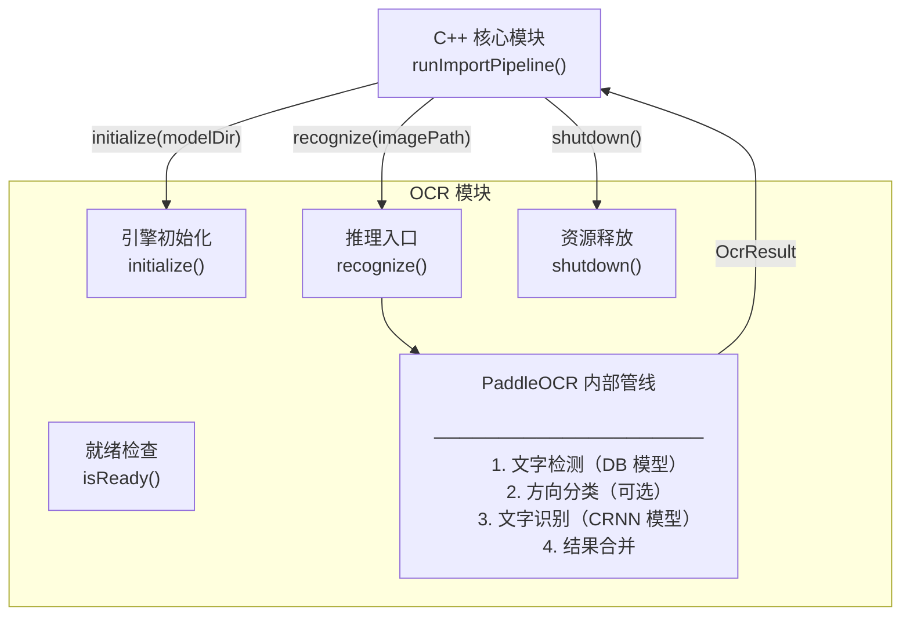

# OCR 模块

> **所属层级**：C++ 后端层（PaddleOCR PP-OCRv5，本地 CPU 推理）  
> **对应索引**：[Arch.md - OCR 模块](../Arch.md#ocr-模块)

---

## 目录

- [模块职责与边界](#模块职责与边界)
- [模块架构图](#模块架构图)
- [模块独有数据结构](#模块独有数据结构)
- [函数规范](#函数规范)
- [处理流程](#处理流程)
- [错误处理与边界情况](#错误处理与边界情况)

---

## 模块职责与边界

**负责的事情：**
- 封装 PaddleOCR PP-OCRv5 推理引擎的初始化和调用
- 对输入的图像文件或内存图像数据执行本地 CPU OCR 文字识别
- 返回结构化识别结果（完整文本 + 各文字块的坐标和置信度）
- 管理 OCR 引擎的生命周期（初始化 / 就绪检查 / 关闭释放）

**不负责的事情：**
- 文字语义理解（调用者自行处理）
- 图像下载和路径管理（由 C++ 核心模块负责）
- 向量化处理（由 AI 网关模块负责）
- 所有与数据库的交互

---

## 模块架构图



---

## 模块独有数据结构

### `OcrEngine` — OCR 引擎状态（单例内部状态）

```
OcrEngine {
    detModel    : PaddlePredictor  // 文字检测模型实例（DB 模型）
    recModel    : PaddlePredictor  // 文字识别模型实例（CRNN 模型）
    clsModel    : PaddlePredictor  // 方向分类模型实例（可选，默认不启用）
    initialized : bool             // 引擎是否已就绪
    modelDir    : string           // 模型文件目录路径
    mutex       : mutex            // 保护多线程并发调用的互斥锁
}
```

### `OcrConfig` — OCR 推理配置

```
OcrConfig {
    useGpu         : bool    // 是否使用 GPU（当前仅支持 CPU，固定 false）
    cpuThreads     : int     // CPU 推理线程数（默认 4）
    detThreshold   : float   // 检测框置信度阈值（默认 0.3）
    recScoreThresh : float   // 识别结果置信度过滤阈值（低于此值的文字块丢弃，默认 0.5）
    enableAngleCls : bool    // 是否启用方向分类（默认 false）
    maxSideLen     : int     // 输入图像缩放最大边长（默认 960）
}
```

---

## 函数规范

### `initialize`

```
initialize(modelDir: string): bool
```

- **描述**：
  1. 检查 `modelDir` 目录下是否存在必要的模型文件（`det_model/`、`rec_model/`、`rec_char_dict.txt`）
  2. 加载 PaddlePaddle 推理引擎，初始化检测模型（DB）和识别模型（CRNN）
  3. 执行一次 dummy 推理（空白图像）用于预热，确保首次实际调用无冷启动延迟
  4. 设置 `OcrEngine.initialized = true`
- **输入**：`modelDir`：包含 OCR 模型文件的目录绝对路径
- **输出**：初始化成功返回 `true`；模型文件缺失或加载失败返回 `false` 并记录详细错误日志

---

### `recognize`

```
recognize(imagePath: string): OcrResult
```

- **描述**：
  1. 检查 `isReady()`，未就绪立即返回失败的 `OcrResult`
  2. 使用 OpenCV 读取图像文件为 `Mat` 对象
  3. 调用内部 `runInference(mat)` 执行推理
  4. 按置信度 `recScoreThresh` 过滤低质量文字块
  5. 将所有文字块拼接为 `fullText`（按从上到下、从左到右的阅读顺序排列）
  6. 返回 `OcrResult`

  > 注意：加载图像和推理均在调用线程执行，PaddleOCR 引擎内部有 `mutex` 保护，多线程并发调用会串行化。
- **输入**：`imagePath`：图像文件绝对路径
- **输出**：`OcrResult`（包含 `fullText`、`blocks` 列表、`success` 标志）

---

---

### `isReady`

```
isReady(): bool
```

- **描述**：返回 `OcrEngine.initialized` 状态，用于在调用推理前快速检查引擎是否已就绪。
- **输入**：无
- **输出**：已就绪返回 `true`，否则返回 `false`

---

### `shutdown`

```
shutdown(): void
```

- **描述**：等待当前正在进行的推理完成（通过 `mutex`），然后释放 PaddlePaddle 推理器对象，清空模型内存，将 `initialized` 置为 `false`。
- **输入**：无
- **输出**：无

---

### `runInference`（内部函数）

```
runInference(mat: cv::Mat): OcrResult
```

- **描述**：PaddleOCR 三阶段推理管线：
  1. 文字检测（DB 模型）：输出文字区域边框列表
  2. （可选）方向分类（CLS 模型）：纠正旋转文字
  3. 文字识别（CRNN 模型）：对每个边框内图像块识别文字字符串
  4. 将检测框坐标转换为 `TextBlock.{x, y, w, h}}` 格式
- **输入**：`mat`：已加载的 OpenCV 图像矩阵
- **输出**：原始 `OcrResult`（未过滤低置信度）

---

### `sortTextBlocks`（内部函数）

```
sortTextBlocks(blocks: TextBlock[]): TextBlock[]
```

- **描述**：按自然阅读顺序（从上到下优先，同行内从左到右）对文字块排序，用于拼接 `fullText` 时保证文字顺序的逻辑正确性。行判断标准：Y 方向重叠超过 50% 视为同一行。
- **输入**：`blocks`：未排序的文字块列表
- **输出**：排序后的文字块列表

---

## 处理流程

### OCR 推理完整流程

```mermaid
flowchart TD
    CALL([调用 recognize]) --> READY{isReady?}
    READY -->|否| FAIL_READY([返回 OcrResult { success: false, error: "引擎未初始化" }])
    READY -->|是| LOCK[获取 engine mutex]
    LOCK --> LOAD[加载图像为 cv::Mat]
    LOAD --> LOAD_OK{加载成功?}
    LOAD_OK -->|否| FAIL_LOAD([返回 OcrResult { success: false, error: "图像读取失败" }])
    LOAD_OK -->|是| DET[DB 模型：文字区域检测]
    DET --> CLS{启用方向分类?}
    CLS -->|是| CLASSIFY[CLS 模型：方向纠正]
    CLS -->|否| REC
    CLASSIFY --> REC[CRNN 模型：文字识别]
    REC --> FILTER[过滤低置信度文字块]
    FILTER --> SORT[sortTextBlocks 排序]
    SORT --> JOIN[拼接 fullText]
    JOIN --> UNLOCK[释放 mutex]
    UNLOCK --> RETURN([返回 OcrResult { success: true }])
```

---

## 错误处理与边界情况

| 场景                                       | 处理策略                                                                      |
| ------------------------------------------ | ----------------------------------------------------------------------------- |
| 模型文件目录不存在或文件缺失               | `initialize` 返回 `false`，记录缺失文件列表，系统继续运行（OCR 降级为空文本） |
| 调用 `recognize` 时引擎未初始化            | 立即返回 `OcrResult { success: false, error: "引擎未初始化" }`，不抛出异常    |
| 图像文件路径不存在或无法读取               | 返回 `OcrResult { success: false, error: "图像读取失败" }`                    |
| 图像尺寸过大（超过 `maxSideLen` 4 倍以上） | 按比例缩放至 `maxSideLen` 后推理，在 `OcrResult` 的坐标中反算回原始尺寸       |
| 图像无任何文字（空白图像）                 | 返回 `OcrResult { success: true, fullText: "", blocks: [] }`（不视为失败）    |
| PaddleOCR 推理崩溃（底层异常）             | 捕获 C++ 异常，返回 `OcrResult { success: false, error: "推理引擎内部错误" }` |
| 多线程并发调用 `recognize`                 | `mutex` 确保推理串行化，并发调用会阻塞等待，不会崩溃                          |
| 图像中包含非中英文文字                     | PP-OCRv5 多语言模型支持常见语种，罕见语种识别精度下降但不崩溃                 |
| 图像格式不受 OpenCV 支持（如某些 AVIF）    | `cv::imread` 返回空 Mat，触发"图像读取失败"处理路径                           |
